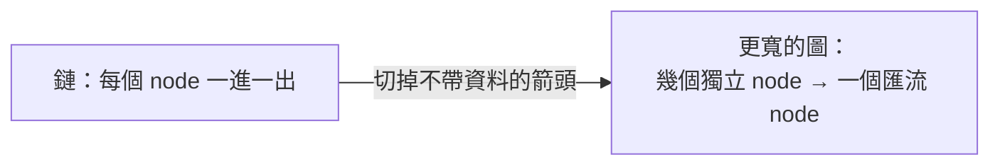
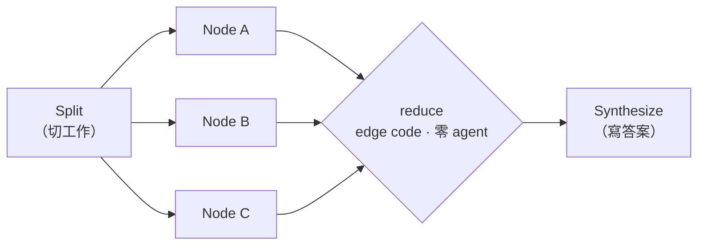

# Graph Engineering 逐段教學：跟著 Codez 走一遍 14 步

> **跟 [graph-engineering.md](./graph-engineering.md) 的分工**
>
> | | 這篇（逐段版） | graph-engineering.md（重組版） |
> | --- | --- | --- |
> | 順序 | 照原文 14 步 | 按「解決什麼問題」重排成七章 |
> | 用途 | 第一次學、想知道每一步為什麼 | 動手時查表、看校準結論 |
> | 深度 | 每步展開成「原文說什麼／為什麼／動手／校準」 | 濃縮成判準與決策表 |
>
> 兩篇技術結論一致。有出入的地方本篇標 **⚠️ 校準** 並指回重組版的 §八——**校準的唯一真相在那裡**，本篇只做轉述，避免兩份各自漂移。
>
> **原文是二手材料**：它是 Anthropic dynamic workflows primitive 的教學化重述，不是第一方文件。它的價值在提法（尤其第 01 步的 edge 判準），技術細節一律以第一方契約為準。

## 目錄

- [怎麼讀這篇](#怎麼讀這篇)
- [開場：為什麼你的 agent 是一條直線](#開場為什麼你的-agent-是一條直線)
- [第一組：看見圖（01–02）](#第一組看見圖0102)
  - [01. Node 是工作，edge 是流過去的東西](#01-node-是工作edge-是流過去的東西)
  - [02. 你的線性腳本是一張退化的圖](#02-你的線性腳本是一張退化的圖)
- [第二組：兩份契約（03–04）](#第二組兩份契約0304)
  - [03. 給每個 node 一份契約](#03-給每個-node-一份契約)
  - [04. 把 edge 當成資料契約](#04-把-edge-當成資料契約)
- [第三組：拓樸（05–07）](#第三組拓樸0507)
  - [05. 用 `parallel()` 展開](#05-用-parallel-展開)
  - [06. 在 barrier 收攏](#06-在-barrier-收攏)
  - [07. Diamond：split → work → merge](#07-diamondsplit--work--merge)
- [第四組：控制流與信心（08–11）](#第四組控制流與信心0811)
  - [08. 用條件式在 runtime 選 edge](#08-用條件式在-runtime-選-edge)
  - [09. 在 edge 上放 verifier](#09-在-edge-上放-verifier)
  - [10. 隔離 node，別讓一個故障毒死整張圖](#10-隔離-node別讓一個故障毒死整張圖)
  - [11. 加 cycle——但要讓它收斂](#11-加-cycle但要讓它收斂)
- [第五組：成本與自走（12–14）](#第五組成本與自走1214)
  - [12. 跨 node 分層模型](#12-跨-node-分層模型)
  - [13. 拓樸就是你的成本與延遲](#13-拓樸就是你的成本與延遲)
  - [14. 讓 Claude 自己畫圖](#14-讓-claude-自己畫圖)
- [六個可以這週動手的圖](#六個可以這週動手的圖)
- [結論：原文收在哪裡](#結論原文收在哪裡)
- [附錄 A：14 步 → 重組版章節對照](#附錄-a14-步--重組版章節對照)
- [附錄 B：原文完全沒提、但你一定會踩到的八件事](#附錄-b原文完全沒提但你一定會踩到的八件事)
- [附錄 C：讀取紀錄與校對紀錄](#附錄-c讀取紀錄與校對紀錄)

---

## 怎麼讀這篇

每一步固定四塊，缺哪塊就代表那步沒有那個問題：

| 區塊 | 內容 |
| --- | --- |
| **原文說什麼** | 濃縮它的主張，關鍵處保留原話 |
| **為什麼會這樣** | 機制。原文多半只給結論，這塊補「憑什麼」 |
| **動手** | 今天就能做的檢查或 code |
| **⚠️ 校準** | 跟第一方契約對不上的地方，指回重組版 §八 |

**先講一句適用邊界**（原文沒講，但它決定這整套有沒有用）：這 14 步假設**你已經知道要做什麼**。產出要有哪些欄位、工作項有哪些、什麼算做完——答不出這三題就別畫圖，攤成圖只會讓你更快、更平行地做錯事。形狀問題與規格問題是兩件事，這篇（和原文）只解前者。

---

## 開場：為什麼你的 agent 是一條直線

**原文說什麼**

多數人做多步 agent，最後都是一條直線：step 1、step 2、step 3，每一步禮貌地等上一步做完才開始。但十個裡有九個會發現，那些步驟**一半根本不用等**。直線 agent 不 route、不 branch、不平行，只排隊——直到 context 塞滿、agent 忘了自己在幹嘛。

接著它給出全文的核心切法：

> prompt 是一個句子。loop 是一個循環。harness 是 agent 站著的地板。
> 但**工作本身的形狀**——什麼先於什麼、什麼能同時、什麼要等齊——那個形狀是一張**圖**。Node 做思考，edge 搬結果。

最後點出工具：Claude Code 出貨了直接畫這種圖的東西——**dynamic workflows**。Claude 寫一段純 JavaScript 編排腳本，再派出一支協調好的 subagent 艦隊執行它。

**為什麼會這樣**

「直線」不是笨，是**它符合我們打字的方式**。你在編輯器裡一行一行寫下來，`await` 一個接一個，語法本身就長得像順序。順序在語法上是免費的，在執行上不是——每一個 `await` 都是一次真實的等待。

而「context 塞滿、agent 忘了自己在幹嘛」是這條線的第二個代價，而且它比慢更致命：單一 agent 把所有中間材料都堆在同一個 context 裡，堆到後面，早期的指令開始失效。所以圖不只是加速，它同時是**分裝**——每個 subagent 帶自己的 context，主 session 只收結論。

**動手**

打開你手上任何一個多步腳本，數一下有幾個 `await`。這個數字是你的「線長」，而線長就是你目前的 wall-clock 下界。接下來 14 步都在削它。

**⚠️ 校準**

原文在開場與第 05 步各說了一次「編排本身**零 model token**，因為它是 code 不是對話」。這句**站得住，但它是原文的推論，不是第一方保證**——契約談 token 時只談 `budget`（`+500k` 指令、`50_000` 這類門檻）與「workflow 會吃掉大量 token」的警告，沒有任何一句替編排層本身的 token 成本背書。詳見重組版 §八「已驗證正確」段末。

---

## 第一組：看見圖（01–02）

### 01. Node 是工作，edge 是流過去的東西

**原文說什麼**

一張圖只有兩種東西：**node** 是一個有界的工作單位（一個 agent、一件事、一進一出）；**edge** 是一個依賴，它只說「這個 node 的輸出餵給那個 node 的輸入」，沒有別的意思。

原文指出主要錯誤是**把「and then」當成 edge**，並給了一個刻意荒謬的例子：「摘要這個檔案，**然後**告訴我天氣」——天氣不消費那份摘要，所以兩者之間沒有 edge，是被線性腳本無謂串起來的兩個獨立 node。

判準：**只有資料真的跨過去，edge 才存在。**

**為什麼會這樣**

這一步是全篇最有價值的提法，值得說清楚它為什麼有效。

「這兩件事有沒有關係」是個**設計問題**，人的直覺對它太寬鬆——時間上相鄰、主題相關、都屬於同一個任務、你先想到 A 才想到 B，全都會被感覺成「有關係」。但執行時只有一種關係會造成等待：**資料依賴**。

原文的貢獻是把那個模糊的設計問題換成一個**機械的文法問題**：上游 `agent()` 的回傳值，有沒有出現在下游 `agent()` 的 prompt 字串裡？有，edge 存在；沒有，這兩個 node 只是被你打字的順序綁在一起。你不需要理解業務語意就能判，甚至可以寫 script 掃。

至於那個天氣例子——它荒謬到讓判準顯而易見，但**真實案例不長那樣**。真實案例長得像「先讀 `config.json`，然後掃描 `src/`」：你會覺得有順序，因為它們在同一個 setup 流程裡；但如果 scan 那步的 prompt 裡沒出現 config 的任何欄位，它們就是兩個獨立 node。**難判的永遠是這種「感覺有關係」的**。

**動手**

拿你的腳本，做一張三欄表：

| `await` 行號 | 回傳值存進哪個變數 | 這個變數在哪些下游 prompt 裡出現 |
| --- | --- | --- |
| L12 | `config` | （空） |
| L18 | `scanResult` | L31 |

第三欄空的那些 `await`，等待成本是白付的。這張表就是你的重畫清單。

---

### 02. 你的線性腳本是一張退化的圖

**原文說什麼**

「做 A、然後 B、然後 C、然後 D」本來就是一張圖，只是每個 node 恰好一進一出——一條不分岔的鏈。原文說這樣的鏈「跑起來正確，但慢而且脆弱，因為**鏈沒有冗餘**：C 卡住，D 就永遠不會發生，而 A 的成果被困在上游無處可去」。

第一個真正的實作技能是**重畫**：對每根箭頭問第 01 步的問題。多數鏈有兩三根箭頭不帶資料——它們只是你當初打字的順序。剪掉，鏈就塌成更寬的東西。

**為什麼會這樣**

**⚠️ 校準（重組版 §八 #5）**：原文這裡的診斷下錯了。它自己舉的例子——C 卡住，D 不跑，A 的成果困在上游——講的是**串連耦合**，跟有沒有備援無關。

這個區分不是咬文嚼字，它決定你開什麼藥：

- 如果你信「問題是缺冗餘」，你會去加**備援**——同一步跑兩次、準備 fallback。但備援治不了「A 的成果卡在上游出不來」，因為那不是 A 失敗，是 A 成功了卻被鎖住。
- 如果你診斷成**耦合**，你會去**切斷不必要的依賴**——這才是原文接下來真正教你做的事（重畫、剪箭頭）。

所以攤開一張圖買到的是兩樣東西：**獨立性**（可同時跑）與**故障圍堵**（一個 node 掛掉不會拖垮其他）。**冗餘不在其中**，它得另外加，而且有三種完全不同的加法：

| 加法 | 做法 | 買到什麼 |
| --- | --- | --- |
| **majority voting**（self-consistency） | 同一個生產 node 跑 N 次取多數 | 產出品質（降低單次抽樣的變異） |
| **best-of-N** | 產 N 個候選，用評審挑最好的 | 產出品質（探索解空間） |
| **adversarial verify** | 替產出配 N 個獨立質疑者 | 誤報過濾（不是讓產出更好，是讓錯的別過關） |

前兩者買品質，第三者買**過濾**——用錯了會失望。想少一點誤報卻去加 majority voting，你只會得到「更一致的錯誤」。

**動手**

把 01 那張表的第三欄空白列全部剪掉，重畫成：幾個獨立 node → 一個匯流 node。



---

## 第二組：兩份契約（03–04）

### 03. 給每個 node 一份契約

**原文說什麼**

> 一個你推理不了的 node，就是一個你平行不了的 node。

修法是給契約：**輸入有界、輸出有界、只做一件事**。輸入是這個 node 讀的東西，**明確傳進去，絕不從共用視窗假設**；輸出是定義好的形狀，讓下一個 node 不用猜。

在 workflow 裡這份契約用 `schema` 強制。`agent()` 帶 JSON schema 時，subagent 被迫回傳通過驗證的結構化資料——而且**驗證發生在 tool-call 層**，形狀不合是 Claude 重試，不是丟一坨自由文字給你 parse 然後祈禱。

**為什麼會這樣**

開頭那句「推理不了就平行不了」值得展開，因為它才是整步的支點。

平行的前提是：**你能在不看其他 node 的情況下，判斷這個 node 對不對。** 如果它的輸出是自由文字、正確性要靠上下文才看得出來，你就得等所有結果一起看——那你就退回 barrier 了（第 06 步）。所以契約不只是工程整潔，**它是平行化的前置條件**。

「驗證在 tool-call 層」這件事的份量也常被低估。對照兩種世界：

| | 自己 parse | `schema` 驗證 |
| --- | --- | --- |
| 壞資料到哪裡 | 已經進到你的 code | 沒離開模型端 |
| 誰知道出錯了 | 只有你 | 模型知道，並重試 |
| 你要寫什麼 | 防呆、決定丟棄還是修補 | 什麼都不用寫 |
| 下游 | 要防禦性程式設計 | 可以直接信任欄位 |

差別不是「省一點 parse code」，是**錯誤根本沒有機會傳播**。

**動手**

```javascript
const FINDING = {
  type: 'object',
  additionalProperties: false,          // 多餘欄位也算違規
  properties: {
    file:   { type: 'string' },
    issue:  { type: 'string' },
    impact: { type: 'string', enum: ['high', 'medium', 'low'] },
  },
  required: ['file', 'issue', 'impact'],
};

const r = await agent(`Audit ${f}`, { schema: FINDING, label: `audit:${f}` });
// r.impact 保證是那三個字串之一。下游不必 parse，也不必防呆。
```

順手的自檢：**`enum` 你填得出來嗎？** 填得出來表示你已經決定了怎麼分級；填不出來表示「重要性」在你腦裡還是個形容詞——那不是 schema 的問題，是規格還沒定形（回到〈怎麼讀這篇〉的適用邊界）。

---

### 04. 把 edge 當成資料契約

**原文說什麼**

edge 不只是「B 排在 A 後面」，它是一個**關於什麼東西跨過去的承諾**：A 產出這個形狀，B 被造來消費這個形狀。用**資料**命名而不是用**順序**命名，兩件事會變簡單——你能一眼看出 edge 是不是真的（資料真的有移動嗎），也能抽換兩端任一個 node 而不破壞圖，只要形狀不變。

實務上 edge 就活在純 JavaScript 裡。fan-out 與 synthesis 中間那個 reduce 步驟——flatten、dedupe、filter——只是對 node 回傳形狀做的 code，**不需要 agent**。原文的話：

> 一張每條 edge 都是 agent 的圖，是在替自己的接線付房租。

**為什麼會這樣**

**命名為什麼會帶出結構**：`const step2 = ...` 這個名字對**任何**資料都成立，所以它永遠不會失敗，也永遠不告訴你任何事。`const rankedFindings = ...` 只對特定形狀成立。取不出名字，就是你不知道那裡流著什麼——這是拿命名當型別檢查用。所以**叫不出形狀的 edge 通常根本不是 edge**。

**成本那一半**，把數量級擺出來就很清楚：

| | `flatMap` ＋ `Set` | 一個 agent |
| --- | --- | --- |
| token | 0 | 數千 |
| 延遲 | 微秒 | 數秒 |
| 確定性 | 100% | 不保證 |
| 出錯方式 | 不會 | 漏項、擅自改寫、順序跑掉 |

最後一列最要命：模型做 `flatMap` **會出錯**，而且是安靜地出錯（少了兩筆、把兩筆相似的合併掉）。code 不會。

判準一句話：**這一步需不需要「判斷」？** 需要 → agent。只是搬 → code。**模型的錢要花在「這算不算數」，不是花在「把兩份資料接起來」。**

**動手**

掃你的腳本，找所有 prompt 裡出現「combine」「merge」「consolidate」「整理成一份」的 `agent()` 呼叫。逐一問：這一步有沒有做判斷？沒有就換成 `flatMap` ＋ `Set`。

---

## 第三組：拓樸（05–07）

### 05. 用 `parallel()` 展開

**原文說什麼**

> 這一步付清了其他所有步驟的成本。

N 個獨立 node——N 個來源要查、N 個檔案要審、N 條路由要稽核——不要串。`parallel()` 收一組 thunk，一個 thunk 派一個 subagent，全部同時執行，再把結果陣列交回來。

兩個細節讓它耐用：

1. `parallel()` 是 **barrier**——等每一個 thunk 都回來才 return，所以下一階段看到的是完整集合。
2. throw 掉的 thunk **解析成 `null`**，不會 reject 整批，所以一個不穩的 agent 沉不掉整場 run。**永遠 `.filter(Boolean)`**。

併發有上限、超出的排隊，所以你可以丟一百個 thunk，它們都會完成——只是一次一小批。

原文還點出一個屬於 context 層的效果：fan-out 活在 Claude 寫的 code 裡，不是在對話裡。**Claude 自己的 context 從不同時裝著九個來源**——每個 subagent 帶自己的，只有最終答案回來。這才是能開到幾十上百個 subagent 而不淹掉 session 的原因。

**為什麼會這樣**

**先講 thunk，因為原文從頭到尾沒解釋它，而這是初學第一個踩的坑。**

thunk 就是 `() => agent(...)`，不是 `agent(...)`。差一個箭頭，行為完全不同：

```javascript
// ✗ 錯：agent(...) 當場就開始跑了。等 parallel() 拿到手，
//    一百個請求已經全部發出去，併發上限根本沒機會生效
await parallel(FILES.map((f) => agent(`Audit ${f}`)));

// ✓ 對：() => agent(...) 只描述「怎麼做」，何時做交給 parallel() 決定
await parallel(FILES.map((f) => () => agent(`Audit ${f}`)));
```

包一層的意義是**把執行時機的控制權交出去**。這就是排隊機制能存在的原因——`parallel()` 手上握的是一疊還沒點火的工作，它才能一次只點 C 個。

**再講收益的真實數字。** 這是原文最誤導人的地方：它說併發「大約是你的核心數」，讀起來像「N 個工作 N 倍快」。實際上——

**fan-out 的收益是 min(N, C) 倍，不是 N 倍。** N 遠大於 C 時，wall-clock 粗估是 `ceil(N/C) × 單項耗時`，而且這是**均一耗時下的下界**；項目快慢差很多時，每一波還會被那一波最慢的拖住。

**最後，context 那一半原文說得對而且重要，值得跟時間收益分開記。** N 開多大，主 context 的增量都只是那 N 份**結論**——產生結論的材料留在各自的 subagent 裡。所以 session 的天花板不在 N，而在**結論的大小**。（這件事的完整版在 [harness-engineering.md](./harness-engineering.md) §四 面向 1 的 tool-call offloading。）

**動手**

```javascript
const raw = await parallel(FILES.map((f) => () =>
  agent(`Audit ${f}`, { phase: 'Audit', schema: FINDING })));
const found = raw.filter(Boolean);   // null ＝ agent 掛了，或被使用者中途 skip
```

**⚠️ 校準（重組版 §八 #1）**

- 精確值是 **`min(16, max(2, CPU 核心數 - 2))`**，而且是**每個 workflow** 分別計。契約簡寫成 `min(16, 核心數 - 2)`，實作另有 2 的下限。本篇以下記作 **C**。
- 另有兩個硬上限：單一 workflow 生命週期**最多 1000 個 agent**（暴走保險）；單次 `parallel()`／`pipeline()` **最多 4096 個項目**，超過是明確報錯，不是無聲截斷。
- 還有一個**柔性**上限原文沒提：workflow size guideline，預設 medium ＝ 15 個 agent（§八 #16）。它不擋你，但它影響 Claude 願意開多大的圖。

---

### 06. 在 barrier 收攏

**原文說什麼**

fan-out 只有在有東西收攏它時才有用。fan-in 是 edge 匯流的那個 node——一個 agent（或一段 code）同時看到所有上游結果，做一件**需要整組才做得對**的事：跨來源去重、按 impact 排序、總數為零就早退。

> 這是**唯一**一個 barrier 賺得回它 wall-clock 成本的地方。

原文給的嗅探法很直白：如果你寫出 `parallel → transform → parallel`，而中間那個 transform 沒有跨項目依賴，你本來就該用 pipeline、直接跳過 barrier。

**為什麼會這樣**

三個合法理由（去重／排序／早退）看起來各自獨立，其實有同一個結構：**它們都是對「集合」的操作，不是對「元素」的操作。**

- 對元素的操作可以逐個做：翻譯這個檔、稽核那條路由——少收一份，你只是**少一份**。
- 對集合的操作不能：去重要先看到全部才知道誰跟誰重複，排序要先看到全部才排得出名次，早退要先數過全部才知道是不是零——少收一份，答案是**錯的**。

所以 fan-in 的判準不是「這裡要收尾了」（那是語意直覺），而是**「少一份就錯，還是只是少一份？」**

**動手**

```javascript
const shortlist = found.filter((c) => c.impact !== 'low');   // edge code：純 JS，零 agent
const ranked = await agent(`Dedupe and rank:\n${JSON.stringify(shortlist)}`,
                           { schema: RANKED });              // barrier node：需要全集
```

注意這兩行的分工——`filter` 是對元素的操作，所以是 edge code；`dedupe and rank` 是對集合的操作，所以才值得一個 agent 和一個 barrier。

判不出來就選 pipeline：它猜錯的代價只是「沒省到」，barrier 猜錯的代價是**每一階段都在等最慢的那個**。

---

### 07. Diamond：split → work → merge

**原文說什麼**

fan-out 接 fan-in 就是 **diamond**，原文稱它是所有正經 agent 圖的主力拓樸：一個 node 切工作、多個 node 平行做、一個 node 合併。市場掃描、相依稽核、code review、研究報告——換掉來源與 prompt，同一個骨架就適配。

正典形式值得背起來：**fan out → reduce → synthesize**。fan out 收廣度，**reduce 用純 code 壓縮**，synthesize 用最後一個 agent 寫答案。

原文的收尾很好：看見 diamond 之後，你不再問「怎麼讓我的 agent 多做幾步」，開始問「**split 在哪、merge 在哪**」——後面這個問題才會 scale。

**為什麼會這樣**

值得單獨記的是**中間那一格會分成兩段**，而且很多人把它壓成一個 agent：

- **reduce** 只壓縮、不判斷 → 屬於第 04 步的 edge code，不該花 agent
- **synthesize** 做判斷 → 這才是真正需要模型的那一步

把兩段混成一個 agent，等於付錢請模型做 `flatMap`，而且會踩到 04 步那張表的最後一列（模型會安靜地漏項、擅自合併）。

**動手**



**一個變體先記著**：judge panel（第 09 步）就是這個骨架——把「多個不同 node」換成「同一個問題的 N 種角度」，merge 換成評分後綜合。

---

## 第四組：控制流與信心（08–11）

### 08. 用條件式在 runtime 選 edge

**原文說什麼**

不是每張圖都固定。有時候走哪條 edge 取決於某個 node 發現了什麼：分類工單再分派到對的 handler、量 diff 大小再決定快掃還是全稽核。在 workflow 裡這就是對某個 node 的**已驗證輸出**做 JavaScript `if` 或 `switch`，因為控制流活在 code 裡。

> 這正是確定性變成**特性**而不是限制的地方。

router 的**判斷**可以由 Claude 出（subagent 做分類），但**分岔是 Claude 寫的 code**——所以同一個分類每次都跑出同一條路。不會有「Claude 決定跳過稽核」這種驚喜，因為要跳過就得先被寫進圖裡，而它沒有。

**為什麼會這樣**

這一步的價值是**可重現性**，而可重現性直接換來兩樣東西：

1. **可測試**——你可以固定 `severity: 'high'` 然後驗證重路徑真的跑了。如果分岔在模型手上，你測不了。
2. **可稽核**——事後要回答「為什麼這次沒跑安全掃描」，答案在 code 裡查得到，不是「模型當時覺得不用」。

還有一個前提要接回第 03 步：**`switch` 的對象必須是已驗證輸出**。沒有 `schema`，你的 `switch` 就得對自由文字做字串比對——`'high'` vs `'High'` vs `'high risk'`，這種 bug 會在半年後某個週五爆掉。

**動手**

```javascript
const { severity } = await agent(`Classify risk:\n${diff}`, { schema: SEVERITY });

const review = severity === 'high'
  ? await parallel(FILES.map((f) => () => agent(`Audit ${f}`)))   // 重路徑
  : await agent(`Quick review of ${diff}`);                       // 輕路徑
```

---

### 09. 在 edge 上放 verifier

**原文說什麼**

> 圖真正的槓桿不是更多 agent——是你能包在它們外面、用來產生**信心**的結構。

verifier node 坐在 edge 上，在結果被放行到下游之前攔住它，而它唯一的職責是**試著弄死這個發現**。活下來就過，沒活下來就永遠到不了答案。

三種 pattern：

| Pattern | 做法 | 每個發現的 agent 數 | 什麼時候用 |
| --- | --- | --- | --- |
| **Adversarial verify** | N 個獨立質疑者，prompt 明寫「去反駁它」，多數活下來才留 | N（建議 3） | 通用預設 |
| **Perspective-diverse verify** | 每個 verifier 給不同鏡頭（correctness／security／能不能重現） | 鏡頭數 | 一個發現可能用好幾種方式錯掉時 |
| **Judge panel** | N 個角度各生成一個方案，平行評分，從贏家 synthesize 並嫁接亞軍的優點 | N ＋ N×M | 解空間很寬時 |

原文說這正是某個團隊把對抗式 code review 織進迴路、完成 Bun runtime 移植所用的 pattern。

**為什麼會這樣**

原文這一步漏了三件影響很大的事：

**其一：gate 可以是 code，而且該優先是 code。** 「gate」＝擋在 edge 上、不通過就不放行的檢查。它可以是 verifier node（一個 agent 試著弄死這個發現），但也可以是**確定性的 code**——跑測試、跑 lint、schema 驗證。**能用 code 做 gate 就別用 agent**：測試套件是最便宜也最可信的 gate，verifier 留給 code 判不了的東西。

**其二：質疑者的 prompt 必須偏向反駁。** prompt 要明寫「不確定就判 refuted」，否則 N 個 verifier 只是**N 次附和**——它們共享同一套訓練與先驗，預設會傾向認同眼前這個看起來合理的發現。這不是加分項，是這個 pattern 能運作的必要條件（理由見下一段）。

**其三：judge panel 不是 gate，是選拔。** 它不擋東西，它從多個候選裡挑一個——放在第 07 步 diamond 的中間那格才對。跟前兩者混在同一張表裡容易讓人以為它也在做過濾。

**再講價錢，因為這是全篇最大的乘數。** 上表最右欄不是裝飾：成本是**發現數 × 鏡頭數 × 輪數**。一輪 20 個發現配 3 個鏡頭就是 **60 個 agent**——遠超預設的 workflow size guideline（medium ＝ 15）。要嘛在 prompt 裡直接要到這個規模，要嘛去 `/config` 調寬（§八 #16）。

**最後，獨立性只買到一半。** workflow 把**結構**那一半做成構造性的：subagent 彼此不通訊、各自獨立 context。但**隔離只是必要條件**——換新 context 仍共享同一套訓練、先驗與失誤模式，不算真正的獨立檢查。所以這裡的 verifier 落在「**結構獨立、模型不獨立、證據最少**」那一格，而「prompt 偏向反駁」就是在補剩下那一半。要真正的獨立性得**換模型**——這是全篇唯一該動 `model` 的地方（見第 12 步）。

**動手**

開工前做兩件事：

1. **先算乘數再決定規模**。`發現數 × 鏡頭數 × 輪數` 算出來超過 15，就得先決定走哪條路——在 prompt 裡明講要這個規模（契約自己留的例外），或去 `/config` 把 workflow size guideline 調寬。事後才發現圖被縮水，你會以為是「沒找到問題」。
2. **檢查 verifier 的 prompt 有沒有那句話**：

```javascript
agent(`Judge "${b.desc}" via ${lens}. Default to real=false if uncertain.`,
      { phase: 'Verify', schema: VERDICT });
//                       ^^^^^^^^^^^^^^^^^^^^^^^^^^^^^^ 少了這句，N 個 verifier 只是 N 次附和
```

**⚠️ 校準（重組版 §五 5.2，原文與契約皆無）**

原文第 11 步的範例 code 裡有個 bug，而它源自這一步的設計：**verifier 自己也會掛**。`parallel()` 把掛掉的換成 `null`，於是寫死的門檻會隨存活票數漂移——

```javascript
// ✗ 壞掉：沒有 quorum 下限——存活票數不足時永遠到不了門檻，等於無聲判死
const ok = votes.filter(Boolean).filter((v) => v.real).length >= 2;
```

五個鏡頭寫死「≥ 3」，掛兩票就變成「3 取 3」的全票制，掛三票起**怎麼投都到不了門檻**。正解是補一條 quorum 下限，門檻本身改成對存活票數取多數。完整寫法（含 `unresolved` 與 `deferred` 的處理）在重組版 §五 5.2。

---

### 10. 隔離 node，別讓一個故障毒死整張圖

**原文說什麼**

在鏈裡故障會串連——C 死、D 不跑、整條停。在圖裡故障應該被**關在它自己的 node 裡**。

這一點已經部分免費：throw 的 thunk 在 `parallel()` 裡解析成 `null`，所以八個好 agent 照樣回來，只有壞的那個掉出去。**你的 `.filter(Boolean)` 就是圍堵。** 原文因此給了一條設計規則：

> 把每個 fan-in 都設計成**容忍缺項**，而不是假設拿得到完整集合。

比較隱晦的故障是 node 互踩：agent 並行寫檔會碰撞。修法是 `isolation: 'worktree'`——每個 agent 跑在自己的 git worktree 裡，在沙箱做完再乾淨合併。原文特別強調：**只在 node 真的並行寫入時才用**，它是那一種拓樸的安全帶，不是每次 run 的預設稅。

**為什麼會這樣**

圍堵分兩層，價錢差很多：

| 層 | 機制 | 成本 | 什麼時候生效 |
| --- | --- | --- | --- |
| **第一層** | throw → `null`，其餘照常回來 | **免費** | 永遠 |
| **第二層** | `isolation: 'worktree'` | 每個 agent 約 **200–500ms** ＋ 磁碟 | 只在並行寫檔時值得 |

第一方契約把第二層標為 **EXPENSIVE**，沒改動的 worktree 會自動移除。

第一層免費這件事的**推論**才是重點，也是原文那條設計規則的由來：既然缺項隨時可能發生，fan-in 就**一律**當作「可能缺項」來寫。第 09 步那個 quorum bug，正是沒照這條做的後果。

**動手**

兩個 grep 就能查完：

1. **每個 `parallel()` 後面有沒有 `.filter(Boolean)`？** 沒有的話，`null` 會流進下游的 `.map()` 或 `JSON.stringify()`，錯誤會在離現場很遠的地方才爆。
2. **並行階段裡有沒有 agent 在寫檔？** 只要 prompt 出現「修改」「寫入」「apply the patch」，就加 `isolation: 'worktree'`；只是讀和分析就**別加**——那筆 200–500ms 是白繳的。

```javascript
// 只讀不寫：不要 worktree
agent(`Audit ${f} for missing auth`, { schema: FINDING });

// 並行改檔：才需要 worktree
agent(`Apply the migration to ${f}`, { schema: PATCH, isolation: 'worktree' });
```

**⚠️ 校準（重組版 §八 #6）**

原文說 `null` ＝ agent 失敗。還有**第二個來源：使用者中途 skip 掉那個 agent**。所以看到 `null` 不能一律當成錯誤上報——它可能是使用者的決定。

---

### 11. 加 cycle——但要讓它收斂

**原文說什麼**

有時候你不進去就不知道工作有多大：未知規模的探索、一個 bug 牽出三個。那需要 **cycle**——一條繞回上游 node 的受控 edge。

危險很明顯：**不收斂的 cycle 就是燒到預算見底的無限迴圈。**

會收斂的 pattern 叫 **loop-until-dry**：持續派 finder，直到**連續 K 輪沒有任何新東西**才停。原文說「成敗全繫於一個細節，而且幾乎每個人第一次都會弄錯」：

> **對「所有看過的」去重，不是對「已確認的」去重。**
> 否則被打槍的發現每一輪重新冒出來，loop 永遠 dry 不了，而你造了一台付錢重新發現同一批死路的機器。

**為什麼會這樣**

走一遍反例就懂了。假設對 `confirmed` 去重：

1. 第 1 輪，finder 找到 bug X。裁決結果是 rejected，所以 X **沒進 `confirmed`**。
2. 第 2 輪，同一批 finder 用同樣的 prompt 跑同樣的 code，**當然又找到 X**。
3. `!confirmed.has(X)` → true，X 被當成「新發現」。
4. 又送去裁決，又被 rejected，又沒進 `confirmed`。
5. 回到第 2 步。`dry` 永遠不會累加，因為每輪都有「新東西」。

關鍵在於 **`confirmed` 記的是「通過的」，但你要防的是「重複找到的」**——這是兩個不同的集合。`seen` 才是後者。

**動手**

```javascript
const seen = new Set(), confirmed = [];
let dry = 0, rounds = 0;

// budget.total 沒設時 remaining() 回 Infinity，這個守衛等於不存在——
// 真正擋住迴圈的是 rounds 上限。1000 agent 的天花板不該由你去撞
while (dry < 2 && rounds++ < 8 && budget.remaining() > 50_000) {
  const found = (await parallel(FINDERS.map((f) => () =>
    agent(f.prompt, { phase: 'Find', schema: BUGS }))))
    .filter(Boolean).flatMap((r) => r.bugs);

  const fresh = found.filter((b) => !seen.has(key(b)));
  if (!fresh.length) { dry++; continue; }
  dry = 0;
  fresh.forEach((b) => seen.add(key(b)));            // 對 seen 去重，收斂靠這行

  // …裁決 fresh，通過的推進 confirmed。
  // 被打槍的不留在 confirmed，但它已經在 seen 裡了，下一輪不會再被撈出來
}
```

**⚠️ 校準（重組版 §八 #9、§五 5.2）**

原文警告 cycle 會燒光預算，卻沒說有內建煞車，也沒示範怎麼用：

- **`budget` 是全域**，有 `total`／`spent()`／`remaining()`。使用者下「+500k」這類指令時 `total` 有值，而且是**硬上限**——到頂之後 `agent()` 直接 throw。
- **但沒設目標時 `remaining()` 回 `Infinity`**。單靠它當守衛等於沒煞車，會一路撞到 1000 agent 天花板。runtime 的錯誤訊息自己就警告這件事，並要你**加硬輪數上限**——上面那個 `rounds++ < 8`。
- 原文範例裡的 `.filter((x) => x.real).length >= 2` 就是第 09 步那個 quorum bug 的現場。

還有一條第一方要求原文沒提：**no silent caps**。腳本只要限制了覆蓋範圍（取前 N、不重試、抽樣、輪數上限提前中止），就得用 `log()` 把丟掉的東西講出來——不然報告讀起來像「全掃過了」，其實沒有。

---

## 第五組：成本與自走（12–14）

### 12. 跨 node 分層模型

**原文說什麼**

不是每個 node 都需要你最好的模型。圖讓這件事變得顯眼——有些 node 有界又重複（抽這個欄位、分類這張工單），有些扛真正的判斷（synthesize 報告、裁決發現）。原文的建議是：**把無聊的 node 跑在便宜模型上**，把貴的 token 花在判斷真正發生的地方。

它也給了一個正確且重要的事實：**subagent 預設繼承你的 session model**，除非腳本覆寫——所以一次大 run 預設整場按 session tier 計價。大 run 前先看 `/model`。

**為什麼會這樣**

**⚠️ 校準（重組版 §八 #4）**：方向對，但**第一方契約的預設剛好相反**——不設 `model`，「只在你很有把握某個 tier 更適合時才設；不確定就省略」。

為什麼契約要你別動？因為**賭錯 tier 的代價不對稱**。把一個你以為「無聊」的 node 降級，如果它其實需要判斷（分類的邊界案例、抽欄位時遇到格式變體），它會**安靜地產出合理但錯誤的結果**，然後那個結果流過所有下游、通過所有 verifier（verifier 驗的是「這個發現成不成立」，不是「上游有沒有降級」），最後毀掉整份產出。省下的錢遠小於這個風險。

而真正該先動的是另一根槓桿，原文完全沒提：

> **`effort`**（`low`／`medium`／`high`／`xhigh`／`max`）——機械性的 stage 調 `low`，只有最難的 verify／judge 往上加。

它的好處是**不換模型就能分層計價**，所以沒有賭錯 tier 的風險：同一個模型，只是想得少一點或多一點。

**動手**

```javascript
// 機械性的 stage：省錢但不賭 tier
agent(`Extract fields from ${f}`, { schema: FIELDS, effort: 'low' });

// 最難的裁決：往上加
agent(`Adjudicate: ${claim}`, { schema: VERDICT, effort: 'xhigh' });
```

**唯一該動 `model` 的例外**：第 09 步末段講的裁判獨立性。verifier 跟被驗的產出跑在同一個模型上，共享同一套失誤模式；要真正的獨立檢查得換模型。**這時候動 `model` 不是為了省錢，是為了讓模型不相關。**

---

### 13. 拓樸就是你的成本與延遲

**原文說什麼**

圖的形狀不是裝飾，它是 wall-clock 時間的**最大單一槓桿**。最常絆倒人的選擇是 `parallel()` 對 `pipeline()`：

- `parallel()` 的 barrier 讓所有東西**等最慢的那個 node**，下一階段才開始。
- `pipeline()` 讓每個項目**獨立**串流走完所有 stage，沒有 barrier——項目 A 可以在 stage 3，項目 B 還在 stage 1。快的項目提早完工，不必閒著排在慢的後面。

> **預設用 `pipeline()`。**

只有在某個 stage 真的需要所有前一階結果同時到齊時才用 barrier——跨全集去重、對總數早退、prompt 要拿「其他發現」來比。原文特別點名兩個**不算理由**的理由：「這樣寫比較乾淨」和「這兩個階段感覺是分開的」。

> Separate is not the same as synchronized.（分開 ≠ 同步）

**為什麼會這樣**

把兩者的 wall-clock 攤開對照（C ＝ 第 05 步的併發上限）：

| | `parallel()` | `pipeline()` |
| --- | --- | --- |
| 語意 | barrier：等齊才進下一階段 | 每個項目獨立走完所有 stage，**無** barrier |
| 時間 | 每階段被最慢的拖住 | 項目 A 可在 stage 3，項目 B 還在 stage 1 |
| Wall-clock | Σ 各階段（`ceil(N/C)` 波 × 該波最慢者耗時） | ≈ max(單一項目的鏈長, `ceil(總 agent 數 / C)` × 單 agent 耗時) |
| 預設 | 只在真的需要全集時 | **這才是預設** |

**兩者都受 C 限制**——pipeline 省掉的是**階段間的等待**，不是總工作量。這點常被誤解成「pipeline 比較快所以工作變少」。

三個最常見的誤判：

| 你以為的理由 | 實際上是什麼 |
| --- | --- |
| 「我得先 flatten／map／filter 一下」 | 純資料整形，搬進 stage 裡做就好，不需要全員到齊 |
| 「這兩個階段概念上是分開的」 | 講的是語意邊界，跟要不要對齊時間軸是兩個獨立問題 |
| 「這樣寫比較乾淨」 | 拿可量測的延遲換版面，代價是真的 |

**動手**

```javascript
const done = await pipeline(FILES,
  (f)        => agent(`Translate ${f}`,               { phase: 'Port', schema: PATCH }),
  (patch, f) => agent(`Run tests for ${f}:\n${patch.diff}`, { phase: 'Test', schema: TEST }),
);
```

兩個原文沒說的呼叫細節（§八 #10）：

- **stage 是可變參數，不是陣列**——`pipeline(items, stage1, stage2, ...)`。
- 每個 stage 收到 **`(prevResult, originalItem, index)`**，所以後段 stage 要標記工作時，不必把 context 硬塞進前一 stage 的回傳值。
- 圍堵的顆粒度是**項目**而不是階段：某個 stage throw 只會把該項目降成 `null` 並跳過它剩下的 stage，其他項目照跑。

---

### 14. 讓 Claude 自己畫圖

**原文說什麼**

最後一步是**不再手繪那些事前規劃不了的圖**。你描述目標，Claude 自己寫編排腳本——拆解任務、決定怎麼 fan out、派出協調好的 subagent 艦隊、綜合結果。你拿到的是**為這一次 run 量身**的圖，而不是一張你希望剛好合用的固定圖。

原文說有三個入口：

1. **prompt 裡說出「workflow」**——Claude 為這個任務寫一張。
2. **跑現成的**——`/deep-research` 是出貨中的真圖：scope → 平行搜尋 → fetch → 對抗式驗證 → synthesize，正是這門課的骨架。
3. **開 `ultracode`**——這個 session 的每個實質任務 Claude 都規劃一張圖。

跑得好的 run **按 `s`** 把腳本存進 `.claude/workflows/`——版控、可具名重跑、任何 clone 這個 repo 的人都能啟動。

**為什麼會這樣**

**⚠️ 校準（重組版 §八 #14）**：把它說成「三個並列的便利選項」是這一步最大的誤導。實際上 workflow 是**硬性 opt-in**——Claude 不會主動開，一定要有人給它開的理由。合法授權共**五**種：

1. prompt 裡出現 `ultracode`
2. **session 已開著 ultracode**（system-reminder 確認，與第 1 種不同）
3. 使用者用自己的話要求（「use a workflow」「fan out agents」）
4. **skill 或 slash command** 的指示
5. 指名跑某個已存的 workflow

而且契約明寫：**「這個任務明顯很適合平行化」不構成理由**——遇到這種情況 Claude 要改成口頭描述可以怎麼跑、大概多少成本，然後問你。

> 這解釋了一個常見困惑——**為什麼你的 agent 預設不 fan out**：不是它看不出來，是它被規定要先問。

**⚠️ 校準（§八 #2）**：`ultracode` 少講了一半。它**同時把 reasoning effort 拉到 xhigh**——設定項的描述是「xhigh effort plus standing dynamic-workflow orchestration」。所以成本不只來自多開 agent，也來自**每個 turn 變貴**。它是 session-wide 的，重任務跑完記得關。

**⚠️ 校準（§八 #3）**：存檔流程比按一個鍵長。按鍵屬實，但完整流程是：按 `s` → 填**名稱** → **`tab` 切 scope** → `enter` 確認。兩種 scope 是 **Project**（存到 `.claude/workflows/<name>.js`）與 **User**（存到使用者層目錄）——**原文沒提 User scope**。存完的提示明說它同時是 slash command：`/<name>` 或 `Workflow({name})`。同名會擋下並問覆寫。

---

## 六個可以這週動手的圖

原文結尾給的六個練習。每個標上拓樸與 gate 型別，方便對回前面的步驟：

| 圖 | 原文怎麼描述 | 拓樸 | 驗證／控制流 |
| --- | --- | --- | --- |
| **全路由安全掃描** | 一個 route 檔一個 subagent，各自獵捕缺失的 auth 檢查，verifier 確認每個發現才進報告——單一 context 裝不下的廣度 | diamond | verifier（gate） |
| **有引用的研究報告** | `/deep-research`，已出貨。拆成不同角度 → 平行搜尋 → 來源去重 → 三票質疑者對抗式驗證每個主張 → 才寫 | diamond | adversarial verify（gate） |
| **逐檔移植模組** | Bun 天花板縮到你的 repo。平行翻譯、測試套件當每檔的 gate、失敗繞回 | pipeline ＋ cycle | 測試套件（**code gate，最便宜**） |
| **Diff 的對抗式審查** | 按 diff 大小 route：小改一次快掃，大改觸發多鏡頭平行稽核（correctness／security／performance），再由 judge panel 綜合 | router ＋ 平行稽核 | 多鏡頭 verify（gate）＋ judge panel（**選拔，非 gate**） |
| **排程生態掃描** | 存一次、永遠重跑。平行查多來源（releases、blog、討論），在 barrier 按 impact 排序，寫 digest | diamond ＋ 跨 run loop | barrier 排序（**非 gate**） |
| **未知規模的探索** | 不知道有幾個 bug。平行 finder、對所有看過的去重、驗證存活者，連兩輪沒新東西才停 | loop-until-dry | 多鏡頭 verify（gate） |

**第三與第五個是圖與 loop 疊起來**：run 內是圖，run 之間是 [loop-engineering.md](./loop-engineering.md) 的心跳與跨 run 記憶。**判別法：狀態在腳本變數裡＝run 內的 cycle；狀態在檔案裡＝跨 run 的 loop。**

---

## 結論：原文收在哪裡

原文的結語值得留著：

> "A prompter asks a question. An architect draws a graph."（Codez, 2026-07-20）

它的論點是：直線 agent 從來不是天花板，只是**第一個形狀**——大家都伸手去拿它，因為它符合我們打字的方式。一旦你看得見 node 與 edge，你就不再要求 agent「多做幾步」，而開始要求圖「做得更寬」：**在工作獨立的地方展開、在信心重要的地方設 gate、在判斷不存在的地方降低成本。**

這三個動詞恰好對應前面三組：展開＝05–07、設 gate＝09–11、降成本＝12–13。

---

## 附錄 A：14 步 → 重組版章節對照

要從逐段版跳去查表版時用這張。**粗體是原文站不住或講反的地方**（校準見重組版 §八）：

| 原文 step | [graph-engineering.md](./graph-engineering.md) 位置 | §八 校準 |
| --- | --- | --- |
| 01 node/edge | §一 1.1 | — |
| 02 linear = degenerate graph | §一 1.2 | #5 措辭（耦合 ≠ 缺冗餘） |
| 03 node contract | §二 2.1 | — |
| 04 edge contract | §二 2.2 | — |
| 05 fan out | §三 3.1 | **#1 併發上限** |
| 06 fan in | §三 3.2 | — |
| 07 diamond | §三 3.3 | — |
| 08 router | §四 4.1 | — |
| 09 verifier | §五 | §五 5.2 quorum（重組版自補） |
| 10 isolation | §六 6.1 | #6 `null` 的第二個來源 |
| 11 cycle | §四 4.2 | #9 budget |
| 12 model tiering | §六 6.2 | **#4 該動的是 `effort`** |
| 13 topology = cost | §六 6.3 | — |
| 14 self-routing | §七 | **#14 硬性 opt-in**、#2 ultracode ＝ xhigh、#3 存檔流程 |

---

## 附錄 B：原文完全沒提、但你一定會踩到的八件事

以下每條的完整版都在重組版 §八，這裡只留「會踩到什麼」：

1. **`Date.now()`／`Math.random()`／無參數 `new Date()` 會 throw**（#7）。原文的 code 風格會誘導你順手用。理由是 resume——時間戳要在 workflow **回傳之後**再蓋，或從 `args` 傳進去；要隨機性就用 index 變化 prompt／label。
2. **Resume：`Workflow({scriptPath, resumeFromRunId})`**（#8）。沒改動的 `agent()` 前綴直接回快取，只有第一個被改的呼叫及其之後才重跑。**這是改腳本迭代的正確方式**，也是第 1 條那些限制存在的理由。
3. **`budget` 全域**（#9）。見第 11 步的校準。
4. **`pipeline()` 的 stage 收到三個參數**（#10）。見第 13 步。
5. **`meta` 的限制**（#11）。必填只有 `name`／`description`；`phases` 的 title 要跟 `phase()` 呼叫**逐字相同**才會併進同一個進度群組。整個物件**不能有變數、函式呼叫、spread、模板字串插值**——違反了腳本解析不過。
6. **`workflow()` 可內嵌別的 workflow，但只有一層**（#12）。子 workflow 共用同一個併發上限、agent 計數、abort signal 與 token 預算。
7. **除錯有 journal：`<transcriptDir>/journal.jsonl`**（#13）。記錄每個 agent 的**實際回傳值**。workflow 回空結果要先讀它，別假設快取結果非空。
8. **腳本是 JavaScript，不是 TypeScript**（#15）。型別註記（`: string[]`）、interface、generics 一律解析失敗。（原文的 code fence 在 X 上被標成 `python`，那是渲染 artifact，內容其實是 JS。）

---

## 附錄 C：讀取紀錄與校對紀錄

### 原文讀取

- **2026-08-06**：以 `claude-in-chrome` 讀取 [x.com/0xCodez/status/2079165300625330317](https://x.com/0xCodez/status/2079165300625330317) 全文（X 長文 Article 格式，非推文串）。取得完整內容：開場 6 段 ＋ 14 步（含各步 code 區塊）＋ 六個範例圖 ＋ 結論。發文時間下午 7:23 · 2026 年 7 月 20 日。
- 原文中段夾 Substack 導流（movez.substack.com），與技術內容無關，本篇未收。

### 逐段對照後可確認的三件事

讀完原文全文，重組版 §八 的判斷都對得上，其中三條可以再收緊：

1. **「編排層零 model token」確實是原文的話**，而且說了兩次（開場第 6 段、第 05 步末）。重組版 §八 寫「本篇正文刻意沒引用這個說法」——精確，但可補上原文出處，讀者才知道被降格的是誰的宣稱。本篇已在〈開場〉的校準欄標明。
2. **§五 5.2 的 quorum 陷阱確實是針對原文 code 補的**。原文第 11 步範例正是 `.filter((x) => x.real).length >= 2` 那個死門檻。所以「原文與契約皆無」不只成立——原文還**示範了壞寫法**。
3. **§八 #15 的 `python` code fence 屬實**：原文每個 code 區塊前面確實掛著 `python`，內容是 JS。

### 校對紀錄

- **2026-08-06**：初版。照原文 14 步順序建立逐段教學版，與 [graph-engineering.md](./graph-engineering.md)（重組版）分工——本篇負責「第一次學、每步為什麼」，該篇負責「查表、校準結論」。校準結論**不在本篇重新推導**，一律轉述並指回該篇 §八，避免兩份漂移
  - 補上原文沒解釋、但初學必踩的機制：thunk 為什麼要包一層箭頭（第 05 步）、對 `confirmed` 去重的反例走查（第 11 步）、降 model tier 的不對稱風險（第 12 步）、fan-in 三個合法理由的共同結構（第 06 步）
  - 〈怎麼讀這篇〉補上原文沒有的適用邊界：規格沒定形就別畫圖

下次 review 觸發點：Codez 原文更新或勘誤、[graph-engineering.md](./graph-engineering.md) §八 校準條目變動、Workflow 脫離研究預覽。
