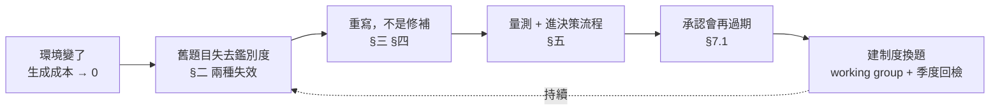

# Coinbase：AI 時代的工程師面試

> 一句話主軸（原文自己的收尾）：**不能用「沒有 AI 也能做事」的標準，去招要跟 AI 一起做事的人。**
>
> 這篇為什麼值得進 repo：它不是又一篇「AI 改變面試」的意見文，而是 [ihower §八](./ihower-harness-engineering.md#八收尾model-harness-fit-與會過期的-harness第-8-篇)「題目會過期」論證的**第三個案例，也是第一個招募側案例**。前兩例（Anthropic 效能 take-home 三個版本、Claude Code 系統提示詞砍 80%）都發生在工程內部；這篇把同一條論證放到「用來篩人的那份題目」上，而且**第一次把配套的組織機制寫出來**——季度回檢、跨職能 working group、題目退役流程。前兩例告訴你「它會過期」，這篇告訴你「那你得養一個誰來換題」。

## 目錄

- [前言：全文骨架與怎麼讀](#前言全文骨架與怎麼讀)
- [一、開場數據：5.7% → 50%+，以及最容易被誤讀的那一句](#一開場數據57--50以及最容易被誤讀的那一句)
- [二、The Challenge：兩個相反的失效模式，與 84% 那個數字](#二the-challenge兩個相反的失效模式與-84-那個數字)
- [三、Phase 1（H2 2025）：前端試點——「把 AI 打開」不等於 AI-native](#三phase-1h2-2025前端試點把-ai-打開不等於-ai-native)
- [四、Phase 2（2026-01）：後端——repo-based 題型](#四phase-22026-01後端repo-based-題型)
- [五、Phase 3（2026-03）：全公司 AI Fluency 上線](#五phase-32026-03全公司-ai-fluency-上線)
- [六、三個基準訊號，與「不加輪次」那條紀律](#六三個基準訊號與不加輪次那條紀律)
- [七、還沒解決的三件事](#七還沒解決的三件事)
- [八、為什麼公開](#八為什麼公開)
- [九、與本 repo 其他筆記的對照](#九與本-repo-其他筆記的對照)
- [十、舉證等級與可疑處](#十舉證等級與可疑處)
- [十一、兩份可執行清單](#十一兩份可執行清單)
- [十二、來源與更新](#十二來源與更新)

### 閱讀路徑建議

- **想馬上拿走可用的**：[§2.3](#23-84-相關性這篇最可抄的一招) 輪次相關性分析 → [§3.3](#33-最便宜的過期偵測) 最便宜的過期偵測 → [§4.3](#43-怎麼自己造一份-repo-based-題) 怎麼造 repo-based 題
- **你在設計 eval 而不是在招人**：[§二](#二the-challenge兩個相反的失效模式與-84-那個數字)（鑑別度的兩種死法）、[§3.1](#31-最重要的一句ai-直接把題解掉了)（施測條件變了）、[§5.4](#54-最值得抄的是最後一列)（訊號要進決策流程）、[§7.2](#72-面試表現能不能預測工作表現goodhart-風險)（Goodhart 風險）
- **你要去面這種面試**：[§十一](#十一兩份可執行清單) 第二份清單
- **只想知道哪些不能照抄**：直接跳 [§十](#十舉證等級與可疑處)。這是公司部落格＋招募品牌文，全篇單一來源、數字自報、無外部驗證

---

## 前言：全文骨架與怎麼讀

原文的章節順序是：TL;DR ＋ 開場數據 → The Challenge → 三個 Phase → 三個基準訊號 → 還沒解決的 → 為什麼公開。

但它真正的骨架不是時間軸，是一個 **eval 生命週期**：



**讀法建議**：把「面試」兩個字換成「你的 eval 套件」，整篇的論證幾乎一字不動地成立。這也是它值得進這個 repo 的理由——它是一份**寫給人類受測者的 eval 重建報告**，而 repo 其他筆記寫的是給 agent 的。兩邊的失效模式、處置方式、保鮮期問題是同構的。

---

## 一、開場數據：5.7% → 50%+，以及最容易被誤讀的那一句

### 1.1 原文說了什麼

- **2025 Q1**：合併進 codebase 的程式碼中，AI 生成佔 **5.7%**。
- **2025 Q4**：AI 生成**首次跨過 50%**。
- **人類 review 的比例接近 100%**，而且原文強調「沒有犧牲品質或合規護欄」。
- 下降的是 **human-authored**（人親手寫的），因為 **background agent 生成的程式碼**上升。

### 1.2 最容易被誤讀的那一句

原文用了一個很刻意的對比句式：**human-authored code（不是 human-reviewed code）大幅下降**。

這個括號是全篇最重要的括號。轉述時最常見的錯誤是把它壓縮成「Coinbase 已經讓 AI 自己寫程式」——原文的意思正好相反：

| 指標 | 方向 | 意思 |
| --- | --- | --- |
| AI-generated 佔比 | 5.7% → >50% | 誰**打字**變了 |
| Human-reviewed 佔比 | 維持 ~100% | 誰**負責**沒變 |
| Human-authored 佔比 | 大幅下降 | 這才是下降的那個 |

**教學重點**：「AI 佔比」是一個關於**產出來源**的指標，不是關於**人退出迴圈**的指標。這兩件事在多數公司的敘事裡被刻意混在一起，因為前者好聽、後者可怕。看到任何「AI 寫了我們 X% 的程式碼」的宣稱，第一個要問的就是 review 那一欄。

### 1.3 為什麼比例會在四季內翻近十倍

原文歸因於 **background agent**（背景代理）生成量上升，而不是「每個工程師打字變快」。

這個差別很關鍵：

- 如果是「每個人變快」，比例會**線性緩升**，因為受限於每個人的注意力。
- 如果是「background agent」，比例會**階躍**，因為一個人可以同時掛五個 agent 跑，產出上限跟人數脫鉤。

換句話說，5.7% → 50% 不是效率曲線，是**分佈改變**——產出的來源從「人的手」搬到「人的佇列」。

> 對照 [harness-engineering.md](./harness-engineering.md)：這正是 harness 存在的理由。當產出來源從手搬到佇列，你需要的不再是更好的編輯器，而是更好的**驗證與放行機制**。

### 1.4 那句被引用最多的話

原文引述一位工程主管，大意是：**當建造的成本趨近於零，「決定該建什麼」「驗證它是對的」「安全地把它送出去」就變成瓶頸**。（原句起頭是 "When the cost of building goes to zero"）

**教學重點**：這句話是整篇文章的公理，後面所有面試設計都是它的推論。而它對你的意義不是「我也要衝到 50%」，是這個推論鏈：

```
生成成本 → 0
  ⇒ 稀缺資源從「會寫」變成「會判斷」
    ⇒ 面試要量的東西必須跟著換
      ⇒ 舊題目不是變難或變簡單，是量錯東西了
```

如果你只從這篇拿走一件事，拿這個推論鏈，別拿那些百分比（理由見 [§十](#十舉證等級與可疑處)）。

### 1.5 那個逼出整篇文章的問題

原文自己把問題問得很直白：**如果我們出的幾乎所有程式碼都是 AI 生成、人類審查的，那我們憑什麼還要求候選人在 45 分鐘計時下、憑記憶、從零寫程式？**

這是一個**內部一致性**問題，不是一個技術問題。它的殺傷力在於：任何公司只要承認自己的日常工作已經變了，就無法迴避這個問句。

---

## 二、The Challenge：兩個相反的失效模式，與 84% 那個數字

### 2.1 舊題型建立在一個已經不成立的假設上

傳統題目（設計一個短網址服務、做一個訊息佇列）的設計假設是：**架構知識是稀缺資源**。它們測的是候選人有沒有內化 caching 策略、sharding 方式、一致性取捨這些正典 pattern，以及**能不能在壓力下回想起來**。

原文的判斷：這個假設在今天不成立了。任何稱職的工程師都能在一分鐘內從 AI 助手拿到一份站得住腳、技術上正確的參考架構。

**教學重點**：這裡要精確——原文說的不是「架構知識沒用了」，是「架構知識**不再稀缺**」。一份 eval 的價值來自它量的東西**稀缺且相關**。當稀缺性消失，題目不會變得「不重要」，它會變得**沒有鑑別度**——這是完全不同的失效方式。

### 2.2 兩個方向相反的失效模式

原文說他們的舊 loop 同時發展出兩個往反方向切的失效：

| 失效 | 樣子 | 原文的判斷 |
| --- | --- | --- |
| **False positive**（偽陽性） | 苦讀過、能背出短網址和分散式佇列標準答案的人**過關**，但展現不出工作上真正需要的判斷力 | 「我們拿到的訊號是**準備度**，不是**能力**」 |
| **False negative**（偽陰性） | 架構判斷力強、但沒在背 pattern 的人，被設計成考回想的題目**卡掉** | 而這些人往往**正是**在 AI-native 環境會發光的人——懂得指揮、評估、修正 AI 輸出，而不是複誦教科書答案 |

**教學重點（這是本節的核心）**：一份 eval 失效有兩種樣子，而且要分開診斷——

1. **沒有鑑別度**：大家都滿分或都零分，分不出人。處置是**加難度或換施測條件**。
2. **量錯東西**：分得出高低，但那條軸跟你要的結果無關甚至負相關。處置是**重寫題目**，加難度只會讓錯誤的軸更陡。

Coinbase 這裡中的是第 2 種——他們的題目分得很清楚，只是分出來的是「誰準備得比較勤」。**加難度會讓事情更糟**，因為會篩出更會背的人。

> 這條直接對應 [eval-engineering.md §4.4](./eval-engineering.md#44-套件規模與保鮮期)：失去鑑別度的處置是重寫而非加案例。這篇補了一個更麻煩的變體——**鑑別度還在，但軸錯了**。這種比全部滿分更難察覺，因為儀表板上看起來一切正常。

### 2.3 84% 相關性：這篇最可抄的一招

原文提到一份內部分析：**兩個不同的面試輪次之間有 84% 的相關性**——意思是兩個昂貴的輪次產出的訊號幾乎相同，而且兩者都沒在量最需要的東西。

**為什麼這招值得單獨拿出來講**：

大多數團隊檢討面試流程的方式是「大家覺得哪一輪沒用」，這是意見之爭，永遠吵不完。相關性分析把它變成一個**可計算的問題**：

```
對每個候選人，收集各輪次的評分 →
算輪次兩兩之間的相關矩陣 →
高相關的一對 = 你付了兩份成本買同一個訊號
```

高相關不一定代表要砍——也可能代表兩輪都在量一個真的很重要的東西。但它**強迫你明確回答**「第二輪多買到了什麼」，而這個問題如果答不出來，那輪就該砍。

**遷移到 agent eval**：同一招原封不動可用。如果你的 5 個 grader 之間相關性 0.9，你其實只有 1 個 grader 外加 4 份 token 帳單。這與 [eval-engineering.md](./eval-engineering.md) 的「判官獨立性」是同一枚硬幣的兩面——那邊問「判官夠不夠獨立」，這邊給了**怎麼量獨立性**的最土法但最有效的方法。

### 2.4 另外兩個發現

- **工程經理（EM）的面試流程兩年沒有實質更新**。
- **關鍵**：現有輪次中，**沒有任何一輪**充分聚焦在候選人實際上怎麼用 AI 工具——而那已經是日常工程工作的一大部分。

第二點是「量錯東西」的極端版本：不是量得不準，是**根本沒量**。

---

## 三、Phase 1（H2 2025）：前端試點——「把 AI 打開」不等於 AI-native

原文特別說明他們不是一次改完，而是**當成一般工程專案跑**：先試點、對照退場標準衡量、資料支持才擴大。這個 meta 做法本身比任何一個題型都值錢，[§六](#六三個基準訊號與不加輪次那條紀律)會回頭講。

### 3.1 最重要的一句：AI 直接把題解掉了

他們學到的第一件事：**你不能只是在既有面試裡把 AI 打開，然後宣稱它是 AI-native 的。**

當他們在標準前端程式題上開放完整 AI 協助，**AI 直接解掉了大部分題目**。

原文給的診斷極精準：**這些題目本來就不是為「有 AI 在場」的環境設計的，它們是設計來量「一個人的工作記憶裝得下什麼」。**

**教學重點**：這是 eval 過期的教科書畫面，而且要看清楚過期的到底是什麼——

- 不是題目變爛了（它昨天還好好的）。
- 不是模型作弊（它就是照題目做）。
- 是**施測條件變了**，於是原本承載鑑別度的那個約束（人腦工作記憶）消失了。

一份 eval 的鑑別度從來不只來自題目本身，而是來自 **題目 × 施測條件**。你改了任一邊，鑑別度就要重新驗證。

> 對照 [ihower §八](./ihower-harness-engineering.md#八收尾model-harness-fit-與會過期的-harness第-8-篇)：量測型元件過期的樣子是**失去鑑別度**，處置只能是**重寫**。Coinbase 這裡是這條規則的完整演示——他們試過「沿用題目、打開 AI」（等於修補），失敗；才走到重寫。

### 3.2 重寫的方向：訊號要來自「怎麼用」而不是「有沒有解出來」

新的前端面試給候選人 AI 工具、給真實的問題，但**題目結構刻意讓有意思的訊號落在使用過程上**：

- prompt 的品質
- 怎麼評估 AI 的輸出
- 怎麼抓到錯誤
- 怎麼迭代

原文的關鍵判斷：**讓 AI 生出一個解很容易；生出一個好解、知道什麼時候該信它、什麼時候該推回去，才需要技能。**

**教學重點**：這是一次**評分對象的搬移**——從 artifact（最後交出的東西）搬到 trajectory（過程）。理由很單純：當 artifact 的取得成本趨近於零，artifact 就不再攜帶訊息了。

> 這與 [eval-engineering.md §3.3](./eval-engineering.md#33-對閘門而言trajectory-比最終答案重要)「對閘門而言 trajectory 比最終答案重要」是**同一個結論從相反方向推出來的**。那邊的理由是「最終答案對了也可能是瞎猜」；這邊的理由是「最終答案對了但不花力氣」。兩邊都指向同一個處置：評過程。

**⚠️ 但要誠實面對代價**：評 trajectory 比評 artifact **貴得多、也主觀得多**。artifact 可以自動判分，trajectory 需要人看、需要 rubric、面試官之間的一致性會下降。原文沒有討論這個代價，這是我認為全篇最大的缺口之一（見 [§十](#十舉證等級與可疑處)）。

### 3.3 最便宜的過期偵測

前端試點的結果：**成功完成**，面試官效率**有可量測的提升**，早期候選人回饋正面。⚠️ 原文**沒有給任何數字**——「可量測的提升」只是一個形容詞。

**可以馬上做的落地動作**（從 3.1 反推出來的，原文沒明寫）：

> 把你現在正在用的面試題／eval 題，原封不動丟給當前最強的模型，計時看它幾分鐘解掉。

這是成本最低的過期偵測。如果模型三分鐘解完，你的題目已經不是在量能力，它在量「這個人有沒有被允許用工具」。而且這個檢查應該**每次模型大版本更新就重跑**——這正是 [§7.1](#71-half-life-problem題目的半衰期) half-life 問題的操作化。

---

## 四、Phase 2（2026-01）：後端——repo-based 題型

### 4.1 「造新題，不是改編舊題」

原文明講：擴展到後端**需要建新題目，而不是改編既有題目**。

這句話是 Phase 1 教訓的直接應用。值得停一下想清楚為什麼改編不行：舊題目的**難度來源**是「從零開始」，而 AI 讓從零開始變便宜；你改編它（加限制、加時間壓力、加邊界條件）只是在同一條已經失效的軸上加碼。新的難度來源必須來自別的地方——而他們選的是**既有的 codebase**。

### 4.2 題型長什麼樣

候選人在一個**真實的 codebase** 裡工作，**全程可用 AI 工具**，任務包括：

- debug 問題
- review 程式碼的正確性與效能
- 對 **rollback 情境**進行推理

原文說這個格式測的是工程師真正在做的事：**不是從零寫，而是跟一個既有的 codebase 和一個 AI 協作者一起（也常常是對抗地）產生更好的結果。**

它要回答三個問題：

1. 能不能 **triage 真實的問題**？
2. 能不能抓到 **AI 引入的細微 bug**？
3. **當他們接受一個 AI 生成的改動時，他們知不知道自己接受了什麼？**

**教學重點**：第三個問題是全篇最尖的一句。它把「AI fluency」從**工具熟練度**重新定義成**承擔責任的能力**——你按下 approve 的那一刻，那段程式碼就是你的了，不管誰打的字。

這也解釋了為什麼 rollback 情境會出現在一個「coding 面試」裡。rollback 推理跟寫程式無關，跟**你對自己剛接受的東西理解到什麼程度**有關。

### 4.3 怎麼自己造一份 repo-based 題

原文沒給造題方法，以下是從它的三個問題反推的可執行版本（**標記：本 repo 補，非原文**）：

1. **取材**：從自己 repo 挑一個**真實的、已經合併的 PR**，最好是當初 review 時真的漏抓過東西的那種。真實性是這類題目的全部價值——合成的 bug 有合成的味道，候選人會聞出來。
2. **埋錯**：埋一個**模型常犯**的錯，而不是人常犯的錯。兩者分佈不同：模型的典型錯是**看起來完全合理但假設錯了**（用了一個不存在的欄位、忽略了一個併發路徑、正確處理了 happy path 但預設值錯）。人的典型錯是 typo 和 off-by-one——後者對這個題目沒有價值，因為 linter 就抓得到。
3. **給 rollback 情境**：「這個改動上線後五分鐘出現 X 症狀，你 roll back 還是 roll forward？你需要什麼資訊才能決定？」——這一題**完全不需要寫程式**，但它的鑑別度可能是整場最高的。
4. **開放 AI，並明說**：不只允許，還要說明「我們會看你怎麼用」。含蓄的允許會讓候選人不敢用，你就量不到東西了。
5. **記錄 trajectory**：要能事後回看 prompt 序列。不然你評的還是 artifact。

---

## 五、Phase 3（2026-03）：全公司 AI Fluency 上線

### 5.1 定位

2026 年 3 月，他們把 AI 訊號推到工程面試 loop 的**每一個階段**——原文特別強調**不是疊加在既有流程上的一層**，而是**成為評估每個候選人的方式本身**。

「不是 overlay」這個措辭值得注意。overlay 的做法（加一個 AI 專用輪次）比較好推，但會產生一個副作用：AI 使用變成一個**獨立的、可以隔離準備的科目**。做進每一階段，才會逼出「在做真實工作時怎麼用 AI」而不是「在 AI 考試時怎麼用 AI」。

### 5.2 各階段的改動（原文以圖片表格呈現）

| 面試階段 | 之前 | 之後 |
| --- | --- | --- |
| **Pre-screen（程式評估）** | 標準程式評估 | **AI-Assisted Coding Assessment** —— 候選人全程使用 AI 工具 |
| **Live coding / Tech Execution** | 不允許使用 AI 工具 | 開啟 **AI 支援與參考資料**；候選人可以像在工作時那樣使用文件與 AI 協助 |
| **Domain / Reverse System Design**（僅適用資深職位） | 標準系統架構討論 | 現在**納入「你在真實建過的系統裡怎麼用 AI」的問題** |
| **Foundational（Hiring Manager 面試）** | 標準領導力問題 | 加入 **AI Competency 問題與評分表**；**每位 HM 都直接評估 AI fluency** |
| **Round-up & offer 審批** | 審批流程中**沒有** AI 訊號 | 每位候選人拿到一個 **AI Fluency 評級（Above / At / Below Threshold）**，且**在主管層的 offer 審批中可見** |

### 5.3 逐列讀這張表

- **Pre-screen**：把最前面、量最大的那一關換掉，代表他們接受**放大漏斗前段的變異**。這是有風險的選擇——最前面那關通常也是最自動化、最需要一致性的一關。
- **Live coding**：注意措辭是「像在工作時那樣」。這句話定義了整個新 loop 的標準——**面試環境要向工作環境對齊**，而不是相反。
- **Domain / Reverse System Design**：這一列的改動最保守（只是「納入問題」），而且**只給資深職位**。對照 [§六](#六三個基準訊號與不加輪次那條紀律) 會發現原因——真正的「用 AI 做系統設計」那一輪還在設計中、尚未上線。所以這一列是一個**過渡措施**：在新輪次做出來之前，先用行為問題撐住這個訊號。
- **Foundational**：「每位 HM 都直接評估」意味著這不是專家的事。它要求**全體 hiring manager 自己得先懂**——這是整張表裡執行成本最高的一格，原文完全沒提他們怎麼訓練 HM。

### 5.4 最值得抄的是最後一列

**AI Fluency 評級（Above / At / Below Threshold）進入 offer 審批流程，主管看得到。**

這一列在技術上最無聊，但在機制上最關鍵。理由：

> **一個訊號如果不進決策流程，它就等於不存在。**

你可以在面試裡問任何問題、產出任何評分，但如果那個分數不改變「這個人拿不拿得到 offer」，它就只是儀式。把評級做進審批畫面，才讓前面四列的所有投資產生後果。

> 這與 [eval-engineering.md §二](./eval-engineering.md#二判決要能改變-run)「判決要能改變 run」是**完全同一條原則**，只是一邊的下游是 CI/CD、一邊的下游是 offer 審批。一個 grader 如果不能擋下合併，就跟一個不能擋下 offer 的評級一樣，是裝飾。

**⚠️ 但三分級（Above / At / Below）有一個明顯的設計張力**，原文沒討論：把一個多維度的判斷壓成三檔，會讓「Below Threshold 是硬否決還是可討論」變成一個模糊地帶。硬否決會產生強烈的準備誘因（大家開始練「AI fluency 面試」），可討論則會讓評級退回裝飾。原文沒說是哪一種。

### 5.5 AI Fluency 的三個維度

原文說這個定義**對 junior 和 senior 一視同仁**：

**1. Usage（使用）**——候選人能不能有效且負責任地使用 AI 工具？會不會**選對工具**、把它用在**工作流程中對的位置**、並且產生**可量測的更好結果**？

- 教學：三個子條件是遞進的。「會用」是門檻，「用在對的位置」是判斷，「可量測的更好結果」是舉證責任。第三條把整個維度從自我宣稱拉回證據。

**2. Application（應用）**——他們知不知道**什麼時候 AI 是、什麼時候不是**正確的解法？能不能設計出**創造真實商業影響**的 AI 賦能工作流，而不只是把任務自動化？

- 教學：這一條測的是**負向判斷**——知道什麼時候**不要**用。這通常比正向能力更難教也更難裝。「不只是自動化任務」那半句是在排除一種很常見的假 fluency：把既有的爛流程自動化，跑得更快但方向沒變。

**3. Understanding Limits（理解限制）**——他們懂不懂 AI 在**哪裡會壞掉**？能不能指出**隱私與安全**的影響，並施加**適當的人類判斷作為護欄**？

- 教學：這一條就是這個 repo 的主軸。「人類判斷作為護欄」翻譯成本 repo 的語言就是 verification 層——你在 [harness-engineering.md](./harness-engineering.md) 面向 5 做的每一件事，在這裡變成一個對人的面試維度。

**⚠️ 對 junior 和 senior 同標準——這是一個有爭議的設計選擇。** 支持的理由很直白：AI fluency 不是年資的函數，junior 反而常常更熟工具。但風險是第 2、3 維度（知道何時不用、知道在哪裡壞掉）**本質上需要經驗**——你很難在沒被 AI 坑過的情況下知道它在哪裡壞。原文把它當成優點陳述，沒有討論這個張力。

### 5.6 早期成效訊號，以及它證明了什麼（沒證明什麼）

原文說：樣本仍小，但**通過新版 AI-Assisted 程式評估的候選人，在後續 onsite 的推進率明顯高於舊版評估的候選人**。他們的解讀是「我們在挑出對的人推進到 onsite，而不是抬高了門檻」，並承諾樣本變大後公布更精確的資料。

**這裡要教一個常見的效度誤讀**：

| 這個數字證明的 | 這個數字**沒有**證明的 |
| --- | --- |
| 新篩子跟**後續面試輪次**的判斷一致（stage-to-stage 一致性） | 新篩子預測**工作表現** |

推進率高只能說明前後兩關看的是同一種東西。如果後面幾關本身也量錯了，那前後一致只代表**錯得很一致**。真正的效度證據要等 [§7.2](#72-面試表現能不能預測工作表現goodhart-風險) 的 45／90 天追蹤。

公允地說：原文自己也知道，它把預測效度**明確列在「還沒解決」那一章**，沒有拿推進率去冒充。這是這篇文章可信度比較高的地方之一。

---

## 六、三個基準訊號，與「不加輪次」那條紀律

### 6.1 為什麼要抽出「訊號」這一層

原文的說法：迭代一年之後，他們落在三個訊號上，並認為一個完整的工程面試 loop 必須產出這三個。**每一輪的具體形式會變、也應該隨 AI 能力演進而變，但這三個訊號是耐久的**，因為它們反映工作真正要求的東西。

**教學重點**：這是一個很值得學的抽象層設計——把「訊號」（耐久）和「題型」（會過期）分開。這樣換題的時候你有一個不動的參照物，知道新題目要打中什麼；否則每次換題都變成從零重新爭論「面試到底要考什麼」。

> 這是 [ihower §八](./ihower-harness-engineering.md#八收尾model-harness-fit-與會過期的-harness第-8-篇)「**角色不過期、題目會過期**」在招募流程上的具體實作。ihower 那邊給的是分界線，Coinbase 這邊給的是**怎麼把分界線做成流程資產**。

### 6.2 判斷與品味是總綱，不是第四個訊號

原文明說：當執行被自動化，**判斷（judgment）與品味（taste）**是最重要的特質——知道什麼真的值得建、分得出「真的好的方案」和「只是看起來對的方案」、感覺得到什麼時候該推翻模型。

而且它特別交代：**這不另設一輪，它是下面每一個訊號最終在讀的東西。**

「分得出真的好的和看起來對的」這句話值得單獨記——那是 AI 產出物的**特徵性風險**。AI 幾乎不產出「明顯很爛」的東西，它產出「看起來完全合理」的東西。所以下游需要的能力不是找爛的，是**識破看起來對的**。

### 6.3 三個訊號逐一

原文為每個訊號標了**成熟度**，這個誠實度本身值得學（見 [§十](#十舉證等級與可疑處)）：

**1. Repo-based coding and debugging（Live，已上線）**

問的是：候選人在**既有 codebase** 裡怎麼工作？

能不能 triage 問題、debug **不是自己寫的**程式碼裡的失敗、對效能與相容性進行推理、在真實 codebase 上有效使用 AI，並且展現出**分辨「正確的改動」和「只是看起來合理的改動」**的判斷力？

原文的理由：這是最接近多數工程工作的類比，因為**你幾乎永遠不是在白紙上開始**。

**2. System design with AI（Early Testing，還在設計中）**

問的是：候選人能不能**指揮 AI 探索設計空間**（生成 schema、草擬 API 契約、壓力測試失效模式）來架構複雜系統，同時**持續施加 AI 無法替代的判斷**？

原文的判斷：系統設計的稀缺資源已經不是 pattern 回想，而是**品味與判斷**——知道哪些約束重要、哪些取捨是真的、什麼時候該推翻模型的產出。他們**正在設計這一輪，預期未來幾季試點**。

⚠️ 注意這一輪**還沒上線**。這也是為什麼 [§5.2](#52-各階段的改動原文以圖片表格呈現) 表格裡 system design 那列的改動最保守。

**3. Leadership and Behavioral（Live，已上線）**

**目的沒變**：評估候選人怎麼做決策、怎麼決定什麼值得建、怎麼處理分歧、怎麼建立信任、怎麼成長。

**變的是一個面向**：現在會**直接問他們日常怎麼用 AI**，當作**具體的行為證據**，而不是抽象的能力宣稱。

- 教學：這是標準行為面試法則（問過去的具體行為，不問假設情境）套用在 AI 上。差別在於這個領域太新，「你會怎麼用 AI」這種假設題現在人人都能講出漂亮答案；只有具體行為（上週你用它做了什麼、哪次它坑了你、你怎麼發現的）還有鑑別度。

### 6.4 「不加輪次」那條紀律

原文說這是整個重建過程中他們**堅守不讓步**的一條約束：

> **不增加輪次。** 每個新訊號要麼**取代**一個既有輪次，要麼**捕捉一個現有 loop 明顯沒在量的、清楚不同的東西**。

理由是雙向的：更長的面試對候選人是更差的體驗，對面試官是更難要求的承諾。如果講不出新輪次為什麼捕捉到不同的訊號，就不加。

**教學重點**：這是 eval 的**成本紀律**，而且是這篇最容易被跳過、卻最該抄的一條。任何評估系統的自然演化方向都是**單調膨脹**——每次出事就加一個檢查，沒人負責刪。恆定總量的約束強迫每次新增都伴隨一次刪除或一次明確的舉證。

注意這條約束跟 [§2.3](#23-84-相關性這篇最可抄的一招) 的相關性分析是**配套的**：相關性分析告訴你哪一輪可以砍，不加輪次的約束逼你真的去砍。少了任何一半，另一半都會失效。

> 對照 [eval-engineering.md §4.4](./eval-engineering.md#44-套件規模與保鮮期)：eval 套件的規模紀律是同一個問題。那邊講的是「加案例不能解決失去鑑別度」，這邊講的是「加輪次不能解決量錯東西」——同一個反射動作，同一個錯。

### 6.5 working group 模式：他們怎麼跑得這麼快

原文把這一段當成「這一切怎麼可能」的答案：

- **不是單一的由上而下命令**。
- 一個**跨職能小組**（工程師、hiring manager、招募人員）**擁有**這個 loop 並持續迭代。
- **每個改動都先當 pilot 跑，有明確的成功標準**。
- **資料支持才上線**。
- **固定週期回檢**。
- 結論：面試 loop 不是每幾年翻新一次的東西，而是**隨著工作本身改變而持續調校的活流程**。

**教學重點**：這段是全篇組織層面最有價值的內容，因為它回答了一個前面所有章節都沒回答的問題——**誰負責注意到題目過期了？**

repo 裡既有的兩個過期案例（[ihower §八](./ihower-harness-engineering.md#八收尾model-harness-fit-與會過期的-harness第-8-篇)）都只講到「它會過期，處置是重寫」，但沒有講**誰來發現、依什麼節奏發現**。Coinbase 給的答案是：**設一個常設的、有 owner 的、跨職能的小組，加上固定回檢週期**。這是把「重寫」從一個事件變成一個**職能**。

而且它有成本，原文自己在 [§7.1](#71-half-life-problem題目的半衰期) 承認：「這需要真實的持續投入」。

### 6.6 給應徵者的一段

原文直接對候選人說：**帶著你在工作上會用的工具來**。他們不測記憶或 pattern 回想，而是評估你**怎麼指揮 AI、怎麼批判它的輸出、怎麼施加判斷去決定模型是不是（以及何時）弄錯了**。最好的準備就是**去做你第一天上工會做的那種工作**。

「最好的準備是做真實的工作」這句話，同時是**招募訊息**和**防作弊設計**——當準備方式和真實工作重合，刷題的邊際效益就消失了。這是題型設計的一個很高的標準：**讓最有效的準備方式，就是真的變強。**

---

## 七、還沒解決的三件事

原文開宗明義：想誠實面對什麼還沒解決，因為整個產業在這件事上都還很早期。

### 7.1 half-life problem（題目的半衰期）

**問題**：AI 模型演進得夠快，**今天用來測 AI fluency 的題目，可能下一季的模型就能輕易解掉**。

**他們的處置**：

- 面試 loop 現在是一個**活的系統（living system）**
- **季度回檢週期**
- 一個**常設 working group** 負責**監控題目有效性**、把**不再產生訊號的題目退役**
- 原文自承：這跟多數公司經營面試流程的模式不同，而且**需要真實的持續投入**

**這一節是整篇文章對本 repo 最重要的貢獻**，理由前面說過但值得再釘一次：

| repo 既有案例 | 過期的是什麼 | 給了什麼 |
| --- | --- | --- |
| Anthropic 效能 take-home（三個版本，Claude 一路追平） | 一份人類 take-home 的鑑別度 | 證明題目會過期，且以**模型版本號**為單位 |
| Claude Code 系統提示詞砍 80% | 指令型腳手架 | 過期性論證的 **context 層**版本 |
| **Coinbase 面試 loop（本篇）** | **整套招募用 eval** | **第一次給出「誰負責換題」的組織答案**：常設 owner ＋ 季度節奏 ＋ 退役流程 |

**教學重點**：注意 Coinbase 的處置**不是「設計一個不會過期的題目」**。他們接受題目一定會過期，改為投資**換題的速度**。這個取捨方向值得記住——在變化快的領域，**可替換性**打敗**耐久性**。

> 這也呼應 [ihower §八](./ihower-harness-engineering.md#八收尾model-harness-fit-與會過期的-harness第-8-篇) 的 Bitter Lesson 收尾：別把今天這個模型的限制寫成永遠不動的架構，設計得精簡、易替換、易量測。

### 7.2 面試表現能不能預測工作表現（Goodhart 風險）

**問題**：他們在探索「面試中的 AI fluency」能不能預測「工作上的 AI fluency」。

**他們的做法**：

- 為**每位新人**建立 **45 天與 90 天的 pulse survey**
- 目標是：**100% 的新人在這兩個檢查點維持或提升他們的 AI Fluency 評級**，且**可量測地在工作中使用可用的 AI 工具**
- 承諾公布學到的東西

**⚠️ 這裡要下一個原文沒下的警告（標記：本 repo 評註，非原文）：**

「**100% 的新人維持或提升評級**」作為目標，有結構性的 Goodhart 風險，理由有三：

1. **這是一個幾乎只能往上、不能往下的指標。** 一個定義上不太可能變差的目標，能傳遞的資訊量很低。
2. **評級的給予者和使用者重疊。** 如果 45／90 天的評級由主管給，而同一個評級又被拿來驗證招募流程的效度，那麼「招募做得好」和「主管願意給高分」在資料上分不開。
3. **它獎勵的是「使用量」而不是「判斷力」。** 「可量測地在使用 AI 工具」很容易退化成計量指標（呼叫次數、採用率），而整篇文章的核心主張恰恰是**判斷力才是稀缺資源**——判斷力有時長成「這件事我不用 AI」，而那在使用量指標上是零分。

> 這正是 [eval-engineering.md §5.2](./eval-engineering.md#52-不要獎勵答案的形狀)「不要獎勵答案的形狀」的**組織版本**：當你獎勵的是可觀察的形狀（用了幾次工具）而不是難觀察的實質（用得對不對），系統會迅速學會產出那個形狀。

公允地說：原文只說這是**探索中**，並承諾公布結果。但這組指標的設計本身值得在抄之前先想清楚。

### 7.3 接下來要做什麼（V2）

原文列出正在探索的 V2 方向：

- **合併前段輪次**，縮短 time-to-signal（更快知道一個候選人行不行）
- **隔離地 A/B 測試改動**，才能乾淨地歸因結果
- 可能建立一個**候選人願意主動參與的 pre-onsite 訊號**
- 密切觀察**三個基準訊號在技術持續變動下是否保持穩定**

**教學重點**：第二點（A/B 測試以乾淨歸因）是承認一個現有的方法論弱點——他們前面一年的改動是**一次改一大包**，所以 [§5.6](#56-早期成效訊號以及它證明了什麼沒證明什麼) 那個「推進率提升」其實**無法歸因到任何單一改動**。原文沒有把這個限制跟前面的成效宣稱連起來講，但你讀的時候應該自己連。

最後一點很有意思：他們連自己剛剛建立的**三個「耐久」訊號**都放進觀察名單。這是內部一致的——如果你相信題目會過期，你就該懷疑訊號層也可能過期，只是週期更長。

---

## 八、為什麼公開

原文的收尾論點：

> **我們希望面試所依據的標準，反映我們營運所依據的標準。如果我們還在篩選「不用 AI 也能做事」的能力，就不可能招到要跟 AI 一起工作的工程師。**

以及公開的理由：整個產業都在navigating同一個轉變，把「什麼有效、什麼無效、什麼還沒被證實」攤開來講，比大家各自默默重造同一個輪子更有價值。

**教學重點**：第一句是整篇的邏輯終點，而且它是一個**可以直接套用到你自己團隊的檢查句式**：

> 我們**篩選**的標準，和我們**營運**的標準，一致嗎？

這個問句對面試有效，對 code review 標準、對 promotion rubric、對任何一種評估都有效。而且它是一個**免費**的診斷——不需要資料，只需要誠實地把兩份標準並排放。

**⚠️ 同時要看清楚這篇文章的另一個功能**：它是招募品牌內容。「歡迎來應徵」寫在最後一句。這不減損內容的價值，但影響你該怎麼讀那些數字（見 [§十](#十舉證等級與可疑處)）。

---

## 九、與本 repo 其他筆記的對照

| 本篇的內容 | repo 對應 | 關係 |
| --- | --- | --- |
| [§7.1](#71-half-life-problem題目的半衰期) half-life problem ＋ working group | [ihower §八](./ihower-harness-engineering.md#八收尾model-harness-fit-與會過期的-harness第-8-篇) 角色不過期／題目會過期 | **本篇的主要貢獻**：第三個過期案例，且第一次給出「誰負責換題」的組織機制 |
| [§3.2](#32-重寫的方向訊號要來自怎麼用而不是有沒有解出來) 評 trajectory 不評 artifact | [eval-engineering.md §3.3](./eval-engineering.md#33-對閘門而言trajectory-比最終答案重要) | 同一結論、相反推導（那邊：對了也可能瞎猜；這邊：對了但不費力） |
| [§5.4](#54-最值得抄的是最後一列) 評級進 offer 審批 | [eval-engineering.md §二](./eval-engineering.md#二判決要能改變-run) 判決要能改變 run | 完全同一條原則，下游一個是 CI／一個是 offer |
| [§2.3](#23-84-相關性這篇最可抄的一招) 輪次相關性分析 | eval-engineering 判官獨立性 | **repo 缺的操作方法**：怎麼**量**判官之間的冗餘（算相關矩陣），而不只是主張要獨立 |
| [§6.4](#64-不加輪次那條紀律) 不加輪次 | [eval-engineering.md §4.4](./eval-engineering.md#44-套件規模與保鮮期) 套件規模紀律 | 同一個反射動作（出事就加）的兩個場景 |
| [§5.5](#55-ai-fluency-的三個維度) Understanding Limits 維度 | [harness-engineering.md](./harness-engineering.md) 面向 5 Verification | 把 verification 從系統設計要求，翻譯成對人的評估維度 |
| [§7.2](#72-面試表現能不能預測工作表現goodhart-風險) 100% 維持或提升評級 | [eval-engineering.md §5.2](./eval-engineering.md#52-不要獎勵答案的形狀) 不要獎勵答案的形狀 | Goodhart 的組織版本（⚠️ 這是本 repo 評註，原文未提） |
| [§2.2](#22-兩個方向相反的失效模式) 量錯東西 vs 沒鑑別度 | [eval-engineering.md §4.4](./eval-engineering.md#44-套件規模與保鮮期) | **repo 補一個變體**：鑑別度還在但軸錯了——比全部滿分更難察覺 |

---

## 十、舉證等級與可疑處

**先定性：這是一篇公司工程部落格＋招募品牌內容，單一來源，全篇數字自報，無外部審計或第三方驗證。** 最後一句是「歡迎來應徵」。這不代表內容不可信，但代表你引用時要分級。

### 可以直接參考的（機制描述，不依賴數字）

- 兩種失效模式的分類（false positive／false negative）
- 「把 AI 打開後 AI 直接解掉題目」這個現象與其診斷
- repo-based 題型的設計、三個核心問句
- AI Fluency 三維度定義
- 不加輪次的約束
- working group ＋ 季度回檢的運作模式
- half-life 問題的陳述

理由：這些是**可以被自己複製並驗證**的做法，不需要相信 Coinbase 的任何數字。

### 引用時必須帶保留的（自報數字）

| 宣稱 | 保留 |
| --- | --- |
| **5.7% → >50% AI 生成** | ⚠️ 沒有定義「AI-generated」的判定方式。是整個 PR 算？逐行算？有 AI 參與就算？不同定義能讓同一批資料在 20%～80% 之間跳。無外部審計 |
| **~100% human-reviewed，且未犧牲品質與合規** | ⚠️「未犧牲品質」沒有給任何品質指標（事故率？回滾率？缺陷密度？）。這是一句主張，不是一個量測 |
| **84% 輪次相關性** | ⚠️ 沒說是哪兩輪、樣本多大、用什麼相關係數。方法可抄，數字別引 |
| **面試官效率有可量測的提升** | ⚠️ **完全沒有數字**。「可量測」在這裡是形容詞不是證據 |
| **新評估通過者 onsite 推進率明顯較高** | ⚠️ 原文自承樣本小。且見 [§5.6](#56-早期成效訊號以及它證明了什麼沒證明什麼)——它證明的是階段間一致性，不是預測效度。另外因為改動是整包上的（原文 [§7.3](#73-接下來要做什麼v2) 自承還沒 A/B），無法歸因到任何單一改動 |

### 原文誠實的地方（值得肯定，也值得學）

- 為三個訊號**標註成熟度**（Live / Early Testing），明說 system design 那輪**還沒上線**
- 把預測效度列進「還沒解決」，而不是拿推進率冒充
- 承認需要 A/B 才能乾淨歸因（等於承認現有成效數字歸因不清）
- 承認這個運作模式**需要真實的持續投入**
- 連自己剛建立的三個「耐久訊號」都放進觀察名單

### 本篇沒討論、但你照做會先撞到的（本 repo 評註）

1. **評 trajectory 的一致性成本**（[§3.2](#32-重寫的方向訊號要來自怎麼用而不是有沒有解出來)）。從評 artifact 換成評過程，面試官之間的評分一致性會下降，需要 rubric 與校準會議。原文完全沒提，但這是實作時最先痛的地方。
2. **每位 HM 都要能評 AI fluency**（[§5.3](#53-逐列讀這張表)）。這要求全體 hiring manager 自己先有這個能力。原文沒說怎麼訓練，而這是整張表執行成本最高的一格。
3. **Above / At / Below Threshold 是不是硬否決**（[§5.4](#54-最值得抄的是最後一列)）。沒說。是硬否決會催生一整個「AI 面試準備」產業；不是硬否決則評級退回裝飾。
4. **Junior 與 senior 同標準的張力**（[§5.5](#55-ai-fluency-的三個維度)）。第 2、3 維度本質上需要被 AI 坑過的經驗。原文當優點講，沒討論張力。
5. **公平性與工具取得差異**。候選人各自熟悉的 AI 工具不同、付費層級不同、公司提供什麼工具會直接影響表現。整篇沒提。
6. **Goodhart 風險**（[§7.2](#72-面試表現能不能預測工作表現goodhart-風險)）。「100% 維持或提升」這個目標的結構問題。

---

## 十一、兩份可執行清單

### A. 如果你要重建自己的評估流程

依成本由低到高排：

1. **跑過期偵測**（今天就能做）：把現在的題目丟給最強的模型，計時。三分鐘解完的題目已經失去鑑別度。→ [§3.3](#33-最便宜的過期偵測)
2. **算輪次相關矩陣**（一個下午）：找出付兩份錢買同一個訊號的地方。→ [§2.3](#23-84-相關性這篇最可抄的一招)
3. **問那個免費的診斷問句**：我們篩選的標準，和我們營運的標準，一致嗎？→ [§八](#八為什麼公開)
4. **立下不加輪次的約束**（一個決定）：新的必須取代舊的，或說清楚它多量到什麼。→ [§6.4](#64-不加輪次那條紀律)
5. **把訊號接進決策流程**（要動系統）：評分如果不改變結果，就是裝飾。→ [§5.4](#54-最值得抄的是最後一列)
6. **造 repo-based 題**（要投入）：真實 PR ＋ 模型典型錯誤 ＋ rollback 情境 ＋ 明說開放 AI ＋ 保留 trajectory。→ [§4.3](#43-怎麼自己造一份-repo-based-題)
7. **設常設 owner ＋ 回檢節奏**（要組織支持）：接受題目會過期，投資換題速度而不是耐久性。→ [§7.1](#71-half-life-problem題目的半衰期)

**別做的**：加難度來對抗 AI（在錯的軸上加碼）、加一個獨立的「AI 輪次」（讓 AI 使用變成可隔離準備的科目）、拿階段推進率當效度證據。

### B. 如果你要去面這種面試

原文自己給的建議是「做你第一天上工會做的那種工作」。展開成具體的：

- **會被看的不是你解不解得出來，是你怎麼解**：prompt 品質、怎麼驗證輸出、怎麼抓到錯、怎麼迭代。所以**把思考講出來**，尤其是你決定不採納 AI 建議的那些時刻——那才是他們在讀的訊號。
- **練「在別人的 codebase 裡工作」**，不是練刷題。triage、debug 不是自己寫的東西、讀 PR 找出「看起來合理但假設錯了」的改動。
- **準備 rollback 推理**：這個改動上線後出事，你 roll back 還是 roll forward？你需要什麼資訊才能決定？這題不用寫程式但鑑別度極高。
- **準備「什麼時候我不用 AI」的具體例子**：Application 維度直接在測負向判斷。只會說「AI 很好用」的人在這一維度是零分。
- **準備「AI 坑過我」的具體故事**：Understanding Limits 維度要的是這個，而且行為問題要**具體事件**，不要抽象能力宣稱。
- **知道你按下 approve 時接受了什麼**：這是後端那一輪的核心問句。可以預期會被追問你剛接受的那個改動的邊界情況。

---

## 十二、來源與更新

### 主要來源

- Coinbase Engineering — "Interviewing Engineers in the AI Era: Lessons from a Year of Rebuilding"，2026-07-13
  - https://www.coinbase.com/blog/interviewing-engineers-in-the-ai-era-lessons-from-a-year-of-rebuilding
  - 中文站同一篇（內文仍為英文）：https://www.coinbase.com/zh-tw/blog/interviewing-engineers-in-the-ai-era-lessons-from-a-year-of-rebuilding
  - ⚠️ 單一來源、公司自報、無外部驗證。舉證分級見 [§十](#十舉證等級與可疑處)
  - Phase 3 的階段對照表在原文中是**圖片**（alt: "interview eng changes"），純文字擷取抓不到；[§5.2](#52-各階段的改動原文以圖片表格呈現) 的表格是從該圖片轉錄

### 本 repo 內部連結

- [ihower-harness-engineering.md](./ihower-harness-engineering.md) — §八「角色不過期、題目會過期」。**本篇是該論證的第三例**（前兩例：Anthropic 效能 take-home 三個版本、Claude Code 系統提示詞砍 80%），且是第一個提供組織機制答案的
- [eval-engineering.md](./eval-engineering.md) — §二 判決要能改變 run（對應 [§5.4](#54-最值得抄的是最後一列)）、§3.3 trajectory 優先（對應 [§3.2](#32-重寫的方向訊號要來自怎麼用而不是有沒有解出來)）、§4.4 保鮮期與規模紀律（對應 [§2.2](#22-兩個方向相反的失效模式)、[§6.4](#64-不加輪次那條紀律)）、§5.2 不要獎勵答案的形狀（對應 [§7.2](#72-面試表現能不能預測工作表現goodhart-風險)）
- [harness-engineering.md](./harness-engineering.md) — 面向 5 Verification（對應 [§5.5](#55-ai-fluency-的三個維度) 第三維度）

### 待辦

- ⏳ 若 Coinbase 公布 45／90 天 pulse 的結果，回來補 [§7.2](#72-面試表現能不能預測工作表現goodhart-風險)——那才是預測效度的真正證據，也會驗證或推翻本篇對 Goodhart 風險的評註
- ⏳ 若 System design with AI 那一輪上線，回來補 [§6.3](#63-三個訊號逐一) 第 2 點
- ⏳ 考慮把 [§2.3](#23-84-相關性這篇最可抄的一招) 的輪次相關性分析法反向補進 [eval-engineering.md](./eval-engineering.md) 的判官獨立性章節——那邊主張要獨立，但沒給量測方法

### 更新紀錄

- **2026-08-08**：初版。逐章教學，並在三處與 repo 既有論證接線（ihower §八 過期性、eval §二 判決要能改變 run、eval §5.2 Goodhart）。原文數字全部標註舉證等級；本 repo 補充的推論與評註（[§4.3](#43-怎麼自己造一份-repo-based-題) 造題方法、[§7.2](#72-面試表現能不能預測工作表現goodhart-風險) Goodhart 風險、[§十](#十舉證等級與可疑處) 六項未討論議題）均已標記為非原文
