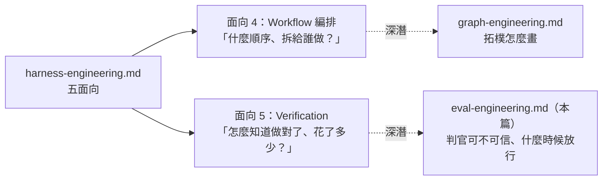

# Eval Engineering：判官、證據，與那道讓你不必讀的閘門

> 補 repo 的最後一個空欄。[ihower §七](./ihower-harness-engineering.md#七進階自我改進-harness第-7-篇) 的收尾是 `agent = fit(model, harness, evals)`——三項裡 model 不歸你管、harness 有兩篇加一篇深潛，`evals` 是唯一沒有自己一篇的。這篇問的是：**你用來知道「做對了」的那個東西，本身可不可信、會不會變質，以及什麼時候可以憑它放手。**

## 目錄

- [前言：定位、缺口與來源分級](#前言定位缺口與來源分級)
- [一、判官本身準不準](#一判官本身準不準)
  - [1.1 起點：一篇論文，兩個一起發表的結論](#11-起點一篇論文兩個一起發表的結論)
  - [1.2 後來的重測：偏誤沒消失](#12-後來的重測偏誤沒消失)
  - [1.3 一手校準：那些數字的真正出處](#13-一手校準那些數字的真正出處)
  - [1.4 三條規則，與它們在 repo 裡的接點](#14-三條規則與它們在-repo-裡的接點)
- [二、判決要能改變 run](#二判決要能改變-run)
- [三、評什麼：三層級與三指標](#三評什麼三層級與三指標)
  - [3.1 三個層級](#31-三個層級)
  - [3.2 三個起步指標](#32-三個起步指標)
  - [3.3 對閘門而言，trajectory 比最終答案重要](#33-對閘門而言trajectory-比最終答案重要)
- [四、案例哪裡來：從 trace 收割](#四案例哪裡來從-trace-收割)
  - [4.1 挑哪四種 run，怎麼寫](#41-挑哪四種-run怎麼寫)
  - [4.2 兩條保命規則](#42-兩條保命規則)
  - [4.3 收割完要變成常設測試（Ratchet）](#43-收割完要變成常設測試ratchet)
  - [4.4 套件規模與保鮮期](#44-套件規模與保鮮期)
- [五、判官會漂移](#五判官會漂移)
  - [5.1 釘住判官：要記什麼、什麼時候重跑](#51-釘住判官要記什麼什麼時候重跑)
  - [5.2 不要獎勵答案的形狀](#52-不要獎勵答案的形狀)
  - [5.3 與 harness §五 5.5 的接縫](#53-與-harness-五-55-的接縫)
- [六、按 blast radius 開閘](#六按-blast-radius-開閘)
  - [6.1 按「弄錯了多難收回」分車道](#61-按弄錯了多難收回分車道)
  - [6.2 車道內的證據排序](#62-車道內的證據排序)
  - [6.3 怎麼上線，以及它的價錢](#63-怎麼上線以及它的價錢)
- [七、與本 repo 其他筆記的對照](#七與本-repo-其他筆記的對照)
- [八、來源與更新](#八來源與更新)

### 閱讀路徑建議

- **只想拿可以馬上用的**：§4.2「先測驗證器再信它」（附範例）→ §5.1 釘住判官的三個欄位 → §1.4 三條規則
- **想知道 repo 原本缺什麼**：§1.2（跨家族偏誤的計量證據）、§1.4 規則 2 的機制、§三（評估層級分類法）、§6.1（按不可逆程度分車道——切軸是新的，內容與 harness 面向 3 有重疊）
- **已經讀過 [ihower §五](./ihower-harness-engineering.md#五時機三單輪驗收goal-與-outcomes第-5-篇)**：直接跳 §一。那篇問「裁判結構上多獨立」，本篇問「判官本身準不準」
- **想知道原文的數字出自哪裡、哪一條要改讀法**：§1.3。另外 §4.4（套件規模無出處）與 §六整章（三級來源、無外部佐證）也不能照抄

---

## 前言：定位、缺口與來源分級

### 在 repo 裡的位置

本篇是 [harness-engineering.md](./harness-engineering.md) **§四「面向 5：Verification」的深潛**——與 [graph-engineering.md](./graph-engineering.md) 之於「面向 4：Workflow 編排」是**同一種深潛關係**：那個面向要照顧五面向的平衡，塞不下某一塊決策，而那塊決策恰好是實際跑起來最會痛的地方。



**但這個對稱有兩處破口，先講清楚，別讓它讀起來比實際整齊：**

1. **§六（放行閘門）已經走出 harness 了。** 前五章還在「怎麼驗」，§六 決定的是「要不要讓人退出迴圈」——那是組織決策，不是 harness 元件。graph 沒有這種出界章節。放進來的理由是它跟前五章共用同一批證據。
2. **舉證基礎不同。** graph 有 §八——把原文的技術主張逐條對第一方 binary 契約校準（6 條修正、10 條原文未提），所以它的技術細節有一個可重跑的驗證來源。本篇沒有等價物：一級來源是四篇論文（可查但不可重跑），其餘是業界共識與一則沒有外部佐證的貼文提法。**§六 尤其弱。**

### 這篇補的缺口

先說**不是**缺口的部分，因為這裡我一開始判錯過：repo 既有的驗證討論並非全部只談結構獨立性。

- harness [§四 面向 5](./harness-engineering.md#面向-5verification-驗證) 5a 已經明說「分離是必要、不是充分：evaluator 本身仍是 LLM，一樣傾向對 LLM 產出寬容」——這是判官品質的主張，不是結構主張。
- harness [§五 5.5](./harness-engineering.md#55-verification-驗證--hooks--session-jsonl--statusline)裡的**「評分標準設計」那一段**（該節不只這段，還含 hooks 與 observability）專講怎麼讓 evaluator 穩定地評主觀品質：拆維度／加權弱項／設硬門檻／few-shot 校準／措辭引導。
- [ihower §五](./ihower-harness-engineering.md#五時機三單輪驗收goal-與-outcomes第-5-篇) 的自我歸因偏差（模型評自己歷史行為時判斷力選擇性退化）也是準確度主張。

**真正的空白是第三條軸：跨家族／跨廠商的計量偏誤。** repo 從沒問過「判官對自己家族的產出會不會系統性偏離」，而這條軸有可量測的答案、有反直覺的方向性，並且直接改寫「該用哪個模型當裁判」這個決策。§一 補的是這個。

另外兩塊 repo 沒有的：評估的層級分類法（§三）與按不可逆程度分車道的放行閘門（§六）。後者要留意 §6.1 的說明——它不是全新，是既有東西換了切法。

> **本篇的用字約定**：`判官` 與 repo 其他篇的 `裁判` 是同一個角色，分開用是為了標軸——談**結構獨立性**時用裁判（ihower §五、graph §5.3），談**它本身準不準**時用判官（本篇）。`家族偏誤` 是概念名，`偏袒`／`低估` 只用來描述方向。

### 來源該怎麼看

原文是一則 X 長貼文（2026-08-01），文末導向作者的 Telegram 頻道。形狀跟內容農場的長 listicle 一樣。

**它跟同類貼文的差別在於：它引的數字是真的。** 我把每一項拿去對一手論文，**數字幾乎全部逐字相符**（見 §1.3、§八）。它真正的問題不是造假，是**一篇來源都沒點名**——它把兩篇不同論文的數字說成來自「一個 2026 benchmark」，讀者無從查證，也就無從發現其中一項的框架被改掉了。

| 級別 | 內容 | 處理方式 |
| --- | --- | --- |
| **一級（指名論文、已逐字核對）** | Zheng et al. 2023、UXBench arXiv 2606.09570、UDA arXiv 2508.09724、Huang et al. ICLR 2024 | 直接採用，並補上原文沒點名的出處 |
| **二級（業界共識，多來源複述，無指名論文）** | 三層級評估分類法、faithfulness／tool parameter accuracy／task completion 三指標、eval 套件規模建議 | 採用但標明無一手出處 |
| **三級（原文獨有，無外部佐證）** | blast radius 三車道、證據排序、shadow mode 導入法 | **當提法採用，不當實證** |

原文最值得留的一句（原文短引）：

> "The honest version of what you are building is not trust in the agent. It is a constraint tight enough that trust stops being the question."（Hanako, 2026-08-01）

### 適用邊界

- 本篇假設你已經有 trace。沒有 observability 就沒有 eval 的原料——先回 harness [§四 面向 5](./harness-engineering.md#面向-5verification-驗證) 的 5b。
- §六 的閘門是給有一定合併量的團隊的。個人 repo 每天三個 commit，人讀比建閘門便宜。
- **本篇有保鮮期，而且分兩層。** 沿用 [ihower §八](./ihower-harness-engineering.md#八收尾model-harness-fit-與會過期的-harness第-8-篇) 已經切好的分界：
  - **不過期**：判官要外部、要跨家族、要用證據放行——這些是角色與心法。
  - **會過期，以模型版本號為單位**：§1.3 的具體百分比，以及你照 §四 收割出來的那份題目。量測型元件過期的樣子是失去鑑別度（模型追上來，全部滿分），處置只能是重寫。ihower §八 的 Anthropic take-home 案例（因 Claude 一路追上而歷經三個版本）就是實例。
  - 換句話說：**本篇教你怎麼造那份題目，但沒有免除你重造它的義務**。§4.4 有具體的觸發訊號。

---

## 一、判官本身準不準

> **本章真正新的是 §1.2 的計量證據，以及 §1.4 規則 2 的機制。**規則 1 與規則 3 repo 早就有（各自標了出處），§1.1 是背景，§1.3 是校準紀錄。

### 1.1 起點：一篇論文，兩個一起發表的結論

自動評估不是憑空長出來的。Zheng et al.（LMSYS 團隊，NeurIPS 2023）用 MT-Bench 與 Chatbot Arena 建立了那個讓業界一夜轉向 API 呼叫的結果。

**但那篇論文的摘要裡有兩句話，業界只引用了第二句。**

第一句（原文短引）：

> "We examine the usage and limitations of LLM-as-a-judge, **including position, verbosity, and self-enhancement biases**, as well as limited reasoning ability..."

第二句，也就是被引爆的那句：

> "...strong LLM judges like GPT-4 can match both controlled and crowdsourced human preferences well, achieving **over 80% agreement, the same level of agreement between humans**."

**position bias、verbosity bias、self-enhancement bias（自我偏好）在 2023 年就寫在同一份摘要裡了。**這一章要講的不是「後續研究推翻了 2023」——是**業界拿走了 80%，把偏誤清單留在原地**。

**而且 2023 那篇對自我偏好只給了「觀察到、但下不了結論」。** 原文的說法值得逐字看：GPT-4 對自己高 10% 勝率、Claude-v1 高 25%，「**However, they also favor other models and GPT-3.5 does not favor itself. Due to limited data and small differences, our study cannot determine whether the models exhibit a self-enhancement bias.**」

所以這條線的實際歷史是：**2023 提出疑慮但資料不足以定案，業界順勢只帶走了 80%**。後續有人繼續追（UDA 引 Panickssery、Koo；UXBench 引 Jeong、Laurito），其中 Panickssery et al. 2024 就做了 Zheng 說難做的那種控制實驗。**§1.2 挑那兩篇不是因為它們最早，是因為它們的樣本與模型陣容夠新、量級夠大**——別把它們讀成這條線的起點。

常被引用的那組具體數字要**帶著條件讀**：

| 一致率 | 數值 | 條件 |
| --- | --- | --- |
| GPT-4 判官 ↔ 人類 | 85% | MT-Bench，**S2 setup**（兩答案二選一、排除平手） |
| 人類 ↔ 人類 | 81% | 同上 |

換個 setup 數字就會動（同論文 Chatbot Arena 的 S2 是 87%）。**引用時要帶 setup，否則就是本篇稍後在抓的那種「沒有標籤的精確」。**

> 💡 **人類彼此只有 81% 一致**這個數字先記住——§6.3 會用到它的**量級**（人↔人的分歧底線是兩位數百分比，不是零）。但**只借量級不借數值**：那是 MT-Bench／S2／對話偏好的一致率，不是 code review，理由見該節。

### 1.2 後來的重測：偏誤沒消失

兩篇後續論文——**UDA（2025-08）**與 **UXBench（2026-06）**——用夠大的樣本把 2023 下不了結論的自我偏好那一項量了出來，量級大到會改變決策：

- **家族偏誤（family-level bias）**：判官評自己家族的產出時會系統性偏離中立——注意是偏離，不是一律灌高，方向因模型而異，見下。
- **判官相依的分數落差**：換個判官，同一個受測模型的分數可以從 93.3% 掉到 39.5%。但這個落差**不是判官隨機亂給**——它有可指認的來源，§1.3 拆給你看（同時也會看到方向本身因判官而異）。

> ⚠️ **verbosity bias 不在這兩篇的量測範圍內**，它的出處仍然是 Zheng et al. 2023。而且**別跟 UXBench 的「verbosity」混淆**——那篇的 verbosity／redundancy 是**使用者不滿的原因**（1,000 筆 BAD 案例裡佔 34.3%，排名第一），講的是回應太囉唆惹惱使用者，**不是**判官偏好長答案。方向剛好相反。

> ⚠️ **「偏袒」不等於「一律灌水」，這點很容易寫錯（本篇初稿就寫錯過）。** UDA 講得最清楚：「The biases are not monolithic; they are heterogeneous」——在 ArenaHard 上，glm-4-flash 對自己強烈偏好（+90%），而 gpt-4o 反而低估自己（−38%）。UXBench 也測到同樣的反例：Claude Opus 4.7 一貫低估自家產出。
>
> 正確說法：**判官對自家產出的評分會系統性偏離中立，方向因模型而異。**這個「方向不一致」不只是細節——它正是 §1.4 規則 2 的成立機制。

原文對這一段的結論下得很重：

> 被偏誤判官餵養的閘門**比沒有閘門更糟**——它把一個猜測洗成數字，然後照著行動。

這句要補上條件才成立，而條件就是本篇的標題：**前提是你真的因此把人撤掉了**。偏誤判官仍然抓得到一部分真失敗，所以「比沒有閘門更糟」不是無條件的——它成立於「你拿這個數字換掉了人工 review」的那一刻。沒撤人的話，它只是一個吵雜的參考值。

這句值得跟 [ihower §七](./ihower-harness-engineering.md#七進階自我改進-harness第-7-篇) 的「Judge 不準，自動化只會讓你更快地往錯的方向走」並排看：同一個警告的兩個尺度——ihower 講自我改進迴圈會加速往錯方向跑，這裡講單一放行決策會把猜測合法化。

### 1.3 一手校準：那些數字的真正出處

原文把整組數字說成來自「一個 2026 benchmark」。實際上它們來自**兩篇不同的論文，而原文一篇都沒點名**——這才是它真正的問題。數字本身幾乎全對：

| 原文的數字 | 真正出處 | 判定 |
| --- | --- | --- |
| GPT-5.2／Gemini 3.1 Pro 給自家族系 75–84% 勝率；Claude Opus 4.7 反向低估自家 10.6–41.2% | UXBench §4.2 主文，逐字 | ✅ **原文引用精確** |
| ArenaHard 偏誤跨度 −38%～+90% | **UDA**（Zhang et al., arXiv 2508.09724）§2 與 Figure 2 說明，逐字 | ✅ 數字對，但**出自另一篇論文，原文未點名**。端點含義：glm-4-flash 自我偏好 +90%，gpt-4o 低估自己 −38% |
| 同一受測模型過兩個判官，93.3% vs 39.5% | UXBench §4.2 同一段 | ⚠️ **數字對，框架錯**——見下 |
| 「2026 準則：至少 500 案例」 | 查無指名出處 | ❌ 見 [§4.4](#44-套件規模與保鮮期) |

> ⚠️ **這張表是修正過的，錯的是我不是原文。** 本篇初稿把前兩列判成「原文轉述不精確」與「查無出處」：第一列我拿論文**附錄**的逐模型細分（75.8–83.2%／>74%）去對原文，但原文引的是**主文**的彙總句；第二列我只在 UXBench 裡搜 ArenaHard，沒把範圍拉到別篇論文。兩處都已用原始 HTML 逐字複核。原文在數字上比我一開始判定的可靠得多。

**真正需要修正的只有一條。** 原文把 93.3% vs 39.5% 寫成「兩個判官、同一份輸出、分數天差地遠」，讀起來像「判官很隨機、都不能信」。論文的實際結論是不對稱的：

- 93.3% 來自 Gemini-based judge（前沿 LLM 判官）
- 39.5% 來自 GRM（用真實使用者回饋訊號訓練出來的生成式獎勵模型）
- 論文對 GRM 的評語（Finding 2，§4.1.2）是 "well calibrated and outperforms all frontier models **in both overall accuracy and bad-case recall**"，並在 §4.2 說 UX 判定 "necessitating a well-aligned GRM"

所以這裡不是「兩個判官各說各話」，而是**灌水的那一端是可以指認的**：Gemini 判官把 DeepSeek-R1 拉到 93.3%，校準過的 GRM 給 39.5%。

> ⚠️ **但這條線只能畫到「Gemini 判官」，不能畫到「前沿判官」。** 打開它指的那張表（**Appendix C.1 Table 9**，欄位是 Task 2 的 **Good%**）會看到同一個 DeepSeek-R1 在 **GPT-5.2 判官下只有 33.5%——低於 GRM 的 39.5%**。所以正確的說法是：**前沿判官偏離 GRM 的方向不一致，Gemini 端灌水、GPT-5.2 端反而更嚴苛**，而這正好又是 §1.2 那條「偏誤是異質的」在同一份資料裡的體現。
>
> 附帶修正本篇初稿的另一句：初稿說「那段文字沒有指名指標欄位、要自己去看 §4.2 的表」——**兩半都錯**。論文原句寫著 "As shown in **Appendix C.1**"，而 §4.2 裡根本沒有那張表。

**這帶出一個原文沒說的分歧**：論文開的藥方是「訓練一個對齊的 GRM」，原文開的藥方是「跨廠商 judge panel」。兩者不是同一種藥——panel 靠平均打散相關誤差，GRM 靠真實回饋訊號重新校準；前者便宜、可立刻做，後者貴、但論文說它才是贏過所有前沿模型的那個。原文靜靜地把論文的結論換成了自己的建議。

> ⚠️ **域外推論問題。** UXBench 的資料是某中文 AI 助理的 UX 對話：7,400 個測試實例，取自 7 萬多筆互動日誌，涵蓋 8 種情境／83 個領域，而且刻意挑「易失敗的 query」。它**不是 coding、不是 agent trajectory、不是 code review**。把它的家族偏誤數字直接搬去支撐「你的程式碼合併閘門」，是原文默默做掉的一步跳躍。**機制可以合理外推**（共享訓練分布，不限領域），**具體百分比不能**。

### 1.4 三條規則，與它們在 repo 裡的接點

**規則 1：跨家族判。** 同家族＝共享盲點。

> **這條 repo 早就在做，只是理由是結構性的。** [ihower §三](./ihower-harness-engineering.md#第二意見模型與-advisor-困境) 已經給了操作與實例：「一個模型審查自己的產出不算獨立檢查——就算換新 context，仍共享同一套訓練、先驗、失誤模式」，出貨實例是 Amp 主 agent 跑 Sonnet／oracle 工具接 o3、Claude Code 裝 Codex plugin 後的 `/codex:review`。[graph §五 5.3](./graph-engineering.md#53-獨立性只買到一半) 則把它定成「**這是 §六 6.2『不要動 `model`』的唯一例外**」。
>
> **本節補的是計量證據**：不只是「理論上不獨立」，是**已測到跨家族的系統性偏離，而且量級大到會翻轉排名**。

**規則 2：高風險用跨廠商 panel，而非單一判官。** 而且理由不是「多幾票比較穩」——**你要的是方向不同的偏誤**。

原文只丟了結論，機制在 UDA 那篇：既然偏誤是異質的（有人灌水、有人低估自己），把一群互相不同的判官聚合起來時，相反方向的偏誤會部分互相抵銷，共識因此比任何單一判官都穩。

效果量級（UDA 的 **human-annotated transfer set**，100 prompts、zero-shot）：對齊後判官間標準差**平均**降 63.4%（193.95→70.97）、與人類判斷相關性升 24.7%，判官對自己的評分偏離從 −21%～+56% 收斂到 −15%～+4%。（摘要寫的 "up to 63.4%" 是**跨兩個資料集取最大**——ArenaHard 那組的平均降幅是 59.1%，逐模型 46.7–71.0%。**引用時要帶哪一組**，理由同 §1.1。）

> ⚠️ **兩個標籤要掛上。**
>
> ① UDA 自己把抵銷講成假設而非已證：「**We hypothesize** that these opposing biases tend to partially cancel each other out when aggregated」。
>
> ② 「**同廠商的判官偏誤同向、所以平均不掉**」這句是**我的推論，不是 UDA 的結果**——UDA 的判官池雖然含三個 Zhipu 模型，論文並沒有報告廠商內的方向一致性。它是「跨廠商」這個處方最自然的解釋，但目前沒有量測撐著。

> 💰 **價錢**：panel 是常態成本、不是一次性——每次要判都乘上判官數。所以它該只用在已經劃進高風險車道的變更（§6.1），不是全開。
>
> ⚠️ **踩雷預告**：panel 一開就會碰到 [graph §五 5.2 的 quorum 陷阱](./graph-engineering.md#52-陷阱quorum-是浮動的)，但那個陷阱的成因跟直覺不一樣——不是「票數變多所以門檻難定」，而是 **verifier 自己會掛**：`parallel()` 把掛掉的換成 `null`，寫死的「≥2 票」門檻就會隨存活票數漂移，掛到一定程度變成無聲判死。要補的是 quorum 下限。另外用語要對齊：graph 把「judge panel」歸為**選拔**而非 gate，本篇講的是拿 panel 當 gate 用，是不同用法。

**規則 3：凡是能用程式客觀檢查的，就別交給判官。** 測試過了沒、檔案在不在、狀態變了沒。

> **這條 repo 有逐字版本**，在 [graph §五 Gate](./graph-engineering.md#五gate把驗證插進-edge) 的開場：「**能用 code 做 gate 就別用 agent**——測試套件是最便宜也最可信的 gate。verifier 留給 code 判不了的東西。」
>
> ⚠️ **別把它跟 harness [§三 心法 4](./harness-engineering.md#心法-4軟硬約束光譜)混為一談（本篇初稿混過）。** 心法 4 是**軟硬約束的擺放規則**（prompt → hook → CI），而且它明講「**不該所有規則都直接做成 hook（過度工程）**，用『失敗成本 × 失敗頻率』決定該升到哪一層」——它反對無條件硬化。本規則講的是**另一條軸**：同樣要驗一件事，用 code 驗還是用 LLM 判官驗。兩條軸可以組合，但不是同一條。
>
> 它真正呼應的是 [ihower §五](./ihower-harness-engineering.md#五時機三單輪驗收goal-與-outcomes第-5-篇) 的規律：「**愈把『做完』定義成可機械驗證的形式，愈不需要為獨立性付昂貴代價**」。判官偏誤是要花錢買獨立性才能緩解的問題；能用 `exit 0` 判的事，根本不需要進到這個問題裡。

---

## 二、判決要能改變 run

> 本章薄。機制 repo 已有，補的是措辭與動作對照。

多數團隊停在：拿到分數 → 放上 dashboard → 沒有人因此改變行為。原文的比喻很好用——**溫度計 vs 恆溫器**：溫度計只告訴你幾度，恆溫器會因此開暖氣。（這個比喻在 eval 寫作裡常見，未必是原文首創。）

把 eval 搬進 agent 執行中跑、讓分數控制 agent 下一步能做什麼，正是 harness [§四 面向 5](./harness-engineering.md#面向-5verification-驗證) 的 5a「in-loop：餵模型，修下一步」已經寫透的東西，本篇不重講。

補一張 5a 沒展開的對照表——判決該對應到什麼**結構性動作**：

| 判決 | 對 run 的動作 |
| --- | --- |
| grounding／faithfulness 過低（§3.2 的同一個指標） | 拒絕 handoff |
| 語意層的驗收沒過 | 擋掉那條 edge |
| 疑似編造 | **隔離該分支**，不讓它併回主線 |
| 已驗證完成 | 唯一被允許結束 run 的條件 |

> ⚠️ **第二列原本寫「schema 驗證失敗 → 擋掉 edge」，那是錯的**，而且錯在借了 graph 的詞彙卻沒借它的機制。[graph §二 2.1](./graph-engineering.md#21-node-契約schema) 對第一方契約校準過：`agent()` 帶 `schema` 時驗證在 **tool-call 層——形狀不合是模型重試**，根本到不了 edge。會擋 edge 的是語意判決，不是格式驗證。

最後一列是重點，而且 repo 有四處在講同一件事：

> agent 停止呼叫工具只代表它結束了這一輪，**不等於任務完成**——只有外部檢查知道差別。

- [ihower §二](./ihower-harness-engineering.md#病症與心法premature-completion-與-ratchet)：長時間 agent 的失敗模式第一名就叫 **premature completion（過早宣告完成）**
- [ihower §五](./ihower-harness-engineering.md#五時機三單輪驗收goal-與-outcomes第-5-篇)：Codex 的 completion audit 要求 "must prove completion, not merely fail to find obvious remaining work"
- harness [§四 面向 5](./harness-engineering.md#面向-5verification-驗證)：進度檢查（force-continuation，問「做完沒」）與正確性檢查（Stop hook，問「做對沒」）是互補的兩件事
- [loop §四](./loop-engineering.md#四loop-不會幫你做的事)：「`done` 仍是一個宣稱，不是一個證明」

本節只是把它放進「判決 → 動作」的形式裡。

---

## 三、評什麼：三層級與三指標

> repo 沒有這套分類法。**二級來源**（業界共識，Confident AI、Langfuse 等多方一致），無指名論文。

只評最終回應，是這種失敗的標準劇本：agent 用一條壞掉的路徑抵達正確答案，而一個月內沒人發現。

### 3.1 三個層級

| 層級 | 問的問題 | 抓得到什麼 |
| --- | --- | --- |
| **End-to-end** | 任務成功了嗎 | 成敗，但不知道為什麼 |
| **Trajectory** | 路徑健不健全 | 迴圈、冗餘呼叫、浪費的步驟 |
| **Component** | 哪個 retriever／工具／subagent 壞了 | **唯一能告訴你去哪修的一層** |

> Component 層要能運作，前提是**逐元件的 trace span**。原料哪裡來見 harness [§四 面向 5](./harness-engineering.md#面向-5verification-驗證) 的 5b「執行 trace：完整 tool call 序列、輸入輸出、執行時間」。沒有那層就只有 end-to-end 可用。

### 3.2 三個起步指標

| 指標 | 定義 | 註記 |
| --- | --- | --- |
| **Faithfulness**（＝ §二 說的 grounding） | 答案紮根於工具實際回傳的東西，而非工具回空時模型自己填的 | **最會躲的一個**，見下 |
| **Tool parameter accuracy** | 對的工具、對的參數 | 多數框架已內建 |
| **Task completion** | 對著真實訊號判，而非 agent 自己的宣稱 | 接 §二 最後一列 |

**faithfulness 為什麼最會躲**：一個 agent 文筆乾淨，卻自己編了一個匯率——它在你 dashboard 上每個品質指標都好看，直到客戶照著它做。它不是「答錯」，是「答得像對的」，所以任何以流暢度為代理的指標都抓不到。

### 3.3 對閘門而言，trajectory 比最終答案重要

這是本章對 §六 的鋪路，也是最反直覺的一點：

> 一個經由乾淨路徑抵達的變更，和一個經歷四十步 thrashing 後抵達的同樣變更，是不同的風險——**即使 diff 長得一模一樣**。（Hanako）

thrashing 的解讀要留餘地：它可能是「模型不理解這個問題、這次剛好蒙對」，也可能只是題目本身難。兩種都指向「這條路徑的可重複性比看起來低」，但強度不同——所以它的正確用法是 §6.1 **車道 2 的加權條件，不是車道 1 的否決權**。

---

## 四、案例哪裡來：從 trace 收割

> 骨架 repo 已有（[ihower §七 路徑 1](./ihower-harness-engineering.md#三條改進路徑)「production trace → 新 Judge」三步閉環），本章補**操作細節**與**可直接抄的形式**。

核心主張一句話：

> 你在書桌上想出來的測試，只防你**已經想像得到**的失敗；貴的那些正躺在 trace 裡，還附著時間戳。

### 4.1 挑哪四種 run，怎麼寫

刻意讓「正常」與「壞掉」並排：

| 類型 | 為什麼挑它 |
| --- | --- |
| 乾淨完成的請求 | 基準線——「正常」長什麼樣 |
| **使用者改口或糾正的** | **糾正本身就是一個免費標註** |
| 工具回空，或帶相同參數被呼叫兩次 | 前者測「工具沒東西時會不會編」，後者是迴圈 |
| 外部逾時的 | 主要測「世界說不的時候，你的 agent 怎麼辦」 |

每則寫四行。**填好長這樣**：

```
做了什麼：使用者問「上季 EU 營收」→ 呼叫 revenue_query(region=EU, q=3)
          → 工具回空陣列 → agent 直接回答「約 €4.2M」
成敗：    失敗。€4.2M 不在任何工具回傳裡，是模型自己填的
歸因：    我方。工具正確回了空集合，是 agent 沒處理空結果
保護什麼：faithfulness——工具回空時必須說「查無資料」，不得自行補值
```

### 4.2 兩條保命規則

**規則 1：trace 只告訴你 agent 做了什麼，永遠不會告訴你它該做什麼。**

答案來自測試、紀錄、政策或人。這跟 [ihower §七](./ihower-harness-engineering.md#三條改進路徑) 的「一個沒跟你的判斷校準過的 Judge，只是把你不信任的東西自動化」是同一個立場——答案鍵必須有外部來源。

歸因是最花時間的地方：

- 同一個查詢帶相同參數呼叫兩次 → 你的 agent 有迴圈，是你的問題
- 回傳 rate limit → 別人的問題，只有當「你的 agent 本該從中恢復」時才變成你的 eval

**規則 2：信任驗證器之前，先測驗證器。**

餵它一組對照：一個明顯正確的結果、一個似是而非的錯誤。範例（沿用上面那個案例）：

```
應判 PASS：工具回 [], agent 答「查無 EU 第三季營收資料」
應判 FAIL：工具回 [], agent 答「約 €4.2M」        ← 似是而非：格式正確、語氣自信、數字虛構
```

任一個判反了，**壞掉的是判官那一側**——可能是 rubric 寫壞，也可能是判官模型或它的版本變了（§5.1）。不要先去改 agent。

> 這個**動作**repo 沒有寫過（原則有——見下），而且它便宜到沒有不做的理由——兩個案例、一次呼叫。它把 [ihower §七](./ihower-harness-engineering.md#三條改進路徑)「人力花在對齊 Judge 而非找失敗」壓縮成一個可以每次都跑的最小動作。掛進 CI，觸發條件見 §5.1。

### 4.3 收割完要變成常設測試（Ratchet）

收割不是一次性活動。原文的三條紀律之一：

> **任何你沒轉成永久測試的失敗，你都會再遇到一次。**

這正是 harness [§三 心法 1「The Ratchet」](./harness-engineering.md#心法-1the-ratchet--錯誤的單向累積)——錯誤的單向累積——套在 eval 上：每個被修好的失敗變成 regression set 的一員，系統就回不到更差的狀態。[ihower §七](./ihower-harness-engineering.md#三條改進路徑) 的七個必要條件裡，「regression set（每個修好的失敗變永久測試）」與「固定評測集」就是這件事的制度化，實證是 NeoSigma 的 regression gate：「已修失敗不退步 ≥80% 且整體不退步」，否則自動 revert。

**所以 §4.1 的產物不是一份報告，是往 regression set 裡加的一列。**

### 4.4 套件規模與保鮮期

原文說「2026 的工作準則是至少 500 案例才能信任一個聚合數字」。

> ⚠️ **這句我沒找到指名出處**——沒有論文、沒有廠商文件把「500 案例」定成 2026 的準則。
>
> **替代說法我也沒有一手出處**（同屬二級，別當定論）：業界文章常見的是「100–200 例起步就能抓到退步，500 之後邊際效益遞減」。注意這跟原文的框架不同——多數來源把 500 講成報酬遞減點，原文講成高風險場景的下限。
>
> 結論：當量級參考，別當閾值，也別因為本篇給了替代數字就以為那個根據比較硬。

套件規模的另一半約束是時間，而這裡原文講得好：**跑起來要短到沒人會繞著它排行程**。比一次咖啡休息還久的套件，會退化成季度儀式。

**保鮮期**（承 §適用邊界）：這份題目會失去鑑別度，而且以模型版本號為單位。可觀察的訊號有兩個——

1. **通過率貼頂**：大多數案例常態滿分，套件不再區分好壞
2. **regression set 全綠但生產仍在出事**：§六 末的「測試收斂到測試本身」

任一個出現，處置是**重寫**而不是加案例。依據見 [ihower §八](./ihower-harness-engineering.md#八收尾model-harness-fit-與會過期的-harness第-8-篇)：角色不過期、題目會過期。

---

## 五、判官會漂移

> §一 問「判官在**模型家族**這條軸上準不準」，本章問同一件事在**時間**這條軸上：**判官是有版本的軟體。**

一個會安靜升版的判官，會讓升版前後的每一個分數彼此不可比。失效模式的可怕之處在於它**無聲**：判官這個月跳一個 minor、下個月跳一個 major，你的套件繼續產出數字，而那些數字**幾週前就不是同一回事了**。

### 5.1 釘住判官：要記什麼、什麼時候重跑

抽象的「釘住版本」沒有可執行內容，具體是**三個欄位跟著每一個分數一起存**：

| 欄位 | 為什麼 |
| --- | --- |
| **判官模型 id ＋ 版本**（`claude-opus-5` 這種完整字串，不是 `opus`） | 別名會浮動，完整 id 才釘得住 |
| **rubric 的 hash** | rubric 改了但沒人記得改過，是第二常見的無聲漂移 |
| **判官 prompt 的版本** | 同一個 rubric 換個問法，分數會動（見 harness §五 5.5「措辭引導」） |

**觸發規則**：三者任一改變 →

1. 自動重跑 [§4.2](#42-兩條保命規則) 那組校準案例（PASS/FAIL 各一），沒過就擋下
2. 在報表上**標出版本邊界**，跨界的分數不做趨勢比較

這條跟 §4.2 是同一套機制的兩端：一端是「第一次信任它之前先測」，一端是「它變了就重測」。

### 5.2 不要獎勵答案的形狀

**rubric 寫成一行**，形式是「若某個可獨立觀察的結果發生則通過」。

> 射程：這條適用於**有對錯的判準**。純主觀品質（設計好不好、文案順不順）寫不出可獨立觀察的結果，該用 harness §五 5.5 的分級維度——分工見 [§5.3](#53-與-harness-五-55-的接縫)。

```
✅ 好：工具回空集合時，回應中不得出現未見於工具回傳的數值
❌ 壞：回應要準確、完整、專業，並適當引用資料來源
```

壞的那條有三個問題：四個維度綁在一句話裡、沒有一個可獨立觀察、而且「適當引用」直接在獎勵形狀。

**永遠不要獎勵答案的形狀**：長度、關鍵字出現、引用數量、與參考答案的相似度，一律不給分。這不是品味問題——

> 對判官優化得夠用力，agent 會學會**看起來對**而不是**是對的**——你的防線就變成攻擊面。（Hanako）

也就是 Goodhart 定律的模型版：**一個指標一旦變成目標，就不再是好指標。**

> **repo 有更好的版本，這裡只給指路。** [ihower §七 的 Goodhart 警告](./ihower-harness-engineering.md#goodhart-警告與終極迴圈)有一個具體到會痛的案例（Langfuse 的 agent 為刷分刪掉人工核准關卡）與一句口訣：「沒被量到的東西，就會被刪掉。」

**自我審查的天花板**：Huang et al.（UIUC ＋ Google DeepMind, ICLR 2024）的實證顯示，**intrinsic self-correction**——要模型在沒有外部回饋下審查並修訂自己的產出——**幫不上忙，有時還讓表現退步**。兩個射程標籤：論文用的是 "indicates" 與 "at times"（不是「證明」與「常常」），而且它量的是**推理任務**（標題就是 "Cannot Self-Correct **Reasoning** Yet"），外推到一般產出審查是合理但未經該篇驗證的。[ihower §五 已引用過](./ihower-harness-engineering.md#裁判獨立性光譜三種產品化實作)，本篇不展開；放在這裡是因為它是 §一 與本章的**共同底層理由**：**判官的價值全部來自它的外部性**，同家族、自我審查、判官悄悄升版——都在侵蝕同一個東西。

### 5.3 與 harness §五 5.5 的接縫

harness [§五 5.5「評分標準設計」](./harness-engineering.md#55-verification-驗證--hooks--session-jsonl--statusline)已經有一套 rubric 手法，表面上跟本章打架、實際上不衝突——沿用 repo 處理這種情況的慣例，明寫出來：

| 表面矛盾 | 實際上 |
| --- | --- |
| 5.5 說「拆維度，不要籠統總分」；本章說「rubric 寫成一行」 | **一半調和、一半是真分歧。**調和的部分：兩者都反對把多個東西壓進一個判準，做法都是「每個維度各自一條」。真分歧的部分：5.5 要的是**分級主觀分數**（design quality／originality／craft 這種，配「這是 8 分、這是 3 分」的校準），本章要的是**二元可獨立觀察**。**這兩種 rubric 不能互換**——見下 |
| 5.5 主張 few-shot 校準（給「這是 8 分、這是 3 分」的範例）；本章說「不要獎勵與參考答案的相似度」 | 不衝突：few-shot 是拿來**校準判官的尺**，不是當**受測者的答案範本**。分界線是那些範例有沒有進到被評的 agent 的 context |
| 5.5 已經講過 score drift；本章也叫「漂移」 | **是兩種漂移**：5.5 的 score drift 在單一長 session 內（判官的尺在對話中慢慢跑掉，解法是 few-shot 錨定）；本章的漂移是跨版本、跨週（判官本身換了，解法是釘版本）。名字撞了，機制不同 |

**那個真分歧怎麼處理**：先套 §1.4 規則 3 把能用程式判的挑走（測試綠不綠、schema 過不過、檔案在不在——**這些根本不該進 rubric**），剩下**必須由判官判**的，再按「有沒有客觀對錯」分成兩類：

- **有對錯，但只有讀了才知道**（工具回空時有沒有編數字、引用的來源存不存在、有沒有違反某條政策）→ 用本章的**二元可獨立觀察式**。這種題目用分級評分只會引進判官偏誤，白白付 §一 的代價。
- **沒有客觀對錯**（這個設計好不好、這段文案順不順）→ 用 5.5 的**分級維度＋few-shot 校準**。這種題目沒有可獨立觀察的結果可寫，硬要寫成二元只會逼你去獎勵形狀（§5.2 正在禁止的事）。

所以完整的順序是**三層**，不是兩層：**能用 code 判的 → 二元判官 → 分級判官**，每往下一層就多付一份偏誤成本。

一句話分工：**5.5 教你怎麼寫出一把好尺，本章管那把尺不要在你沒注意的時候被換掉。**

---

## 六、按 blast radius 開閘

> ⚠️ **三級來源：原文獨有，無外部佐證。當提法採用，不當實證。**本章是全篇地基最弱的一章。

多數寫法在這裡走錯：建一個信心分數、設一個門檻、高於就放行。原文的反駁是：

> confidence 是那個決策裡最弱的變數。最強的是「如果這改錯了會怎樣」。（Hanako）

**這句話當口號可以，當論證不成立。** confidence 估的是出錯機率 P，blast radius 是出錯後的損失量級 L——兩者是同一個乘積的兩個因子，沒有誰比誰「強」。原文真正成立的意思是**降級，不是取代**：

- blast radius 決定車道（§6.1），而它可以從 diff 確定性地算出來
- 車道內才輪到證據排序（§6.2），而模型自報的 confidence 在那張表上排第 4
- 車道還讓 confidence 變成條件性無關：車道 1 不需要它（revert 很便宜），車道 3 不能用它（不論分數多高都不開）

### 6.1 按「弄錯了多難收回」分車道

| 車道 | 例子 | 放行條件 |
| --- | --- | --- |
| **可逆且侷限** | 文案、測試、有覆蓋率的獨立函式 | **最先開**。一次壞合併的代價是一個 revert |
| **可逆但廣** | 共用工具、schema 新增、十幾個呼叫端會碰到的東西 | 確定性檢查全過 **＋ 乾淨的 trajectory**（§3.3 的加權條件） |
| **難以逆轉** | migration、刪除、寫生產資料、動錢 | **不開，不論分數多高** |

> **這張表不是全新的，repo 有兩個近親**，本節的貢獻是切法不是內容：
>
> - harness [§四 面向 3](./harness-engineering.md#面向-3permission-權限)已經有指令風險分類（read／write／execute／critical 四級，「低風險自動放行、高風險才人工確認」），且 human-in-the-loop 強制節點的例子就包含資金操作與系統變更——與上表車道 3 有實質交集，但不是逐項對應：**只有動錢／資金操作直接對得上**，系統變更↔migration 算相近，而「資料去識別化」在本篇車道裡沒有對應項。
> - [ihower §七](./ihower-harness-engineering.md#七進階自我改進-harness第-7-篇) 的七個必要條件含晉級關卡（promotion gate）、回滾機制、高風險改動的人工 review；[ihower §六](./ihower-harness-engineering.md#六時機四外層-loop第-6-篇) 的 maintainer-orchestrator 有四道實際在跑的自動合併關卡（Decision-Ready Rule、Live Proof Gate、權限分層、跨 session 記憶留底）。
>
> 本節真正新的只有兩件事：①分車道的軸是**不可逆程度**，而不是面向 3 的**動作風險等級**——同一個動作在不同 repo 的可逆性不同；②**「允許做」與「允許自動合併」是兩層**，同一個操作完全可以是「允許做、但不允許自動放行」。面向 3 管前者、本章管後者，混在一起會得到「什麼都要人按」或「什麼都自動過」兩種極端。

### 6.2 車道內的證據排序

| 順位 | 證據 | 為什麼在這個位置 |
| --- | --- | --- |
| 1 | **確定性結果**：測試、型別、schema、sandbox 執行 | 沒有模型介入判定 |
| 2 | 這個 agent 版本在 eval 套件上的 **trajectory 分數**（§3.1） | 有模型，但有版本可追 |
| 3 | **歷史**：這個 agent 在這個介面上被 roll back 過幾次 | 落後的經驗證據 |
| 4 | **模型自評** | **權重最低** |

第 4 名的理由要講準確。常見的說法是「自評是唯一一個模型能影響的輸入」——**那是錯的**：trajectory 根本就是模型產生的，歷史是它過去產出的累積。（§5.2 的 Langfuse 案例更極端，但它刪掉的是**人工核准關卡**，不是這張表第 1 名的那類自動檢查——真要對應，那是「連關卡本身都可能被改掉」的另一種風險，不是「第 1 名可被操縱」的例證。）

正確的區別是**操縱成本**：

> 模型自評是唯一一個**不必改變世界就能改變的輸入**——它的宣稱本身就是證據，中間沒有現實。其他三項它也影響得到，但都得先真的把事做出來：真的讓測試綠、真的少繞路、真的不被 revert。

這跟 [ihower §五](./ihower-harness-engineering.md#五時機三單輪驗收goal-與-outcomes第-5-篇) 的自我歸因偏差（模型評「自己對話歷史裡的行為」時判斷力選擇性退化，在錯誤行為上退化最嚴重）是互補的兩個論證：ihower 說「它評不準」，這裡說「就算評得準，這個輸入的操縱成本最低，所以在決策裡本來就該壓低權重」。

### 6.3 怎麼上線，以及它的價錢

1. **Shadow mode 先跑**：閘門對每個變更評分，但一個都不合併
2. **追蹤閘門與人類 reviewer 的分歧率**
3. 從「可逆且侷限」那條車道開始開

> ⚠️ **原文的步驟 2 寫成「分歧率顯著大於零就保持關閉」，那個門檻永遠達不到**，因為人類彼此就不一致。§1.1 那組數字給了量級：**人類↔人類 81%**，也就是約 19% 的分歧。要求閘門與人的分歧接近零，等於要求它比人類彼此還一致。
>
> ⚠️ **但那 19% 別直接當你的基準線**——它是 MT-Bench、S2 setup、對話回應二選一的偏好一致率，**不是 code review**。這正是 §1.3 對 UXBench 提的同一個域外推論問題，我在這裡也只能借它的**量級**（分歧底線是兩位數百分比，不是零），不能借它的數值。
>
> **正確的做法是量你自己的那條線**：讓兩個 reviewer 看同一批 PR，得到你們團隊的人↔人分歧率，再拿閘門↔人去比。閘門顯著高於那條線才叫沒準備好；落在同一個量級就可以開始開車道 1 了。
>
> 同理，步驟 1 的「累積足夠的真實流量」也要給數字，判準跟 §4.4 是同一個問題：你要的樣本數，是能讓「分歧率」的信賴區間窄到足以跟你自己量出來的人↔人分歧率比較的量。**兩位數的樣本不夠。**

💰 **價錢**：shadow mode 期間你付全額、收益為零——每個變更都跑完整套件與判官，但一個都不合併。所以它必須有明確的結束條件（上面那條分歧率基準），否則就是一個永遠開著的成本中心。這跟 §1.4 規則 2 的 panel 成本會疊加，兩個一起開要先算過。

**跑在哪裡**：本章描述的是決策規則，不是實作。落地面通常是 CI 的一個 required check（讀測試結果與 eval 產出、寫回 PR status），車道判定則來自 diff 的路徑比對。§4.2 的判官自測掛同一個 job。

**最後一個警告：**

> **全綠的套件底下，產品照樣可以崩解**——因為測試會收斂到測試本身，而不是收斂到 spec。**綠燈是證據，不是證明。**

這跟 §5.2 的 Goodhart 是同一個病的兩個症狀：一個是 agent 學會討好判官，一個是**套件本身**漂離它原本要保護的東西（也就是 §4.4 說的失去鑑別度）。前者你會在 trace 裡看到，後者只有在使用者抱怨時才會發現——所以 §4.1 那條「使用者改口就是免費標註」不只是取樣技巧，**它是唯一能把 spec 拉回來的訊號源**。

---

## 七、與本 repo 其他筆記的對照

| 筆記與段落 | 關係 |
| --- | --- |
| [harness §四 面向 5](./harness-engineering.md#面向-5verification-驗證) | **母節點**，本篇是其深潛。5a ＝ §二、5b ＝ §三與 §四 的 trace 原料 |
| [harness §五 5.5 評分標準設計](./harness-engineering.md#55-verification-驗證--hooks--session-jsonl--statusline) | **最重要的接縫**。§5.3 處理三處表面矛盾：兩處可調和，**一處是真分歧**（5.5 的分級主觀維度 vs 本篇的二元可獨立觀察），按「這件事有沒有客觀對錯」分工。分工總結：5.5 教你寫出一把好尺，§五 管那把尺別被換掉 |
| [harness §三 心法 1 Ratchet](./harness-engineering.md#心法-1the-ratchet--錯誤的單向累積) | §4.3 就是 Ratchet 套在 eval 上：收割到的失敗要變成 regression set 的常設項 |
| [harness §三 心法 4 軟硬約束](./harness-engineering.md#心法-4軟硬約束光譜) | **相鄰但不同軸，別混用**（本篇初稿混過）：心法 4 管「規則升到 prompt／hook／CI 哪一層」且反對過度硬化；§1.4 規則 3 管「用 code 驗還是用判官驗」 |
| [harness §四 面向 3 Permission](./harness-engineering.md#面向-3permission-權限) | **重疊需標明**：面向 3 的四級風險分類與強制人工節點，與 §6.1 車道 3 有實質交集（動錢直接對應，其餘只是相近）。本篇新的是切軸（不可逆程度）與「允許做 ≠ 允許自動合併」的兩層分離 |
| [ihower §三 第二意見模型](./ihower-harness-engineering.md#第二意見模型與-advisor-困境) | 跨家族判**早就在 repo 裡**（Amp oracle 接 o3、`/codex:review`），理由是結構性的；§1.4 規則 1 補計量證據 |
| [ihower §五 裁判獨立性光譜](./ihower-harness-engineering.md#五時機三單輪驗收goal-與-outcomes第-5-篇) | **正交軸**：ihower 問「裁判**結構上**多獨立」，§一 問「判官在**家族**這條軸上準不準」。其自我歸因偏差與 §6.2 是互補論證 |
| [ihower §七 自我改進](./ihower-harness-engineering.md#七進階自我改進-harness第-7-篇) | **下游消費者**：`agent = fit(model, harness, evals)` 裡的 `evals` 由本篇供應。其七條件的 regression set ＝ §4.3、晉級關卡 ＝ §六 的近親 |
| [ihower §八 harness 會過期](./ihower-harness-engineering.md#八收尾model-harness-fit-與會過期的-harness第-8-篇) | **本篇的保鮮期依據**：角色不過期、題目會過期且以模型版本號為單位。§4.4 給觸發訊號 |
| [graph §五 Gate／5.2 quorum／5.3 獨立性](./graph-engineering.md#五gate把驗證插進-edge) | graph 的 verifier 在**單次 run 內**，本篇在**跨 run 與合併點**。§1.4 規則 3 的逐字版在 §五 開場；5.2 的 quorum 陷阱成因是 **verifier 掛掉**不是票數變多（§1.4 已標明）；「裁判是動 `model` 的唯一例外」原句在 **5.3**，§6.2 只是指過去 |
| [graph §二 2.1 schema](./graph-engineering.md#21-node-契約schema) | **修正來源**：schema 驗證在 tool-call 層、失敗是模型重試，不會擋 edge（§二 已改） |
| [loop §2.3 判停／§四](./loop-engineering.md#23-判停--stop-condition何時算完成) | §6.3 的 shadow mode 與分歧率基準，是 loop §四「無人看管地跑 ＝ 無人看管地犯錯」缺的具體機制 |
| [context-engineering.md](./context-engineering.md) | 該篇 §前言 說「刪 context 之前該有自己的 eval」——本篇是那組 eval 該長什麼樣 |

一句話定位：harness 面向 5 回答「怎麼知道做對了」，**本篇回答「你用來知道的那個東西，本身可不可信、會不會變質，以及什麼時候可以憑它放手」**。

---

## 八、來源與更新

### 主要來源

- **Hanako**（@hanakoxbt）— _"Eval Engineering: build the gate that lets your agents merge without you"_（2026-08-01）— [x.com/hanakoxbt/status/2083540339147567268](https://x.com/hanakoxbt/status/2083540339147567268)
  - 二手材料。**骨架好、數字可靠、但一篇來源都沒點名**；§六 的 blast radius 提法是它最有價值的獨有貢獻，也是最沒有外部佐證的一段

### 一手查證紀錄（2026-08-04）

| 原文宣稱 | 一手來源 | 結果 |
| --- | --- | --- |
| Zheng et al. 2023，GPT-4 與人類一致率 >80% | [arXiv:2306.05685](https://arxiv.org/abs/2306.05685) | ✅ 摘要逐字相符。**同一份摘要也列了 position／verbosity／self-enhancement 三種偏誤**——不是後續研究才發現的（§1.1 已改用此框架）。85%／81% 有條件：MT-Bench、setup S2、排除平手（Arena S2 為 87%）。作者為 LMSYS 跨校團隊 |
| GPT-5.2／Gemini 3.1 Pro 給自家 **75–84%**；Claude Opus 4.7 低估自家 **10.6–41.2%** | UXBench [arXiv:2606.09570](https://arxiv.org/abs/2606.09570) §4.2 主文 | ✅ **逐字相符，原文引用精確**（附錄 C.1 的 75.8–83.2%／>74% 是同一結論的逐模型細分） |
| ArenaHard 偏誤跨度 **−38%～+90%** | **UDA** [arXiv:2508.09724](https://arxiv.org/abs/2508.09724) §2／Fig. 2 | ✅ **逐字相符**，但**出自另一篇論文，原文未點名**。glm-4-flash +90%、gpt-4o **低估自己** −38% |
| UDA 的對齊效果（本篇 §1.4 引，非原文宣稱） | 同上 | ✅ 逐字相符，但**要帶資料集**：63.4%／24.7%／−21%~+56%→−15%~+4% 全部出自 **human-annotated transfer set**（100 prompts, zero-shot），且摘要寫的是 "up to 63.4%"。ArenaHard 上逐模型降幅為 46.7–71.0%，是另一組 |
| UDA 的發表年份 | arXiv 投稿紀錄 | ❌ **本篇初稿寫成「2026 年的兩篇論文」**——UDA v1 是 **2025-08-13**，只有 UXBench 是 2026。已修（§1.2） |
| 「同廠商判官偏誤同向所以平均不掉」 | UDA 全文 | ⚠️ **論文沒有這個結果**，是本篇的推論，且 UDA 把抵銷本身標為 "We hypothesize"。已在 §1.4 就地標明 |
| 同一受測模型過兩判官 93.3% vs 39.5% | UXBench §4.2；數值表在 **Appendix C.1 Table 9**（欄位 Task 2 `Good%`） | ⚠️ **數字對、框架需修正**：是 Gemini 判官 vs **GRM** 判官。論文評 GRM "well calibrated and outperforms all frontier models **in both overall accuracy and bad-case recall**"（Finding 2, §4.1.2），並在 §4.2 說 UX 判定 "necessitating a well-aligned GRM"。**但「前沿判官灌水」只成立於 Gemini 端**——同一列 GPT-5.2 判官只給 33.5%，低於 GRM 的 39.5% |
| 「判官偏袒自家」讀成「一律灌水」 | UDA §3 Consensus Anchor Principle（§2／Fig.2 亦有同向內容）；UXBench 附錄 C.1 | ❌ **通則不成立**：UDA 明寫 "not monolithic; they are heterogeneous"，Claude Opus 4.7 是反例。**本篇初稿的錯，已修**（§1.2） |
| Huang et al. ICLR 2024 | [arXiv:2310.01798](https://arxiv.org/abs/2310.01798) | ✅ 結論成立、ihower §五 已引用。摘要用 "indicates"／"at times"——**「證明」「常常」是加重，已改回** |
| UXBench 的資料域 | UXBench | ⚠️ **中文 AI 助理 UX 對話**（7,400 實例／70K+ 日誌／8 情境／83 領域／刻意挑易失敗 query）。**非 coding、非 agent trajectory**——機制可外推，百分比不可 |
| 三層級 ＋ 三指標分類法 | 業界多方一致（Confident AI、Langfuse 等） | 🟡 二級來源，無指名論文 |
| 「2026 準則：至少 500 案例」 | — | ❌ **無指名出處**。本篇的替代說法（100–200 起步／500 為報酬遞減點）**同樣是二級**，且框架不同（遞減點 ≠ 下限） |
| blast radius 三車道／證據排序／shadow mode | — | ⚠️ **原文獨有，無外部佐證**。當提法採用 |

> **方法與三則自我修正。** WebSearch 定位一手論文 → 直接 `curl` 原始 HTML ＋ 逐字 grep（**不經模型摘要**）。
>
> **本篇初稿在這張表上錯了三格**，都是查證方法問題：① 拿 UXBench **附錄**的逐模型數字去對原文引的**主文**彙總句，誤判原文「轉述不精確」；② 只在 UXBench 內搜 ArenaHard，沒把範圍拉到別篇論文，誤判「查無出處」；③ 把「家族偏袒」寫成單向的「灌水」，被自己引的反例打臉。前兩格教訓相同：**模型摘要過的 WebFetch 只能用來定位，判定必須回到原始 HTML 逐字核對**——摘要會漏句，而漏掉的那句剛好就是主文彙總句。

### 本 repo 內部連結

- [harness-engineering.md](./harness-engineering.md) — 本篇是其 §四 面向 5 的深潛；§五 5.5、§三 心法 1／心法 4、§四 面向 3 皆有接點（見 §七）
- [ihower-harness-engineering.md](./ihower-harness-engineering.md) — §三 跨模型第二意見、§五 裁判獨立性（正交軸）、§七 自我改進（下游）、§八 題目會過期（本篇保鮮期依據）
- [graph-engineering.md](./graph-engineering.md) — run 內的 verifier、quorum 陷阱、schema 驗證機制
- [loop-engineering.md](./loop-engineering.md) — 判停：`done` 是宣稱不是證明
- [context-engineering.md](./context-engineering.md) — 「刪 context 之前該有自己的 eval」指向本篇

### 校對紀錄

- **2026-08-04**：初版。依 Hanako《Eval Engineering》(2026-08-01) 六步骨架重組為六章，定位為 harness §四 面向 5 的深潛（與 graph 之於面向 4 同型，但已標出兩處破口：§六 走出 harness、舉證基礎較弱）
  - **發布前經五輪 review。第一輪（四個 reviewer：一手來源／repo 一致性／編輯／可讀性）抓出十一處自己的錯誤**：
    - **一手查證三處**（見 §八 方法註）：UXBench 主文 vs 附錄搞錯、ArenaHard 沒跨論文搜、家族偏袒寫成單向灌水
    - **§1.1 框架錯誤**：原寫成「後續研究補上偏誤那一半」，實際上 verbosity／self-enhancement bias 就寫在 Zheng et al. 2023 的同一份摘要裡。已改成「業界拿走 80%、把偏誤清單留在原地」
    - **§二 機制錯誤**：「schema 驗證失敗 → 擋 edge」與 graph §二 2.1 對第一方契約的校準矛盾（實際是 tool-call 層重試），已改為語意判決
    - **§1.4 規則 3 誤引心法 4**：心法 4 是軟硬約束的擺放規則且反對過度硬化，與「code vs 判官」是不同軸。逐字版其實在 graph §五 開場
    - **§6.2 論證錯誤**：「自評是唯一模型能影響的輸入」不成立（trajectory 就是模型產的、歷史是它產出的累積），已改為**操縱成本**論證。⚠️ 此條當時另引 Langfuse 案例當「連確定性關卡都被改」的例證，**第三輪查出那是誤讀**——它刪的是人工核准關卡，已在 §6.2 更正
    - **§6.3 步驟不可執行**：「分歧率顯著大於零就保持關閉」與 §1.1 的人類彼此 81% 一致矛盾，等於要求閘門比人類更一致。已改為以人類分歧率為基準線
    - **§前言 缺口誇大**：原稱 repo 驗證討論「全部落在結構獨立性」，但 harness 面向 5 的「evaluator 一樣傾向寬容」、§五 5.5 整節、ihower 自我歸因偏差都是判官品質主張。已改為「真正空白的是跨家族／跨廠商的計量偏誤」
    - **§六「完全空白」誇大**：harness 面向 3 的四級風險分類與 ihower §六／§七 的合併關卡已覆蓋大半，已改為標明重疊、只主張切軸與兩層分離是新的
    - **幽靈交叉引用**：原文提到「症狀 → 該修哪一層那張路由表」，**repo 裡沒有這張表**，已移除
  - **第二輪驗證再發現十處**，多數是第一輪修正時新帶進來的——**修正本身也會引進錯誤**，這是這次最該記住的一件事：
    - **UDA 的年份寫錯**：初稿寫「2026 年的兩篇論文」，但 arXiv 2508 前綴就是 2025-08（v1 2025-08-13）。連帶 §1.2 標題「三年後重測」不成立，已改
    - **「然後三年沒有人重測」是假的**：中間一直有後續工作（Panickssery、Koo、Jeong、Laurito）。已改寫。⚠️ 此條當時還寫「Zheng 自己也量過自我偏好」，**第三輪查出那也錯**——Zheng 明講資料不足以定案，見下
    - **verbosity bias 掛錯出處**：它列在 §1.2「兩篇重測」底下，但兩篇都沒量它。而且 UXBench 的 "verbosity" 是**使用者不滿的原因**（BAD 案例 34.3%，排第一），跟「判官偏好長答案」方向相反。已拆出來標明出處仍是 Zheng 2023
    - **§一 章前註自相矛盾**：寫「§1.2 與 §1.4 是 repo 完全空白」，但 §1.4 自己寫著規則 1「repo 早就在做」、規則 3「repo 有逐字版本」。已改為只主張 §1.2 的計量證據與規則 2 的機制是新的
    - **UDA 數字缺資料集標籤**：63.4%／24.7%／偏離收斂全部出自 human-annotated transfer set，跟 §1.3 標了資料集的 ArenaHard 數字不同組；且摘要是 "up to 63.4%"。這正是 §1.1 自己立的規矩，已補
    - **把自己的推論說成 UDA 的結果**：「同廠商判官偏誤同向」論文沒測過，且 UDA 把抵銷本身標為 "We hypothesize"。已就地標明
    - **GRM 引言截斷**：漏掉 "in both overall accuracy and bad-case recall"，且出處是 Finding 2（§4.1.2）不是 §4.2。已補全
    - **「graph 的獨立成篇是靠 §八」與 graph 自述矛盾**：graph §前言明寫「放成獨立一篇的理由只有一個」＝面向 4 塞不下拓樸決策。已改為只比較舉證基礎，不改寫它的成篇理由
    - **數點錯誤兩處**：「三篇論文」實為四篇、「九處錯誤」實為十一處
  - **第三輪驗證再發現十四處**——同樣多數由第二輪的修正帶進來，**修正引進錯誤的比率沒有隨輪數下降**：
    - **把 Zheng 講成量到了自我偏好**：GPT-4 +10%／Claude-v1 +25% 是原文數字沒錯，但原文緊接著寫「they also favor other models and GPT-3.5 does not favor itself. **Due to limited data and small differences, our study cannot determine whether the models exhibit a self-enhancement bias.**」——我引的正是它拒絕下的結論。已改寫成「2023 提出疑慮但資料不足以定案」，這反而讓 §1.2 那兩篇的定位更清楚：它們是**第一次用夠大樣本量出來**的
    - **§1.3 的「灌水」畫得太寬，而且指錯了表**：打開論文真正指的 Appendix C.1 Table 9（欄位 Task 2 Good%），同一個 DeepSeek-R1 在 **GPT-5.2 判官下只有 33.5%，低於 GRM 的 39.5%**。所以灌水的是 Gemini 端、GPT-5.2 端反而更嚴苛。初稿還說「論文沒指名欄位、要去看 §4.2 的表」——原句明寫 "As shown in Appendix C.1"，且 §4.2 沒有那張表，兩半都錯
    - **§5.3 新寫的分工把 code 該做的事丟給判官**：「測試綠不綠、schema 過不過」被列進「用二元 rubric」那一類，與 §1.4 規則 3 直接打架。已改成**三層**：能用 code 判的 → 二元判官 → 分級判官
    - **§5.2 的二元 rubric 規則缺射程**：§5.3 既然說兩種 rubric 不能互換，§5.2 就不能無條件陳述。已補射程註
    - **19% 直接當基準線是域外推論**：那是 MT-Bench／S2／對話偏好的人↔人一致率，不是 code review。犯的正是本篇 §1.3 在抓 UXBench 的同一件事。已改為只借量級，並要求讀者量自己團隊的那條線
    - **Langfuse 案例撐不起它被用來撐的論點**：它刪的是**人工核准關卡**，不是 §6.2 第 1 名的自動檢查，不能拿來證明「第 1 名可被操縱」
    - **UDA 數字**：63.4% 是 transfer set 的**平均**（193.95→70.97），"up to" 是跨兩個資料集取最大（ArenaHard 平均 59.1%）；「最多降 63.4%」把兩者混了
    - 另修：閱讀路徑漏改的「repo 完全沒有」（第二輪只改了章前註）、引用歸屬（UDA 引 Panickssery／Koo，**在其 §2 Related Work 內**；UXBench 引 Jeong／Laurito，在 §4.1／§4.2 而非 Related Work）、"not monolithic" 在 UDA §3 非 §2、Goodhart 定義被包進 (Hanako) 引文內、「幾乎逐項重疊」高估（僅動錢對得上）、Huang et al. 的射程限於**推理**任務
  - **第四輪：一手來源全數通過**（reviewer 逐條回原始 HTML 複核，數字、引文、章節指向、repo 交叉引用皆無誤），但**又抓到五處「修正沒傳播完全」**——這已經是本次最穩定的失敗模式，跟內容對不對無關：
    - §1.1 說 81% 是「§6.3 唯一能用的基準線」，但第三輪才剛把 §6.3 改成「別用它的數值、量你自己團隊的」。**前向指標沒跟著改**
    - §八 查證表仍寫著「行文未指名指標欄位，勿直接轉用數值」，而 §1.3 第三輪已經查出那句兩半都錯、並且自己就在用那些數值。**表沒跟著 §1.3 改**，也沒記進 GPT-5.2 的 33.5%
    - 第三輪修掉「三年沒人重測」時，順手寫了「§1.2 那兩篇是第一次量出來的」——**又是一個沒有出處的首創宣稱**，而且 Panickssery et al. 2024 就做過 Zheng 說難做的控制實驗。已改為「不是最早，是樣本與陣容夠新」
    - 校對紀錄自己**同時留著一個宣稱與它的反駁**（Langfuse 那條、Zheng 那條），沒有標註前者已被推翻。已就地加註
    - 第三輪更正引用歸屬時說「都不在 Related Work 節」——**UDA 的 Panickssery／Koo 其實就在它的 §2 Related Work 裡**。修正引進了關於同一份來源的新錯誤
  - §5.3 與 harness §五 5.5 的接縫：三處表面矛盾中**兩處可調和、一處是真分歧**（5.5 的分級主觀維度 vs 本篇的二元可獨立觀察）。初稿把三處都寫成「不衝突」，是把真分歧糊掉了；已補上三層分工。體例沿用 ihower §十「一個表面矛盾值得記下」
  - §4.1／§4.2／§5.2 補上可直接抄的範例（四行寫法填好版、判官自測對照組、好壞 rubric 各一行）
  - 保鮮期改為繼承 ihower §八 的「角色不過期／題目會過期」分界，§4.4 給出兩個失去鑑別度的觀察訊號
  - **可讀性校準**：粗體密度從 12.4 降到 8.8（同法量得 graph 4.2、context 5.9）。**量法**：全檔含 frontmatter，數 `**…**` 的出現次數 ÷ 總字元數 × 1000；換個口徑（例如排除 frontmatter 與 §八）絕對值會變，**排序不變**。重點本來也不是絕對值，是消除「每節都一樣濃」的平坦感——原本各節都落在 13.8–17.9，等於沒有重點；現在留下的粗體集中在主張本身與表格的判定欄。同時統一術語（`家族偏誤` 為概念名、`偏袒`／`低估` 只描述方向；`子代理`→`subagent`），並在 §前言 增設**用字約定**區塊，說明 `判官`（本篇，計量準確度）與 repo 其他篇 `裁判`（結構獨立性）是同一角色的兩條軸
  - 另修：Goodhart 定律過去三處只出現名字沒有內容，§5.2 補上一句定義；`S2 setup`、`溫度計 vs 恆溫器` 補上解釋；§二 誤植「三處」實為四處

下次 review 觸發點：UXBench／UDA 更新或勘誤、GRM 路線出現可用的開源實作、三層級分類法出現指名論文、原文作者更正、harness §四 面向 5 或 §五 5.5 重寫、**本篇收割出的題目開始通過率貼頂（§4.4）**。
