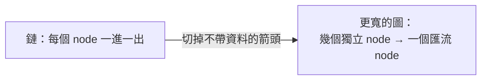
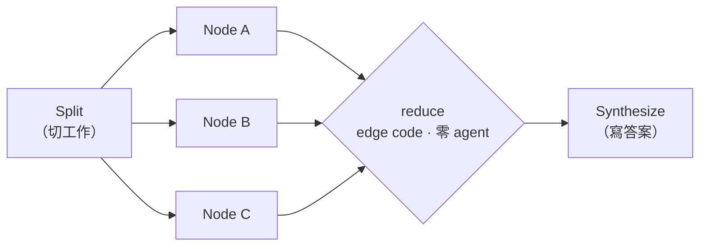

# Graph Engineering：把線性 agent 攤成圖

> 補 repo 的**形狀**維度。既有四篇分層筆記問的是「怎麼說、給什麼、在什麼環境、誰按下一步」；這篇問「工作本身的依賴形狀長什麼樣」——什麼先於什麼、什麼可以同時、什麼必須等齊。

## 目錄

- [前言：射程、前提、來源](#前言射程前提來源)
- [一、兩個原語：node 與 edge](#一兩個原語node-與-edge)
  - [1.1 edge 的判準：資料有沒有跨過去](#11-edge-的判準資料有沒有跨過去)
  - [1.2 線性腳本是退化的圖](#12-線性腳本是退化的圖)
- [二、兩份契約](#二兩份契約)
  - [2.1 Node 契約：schema](#21-node-契約schema)
  - [2.2 Edge 契約：搬運那段是 edge code](#22-edge-契約搬運那段是-edge-code)
- [三、拓樸四型](#三拓樸四型)
  - [3.1 Fan-out：`parallel()` 與它的天花板](#31-fan-outparallel-與它的天花板)
  - [3.2 Fan-in：唯一非等不可的位置](#32-fan-in唯一非等不可的位置)
  - [3.3 Diamond：split → work → merge](#33-diamondsplit--work--merge)
  - [3.4 Pipeline：沒有 barrier 的那一種](#34-pipeline沒有-barrier-的那一種)
  - [3.5 Barrier 決策表](#35-barrier-決策表)
- [四、控制流：router 與會收斂的 cycle](#四控制流router-與會收斂的-cycle)
  - [4.1 Router](#41-router)
  - [4.2 Cycle：loop-until-dry](#42-cycleloop-until-dry)
- [五、Gate：把驗證插進 edge](#五gate把驗證插進-edge)
  - [5.1 三種 pattern 與它們的價錢](#51-三種-pattern-與它們的價錢)
  - [5.2 陷阱：quorum 是浮動的](#52-陷阱quorum-是浮動的)
  - [5.3 獨立性只買到一半](#53-獨立性只買到一半)
- [六、成本三槓桿](#六成本三槓桿)
  - [6.1 隔離](#61-隔離)
  - [6.2 先動 effort，不要動 model](#62-先動-effort不要動-model)
  - [6.3 拓樸就是成本](#63-拓樸就是成本)
- [七、自走圖：授權而非入口](#七自走圖授權而非入口)
- [八、本機校準：第一方契約對過的 16 條](#八本機校準第一方契約對過的-16-條)
- [九、與本 repo 其他筆記的對照](#九與本-repo-其他筆記的對照)
- [十、來源與更新](#十來源與更新)

### 閱讀路徑建議

- **只想學會判斷「這裡該不該平行」**：§一 1.1 的 edge 判準 → §三 3.1 的併發天花板（收益是 min(N, C) 倍，不是 N 倍）→ §三 3.5 決策表 → §六 6.3 對照
- **要動手寫腳本**：§二 → §三 → §四 4.2 → **§八 全掃一遍**（免踩雷清單）→ §五 5.2
- **已讀過 harness §六、想知道差在哪**：直接看 §九

---

## 前言：射程、前提、來源

### 這篇問兩件事

1. **形狀與判斷**（§一～§五、§六 6.3）：什麼先於什麼、什麼可以同時、什麼必須等齊。換一套工具這部分還在。
2. **把形狀跑起來會撞到的產品表面**（§六 6.1／6.2、§七、§八）：本機 v2.1.220 實測。這部分會過期，但現在能省你一個下午。

只想練判斷的可以停在 §六 6.3；要動手寫的請把 §八 掃過再開工。

### 這些 code 是什麼

本篇所有 code 都是 **Claude Code dynamic workflow 腳本**：一段純 JavaScript，由 Claude 寫、由 runtime 直接執行，不是又一輪對話。`agent()` 派出一個 subagent；`parallel()`／`pipeline()` 是兩個併發原語；`schema`／`phase`／`isolation`／`model`／`effort` 都是 `agent()` 的選項；`log()`／`budget` 是全域。

你不能自己 `node script.js` 把它跑起來——**怎麼讓它開起來見 §七，授權規則見 §八 #14，改完腳本重跑見 §八 #8 的 `Workflow({ scriptPath, resumeFromRunId })`**。

### 先講適用邊界

**本篇假設你已經知道要做什麼。** 範圍沒結晶化的時候，把它攤成圖只會讓你更快、更平行地做錯事——這是 [harness-engineering.md](./harness-engineering.md) §六 記錄的社群實戰結論（workflow 翻車主因是「範圍沒結晶化」，不是圖畫得不好）。形狀問題與規格問題是兩件事，這篇只解前者。

### 在 repo 裡的位置

本 repo 有四篇「分層」筆記，分工是同一件事的四個層（另有 [ihower-harness-engineering.md](./ihower-harness-engineering.md) 的開發者視角與 [boris-cherny-tips.md](./boris-cherny-tips.md) 的實務技巧，不在這條軸上）：

| 筆記                                               | 回答的問題             |
| -------------------------------------------------- | ---------------------- |
| [prompt.md](./prompt.md)                           | 怎麼說                 |
| [context-engineering.md](./context-engineering.md) | 給什麼資訊             |
| [harness-engineering.md](./harness-engineering.md) | 在什麼環境做事         |
| [loop-engineering.md](./loop-engineering.md)       | 誰按下一步、什麼時候停 |

這篇不是第五層，是 [harness-engineering.md](./harness-engineering.md) §四「面向 4：Workflow 編排」（它獨佔的問題是「什麼順序、拆給誰做？」）的深潛。**注意術語接縫**：面向 4 把這個拓樸叫「Fork-Join 並行」（用 `git worktree` 實作），本篇拆成 fan-out／fan-in／diamond／pipeline 四型；至於 workflow 這個 primitive 該不該選，在 §六 的四 primitive 表，不在這裡。

放成獨立一篇的理由只有一個：面向 4 要照顧五面向的平衡，塞不下拓樸決策，而拓樸決策恰好是實際跑起來最會痛的地方。

### 來源該怎麼看

原文是一則 X 長貼文（2026-07-20），中段夾作者 Substack 導流。**它是二手材料**——內容是 Anthropic dynamic workflows primitive 的教學化重述。

價值在於它的**提法**：「edge 的判準是資料有沒有跨過去」這個切法，官方文件沒有，而它確實能改變你讀自己腳本的方式。但**技術細節一律以第一方為準**，所以本篇把原文的每個技術主張都拿去對 v2.1.220 的工具契約，結果集中在 §八。原文的收尾一句值得留著：「A prompter asks a question. An architect draws a graph.」（Codez, 2026-07-20）

### 14 步 → 本篇章節

| 原文 step                    | 本篇位置 | §八 校準                 |
| ---------------------------- | -------- | ------------------------ |
| 05 fan out                   | §三 3.1  | **#1 併發上限**          |
| 12 model tiering             | §六 6.2  | **#4 該動的是 effort**   |
| 14 self-routing              | §七      | #2、**#14**、#3          |
| 02 linear = degenerate graph | §一 1.2  | #5 措辭                  |
| 10 isolation                 | §六 6.1  | #6 null 的來源           |
| 11 cycle                     | §四 4.2  | #9 budget                |
| 09 verifier                  | §五      | §五 5.2 quorum（本篇補） |

其餘七步與本篇一一對應，無校準：01→§一 1.1、03→§二 2.1、04→§二 2.2、06→§三 3.2、07→§三 3.3、08→§四 4.1、13→§六 6.3。

**這張表按校準重要性排，不按 step 序**（想反查某一步，用下面那行清單）。粗體的 #1、#4、#14 是原文站不住或講反的地方；#2 與同格的 #3 性質不同——說法本身屬實，只是各漏了一半（#2 漏掉 effort 被一起拉到 xhigh，#3 漏掉存檔流程與 User scope）。

---

## 一、兩個原語：node 與 edge

### 1.1 edge 的判準：資料有沒有跨過去

圖只有兩種東西：**node** 是一個有邊界的工作單位（一個 agent、一件事、一進一出）；**edge** 是一個依賴——這個 node 的輸出是那個 node 的輸入。

> **本篇的用字約定**：`edge` 一律指依賴關係本身；實作它的那段 JS 叫 **edge code**。後面說「在 edge 上加 X」是簡寫，實際做的是**插入一個 node，把一條 edge 拆成兩條**。

判準只有一句：**畫得出箭頭才有 edge**。而落到腳本上，這條箭頭有實體——它是一個變數：上游 `agent()` 的回傳值，有沒有出現在下游 `agent()` 的 prompt 字串裡？有，edge 存在；沒有，這兩個 node 只是被你打字的順序綁在一起。

這給你一個可以機械執行的動作：把腳本裡每個「然後」抓出來，逐一檢查下游 prompt 有沒有引用上游的變數。引用不到的那些「然後」，等待成本是白付的。（原文的例子：「摘要這個檔案，**然後**告訴我天氣」。）

### 1.2 線性腳本是退化的圖

「A 然後 B 然後 C」本來就是圖，只是每個 node 恰好一進一出。第一個實作動作是**重畫**：對每根箭頭問 1.1 的問題，剪掉不帶資料的，鏈就塌成更寬的形狀。



原文說鏈「沒有冗餘所以脆弱」——**措辭要修**，而且它自己舉的例子就不符：「C 卡住 D 就永遠不跑」講的是**串連耦合**，不是缺冗餘。改成圖買到的是**獨立性**（可同時跑）與**故障圍堵**（§六 6.1），不是冗餘。

冗餘得另外加，而且有三種不同的加法，別混為一談：同一個生產 node 跑 N 次再取多數（**majority voting**／self-consistency）、產 N 個候選再用評審挑最好的（**best-of-N**，就是 §五 5.1 的 judge panel）、替產出配 N 個獨立質疑者（**adversarial verify**，§五 5.1）。前兩者買的是產出品質，第三者買的是誤報過濾——都是額外掛上去的，不是圖天生就有。

---

## 二、兩份契約

### 2.1 Node 契約：schema

能塞進圖的 node 要**輸入有界、輸出有型、只做一件事**。輸入明確傳進去，不從共用 context 假設；輸出是定義好的形狀，讓下游不用猜。

`agent()` 帶 `schema` 時，subagent 被強制走結構化輸出，而且**驗證在 tool-call 層**——形狀不合是模型重試，不是丟一坨自由文字給你 parse。

```javascript
const FINDING = {
  type: 'object',
  additionalProperties: false,
  properties: {
    file:   { type: 'string' },
    issue:  { type: 'string' },
    impact: { type: 'string', enum: ['high', 'medium', 'low'] },
  },
  required: ['file', 'issue', 'impact'],
};

const r = await agent(`Audit ${f}`, { schema: FINDING, label: `audit:${f}` });
// r.impact 保證是那三個字串之一。下游不必 parse，也不必防呆。
```

> 這是 [ihower-harness-engineering.md](./ihower-harness-engineering.md) §三「工具回傳值是寫給 agent 的回饋」在 node 邊界上的硬化版：不只是把回傳值寫好，而是讓格式違規根本過不了關。

### 2.2 Edge 契約：搬運那段是 edge code

edge 的名字應該是它搬運的形狀，不是它在腳本裡的行號：`const step2 = ...` 換成 `const rankedFindings = ...`。這麼命名之後 1.1 的判準會自己浮出來——**叫不出形狀的 edge 通常就不是 edge**。而且 node 因此變成可替換件：形狀不動，兩端各自怎麼重寫都不影響圖。

合併如果只是 flatten + dedupe，就不必開 agent：`flatMap` 加一個 `Set` 就夠，而且是確定性的。**模型的錢要花在「這算不算數」，不是花在「把兩份資料接起來」。**

---

## 三、拓樸四型

### 3.1 Fan-out：`parallel()` 與它的天花板

N 個獨立 node 不要串，`parallel()` 一次派出去。

```javascript
const raw = await parallel(FILES.map((f) => () =>
  agent(`Audit ${f}`, { phase: 'Audit', schema: FINDING })));
const found = raw.filter(Boolean);   // null ＝ agent 掛了，或被使用者中途 skip
```

三個細節：

1. **它是 barrier**——等所有 thunk 回來才 return。
2. **爆掉的 thunk 變 `null`，不 reject 整批**。所以永遠 `.filter(Boolean)`。
3. **併發有上限：`min(16, max(2, CPU 核心數 - 2))`，每個 workflow 計，以下記作 C**（§八 #1）。超出的排隊。

第 3 點決定你的預期值，原文只寫「大約是核心數」就帶過。**fan-out 的收益是 min(N, C) 倍，不是 N 倍**；N 遠大於 C 時，wall-clock 粗估是 `ceil(N/C) × 單項耗時`——這是均一耗時下的下界，項目快慢差很多時每一波還會被最慢的那個拖住。丟 100 個 thunk 進去它們都會完成，但是分批完成的。

還有一個屬於 context 層的效果，值得跟時間收益分開記：`parallel()` 的展開發生在 runtime，不是在對話裡多疊幾輪。主 context 只看得到 N 個回傳值，看不到產生它們的材料——N 開多大，主 context 的增量都只是那 N 份結論。session 的天花板因此不在 N，而在結論的大小。

> 這件事的完整版在 [harness-engineering.md](./harness-engineering.md) §四 面向 1 的 tool-call offloading，以及 §六「中間結果落點」（該處原話：「面向 1 offloading 開到極致」）。

### 3.2 Fan-in：唯一非等不可的位置

fan-in 的判準不是「這裡要收尾了」，而是「**這一步的正確性依賴於整組**」——去重要先看到全部才知道誰跟誰重複，排序要先看到全部才排得出名次，早退要先數過全部才知道是不是零。三者共通點：少收一份，答案是**錯**，不只是變差。

```javascript
const shortlist = found.filter((c) => c.impact !== 'low');   // edge code：純 JS，零 agent
const ranked = await agent(`Dedupe and rank:\n${JSON.stringify(shortlist)}`,
                           { schema: RANKED });              // barrier node：需要全集
```

### 3.3 Diamond：split → work → merge

fan-out 接 fan-in 就是 diamond，實務上大半的圖都是它的變形。值得單獨記住的是中間那一格會分成兩段：**fan out → reduce → synthesize**。reduce 屬於 §二 2.2 的 edge code——它只壓縮、不判斷，所以不該花 agent；synthesize 才是真正需要模型的那一步。把兩段混成一個 agent，等於付錢請模型做 `flatMap`。



Judge panel（§五 5.1）是這個骨架的變體：把「多個不同 node」換成「同一個問題的 N 種角度」，merge 換成評分後綜合。

### 3.4 Pipeline：沒有 barrier 的那一種

每個項目**獨立**走完所有 stage，快的先完工，不必卡在最慢的那個後面。

```javascript
const done = await pipeline(FILES,
  (f)        => agent(`Translate ${f}`,               { phase: 'Port', schema: PATCH }),
  (patch, f) => agent(`Run tests for ${f}:\n${patch.diff}`, { phase: 'Test', schema: TEST }),
);
```

注意呼叫形式：**stage 是可變參數，不是陣列**——`pipeline(items, stage1, stage2, ...)`。每個 stage 收到 `(prevResult, originalItem, index)`（§八 #10），所以後段 stage 要標記工作時，不必把 context 硬塞進前一 stage 的回傳值。

圍堵的顆粒度是**項目**而不是階段：某個 stage throw 只會把該項目降成 `null` 並跳過它剩下的 stage，其他項目照跑。

### 3.5 Barrier 決策表

判準只有一條：**這個等待有沒有換到「少一份就錯」的正確性？**

換到了 → barrier。跨全集比對、整組為零才早退、prompt 要引用同批其他結果，都屬這類。它們的共同點是：缺一份時答案是**錯的**，不只是差一點。

沒換到 → pipeline。三種最常見的誤判：

| 你以為的理由                         | 實際上是什麼                                     |
| ------------------------------------ | ------------------------------------------------ |
| 「我得先 flatten／map／filter 一下」 | 純資料整形，搬進 stage 裡做就好，不需要全員到齊  |
| 「這兩個階段概念上是分開的」         | 講的是語意邊界，跟要不要對齊時間軸是兩個獨立問題 |
| 「這樣寫比較乾淨」                   | 拿可量測的延遲換版面，代價是真的                 |

判不出來就選 pipeline：它猜錯的代價只是「沒省到」，barrier 猜錯的代價是每一階段都在等最慢的那個。

---

## 四、控制流：router 與會收斂的 cycle

### 4.1 Router

走哪條 edge 可以取決於某個 node 發現了什麼——分類工單再分派、量 diff 大小再決定快掃還是全稽核。在腳本裡這就是對**已驗證輸出**做 `if`／`switch`。

```javascript
const { severity } = await agent(`Classify risk:\n${diff}`, { schema: SEVERITY });

const review = severity === 'high'
  ? await parallel(FILES.map((f) => () => agent(`Audit ${f}`)))   // 重路徑
  : await agent(`Quick review of ${diff}`);                       // 輕路徑
```

**判斷由 Claude 出，分岔由 code 決定**，所以同一個分類每次走同一條路。不會有「agent 心情好就跳過稽核」——要跳過得先被寫進圖裡。

### 4.2 Cycle：loop-until-dry

事前不知道工作有多大時（未知規模的探索、一個 bug 牽出三個），需要一條繞回上游的受控 edge。不收斂的 cycle 就是燒到預算見底的無限迴圈。

收斂條件：**連續 K 輪沒有新東西才停**。成敗只繫在一個細節：

> **dedupe 的對象是「所有看過的」，不是「已確認的」。** 否則被打槍的發現每輪重新冒出來，loop 永遠 dry 不了。

```javascript
const seen = new Set(), confirmed = [], deferred = [];
let dry = 0, rounds = 0;

// budget.total 沒設時 remaining() 回 Infinity，這個守衛等於不存在（§八 #9）——
// 真正擋住迴圈的是 rounds 上限。1000 agent 的天花板不該由你去撞
while (dry < 2 && rounds++ < 8 && budget.remaining() > 50_000) {
  const found = (await parallel(FINDERS.map((f) => () =>
    agent(f.prompt, { phase: 'Find', schema: BUGS }))))
    .filter(Boolean).flatMap((r) => r.bugs);

  const fresh = found.filter((b) => !seen.has(key(b)));
  if (!fresh.length) { dry++; continue; }
  dry = 0;
  fresh.forEach((b) => seen.add(key(b)));            // 對 seen 去重，收斂靠這行

  for (const b of await judgeAll(fresh)) {           // judgeAll 見 §五 5.2，保證無 null
    if (b.verdict === 'unresolved') deferred.push(b);
    else if (b.verdict === 'real') confirmed.push(b);
    // 'rejected' 不留——但它已經在 seen 裡了，下一輪不會再被撈出來
  }
}

// 收工前把 deferred 重判一次：只花裁決的 token，不用再跑 finder（§五 5.2）
const rejudged = await judgeAll(deferred);
confirmed.push(...rejudged.filter((b) => b.verdict === 'real'));
const unresolved = rejudged.filter((b) => b.verdict === 'unresolved');
if (unresolved.length) log(`仍無法裁決 ${unresolved.length} 筆，未計入 confirmed`);
```

最後那個 `log()` 不是裝飾。第一方契約有一條 **no silent caps**：腳本只要限制了覆蓋範圍（取前 N、不重試、抽樣），就得把丟掉的東西講出來——不然報告讀起來像「全掃過了」，其實沒有。

> **跟 loop engineering 的 cycle 不是同一個東西。** 這裡的 cycle 在**單一 run 內**，狀態存在腳本變數裡。[loop-engineering.md](./loop-engineering.md) 講的是**跨 run**：排程心跳叫醒、跨 run 記憶留在磁碟、`/goal` 判停。**判別法：狀態在變數裡＝run 內的 cycle；狀態在檔案裡＝跨 run 的 loop。** 兩者可以疊——`/schedule` 叫醒的一次 run，內部跑一張含 loop-until-dry 的圖。

---

## 五、Gate：把驗證插進 edge

**gate**＝擋在 edge 上、不通過就不放行的檢查。它可以是**確定性的 code**（跑測試、跑 lint、schema 驗證），也可以是 **verifier node**（一個 agent 試著弄死這個發現）。

**能用 code 做 gate 就別用 agent**——測試套件是最便宜也最可信的 gate。verifier 留給 code 判不了的東西。

### 5.1 三種 pattern 與它們的價錢

| Pattern                        | 做法                                                          | 每個發現的 agent 數               | 什麼時候用                                              |
| ------------------------------ | ------------------------------------------------------------- | --------------------------------- | ------------------------------------------------------- |
| **Adversarial verify**         | N 個獨立質疑者，prompt 明寫「去反駁它」，多數活下來才留       | N（建議 3）                       | 通用預設                                                |
| **Perspective-diverse verify** | 每個 verifier 給不同鏡頭（correctness／security／能不能重現） | 鏡頭數                            | 一個發現可能用好幾種方式錯掉時                          |
| **Judge panel**                | N 個角度各生成一個方案，平行評分，從贏家 synthesize           | N ＋ N×M（M＝每個方案配幾個評審） | **這不是 gate**，是選拔。放在 diamond 那一格（§三 3.3） |

價錢欄不是裝飾：4.2 那個例子是「發現數 × 鏡頭數 × 輪數」，一輪 20 個發現配 3 個鏡頭就是 60 個 agent。§六 整章在講省錢，這張表是全篇最大的乘數。而且 60 已經遠超預設的 workflow size guideline（medium ＝ 15 個 agent）。它是建議不是硬上限——契約明寫「除非使用者的 prompt 要求不同規模，否則照著走」，所以要嘛在 prompt 裡直接要到這個規模，要嘛去 `/config` 調寬——見 §八 #16。

質疑者的 prompt 要**偏向反駁**（不確定就判 refuted），否則 N 個 verifier 只是 N 次附和。

### 5.2 陷阱：quorum 是浮動的

verifier 自己也會掛。`parallel()` 把掛掉的換成 `null`，於是這種寫法有 bug：

```javascript
// ✗ 壞掉：沒有 quorum 下限——存活票數不足時永遠到不了門檻，等於無聲判死
const ok = votes.filter(Boolean).filter((v) => v.real).length >= 2;
```

死門檻會隨存活票數漂移，而且鏡頭愈多漂得愈兇：五個鏡頭寫死「≥ 3」，掛兩票就變成「3 取 3」的全票制，掛三票起永遠過不了關——怎麼投都到不了門檻，等於無聲判死。**要補的是一條 quorum 下限**，門檻本身再改成對存活票數取多數：

```javascript
async function judgeAll(items) {
  // 用 parallel() 而不是 Promise.all：單筆裁決 throw 時只有那一筆變 null，
  // Promise.all 會炸掉整輪連同已累積的結果。但這層保護只蓋 thunk 內部的 throw——
  // 預算／1000 agent 上限是在 parallel() 進入點就檢查的，已經到頂時 parallel() 本身會 throw（§八 #9）
  const judged = await parallel(items.map((b) => () => judgeOne(b)));
  // 回傳值與輸入同序（內部是 allSettled），所以 null 可以對回原項目：
  // 照 §六 6.1 容忍缺項，但不無聲吞掉——變成 unresolved 流進 deferred 等重判
  return judged.map((r, i) => r ?? { ...items[i], verdict: 'unresolved', survived: 0 });
}

async function judgeOne(b) {
  const votes = (await parallel(LENSES.map((lens) => () =>
    agent(`Judge "${b.desc}" via ${lens}. Default to real=false if uncertain.`,
          { phase: 'Verify', schema: VERDICT })))).filter(Boolean);

  // quorum 下限：票數不足就不給裁決，並記下活了幾票
  if (votes.length < 2) return { ...b, verdict: 'unresolved', survived: votes.length };
  return { ...b, survived: votes.length,
           verdict: votes.filter((v) => v.real).length > votes.length / 2
                    ? 'real' : 'rejected' };
}
```

**功勞要歸對地方**：救命的是 `votes.length < 2` 那一行。存活 2 票或 3 票時，`> votes.length / 2` 跟原本的 `>= 2` 判斷完全一致（都要 2 票同意）；兩者只在存活 4 票以上才分岔。比例寫法買到的是「票數浮動時門檻跟著動」，**不是**把「2 取 2」放寬回「3 取 2」——後者辦不到，2 票的多數本來就是 2。

**`unresolved` 跟 `rejected` 不能混為一談**，但兩者都必須留在 `seen` 裡——把 quorum 不足的移出 `seen` 會直接破壞 4.2 的收斂。正解是：留在 `seen`（不再**重找**），另存 `deferred`，收工前**重判**一次（4.2 末段那幾行）。重判只花裁決的 token，不用再跑 finder。

兩個邊界先講死：只剩 2 票時「過半」等於兩票全同意，比 3 取 2 更嚴——這是刻意的保守，寧可留在 `deferred` 也不要用半票放行。重判後仍然 `unresolved` 的，列進報告的「未裁決」區並附上掛掉的票數，**不要當成 `rejected` 吞掉**：沒被否證跟被否證是兩件事。

這條在原文與第一方契約裡都沒有；它是「fan-in 要容忍缺項」（§六 6.1）碰上「絕對門檻」時的必然結果。

### 5.3 獨立性只買到一半

workflow 把**結構**那一半做成構造性的：subagent 彼此不通訊、各自獨立 context，這是 [harness-engineering.md](./harness-engineering.md) §六 說「隔離是刻意設計，不是限制」的意思。

但**隔離只是必要條件**。harness §四 面向 5 已經寫過「分離是必要、不是充分」；[ihower-harness-engineering.md](./ihower-harness-engineering.md) §三 更直接——換新 context 仍共享同一套訓練、先驗與失誤模式，不算獨立檢查。ihower §五 的「裁判獨立性光譜」講的是**單輪驗收**上的版本（自我審計 → 全新 context 的 grader agent），而它的結論是**取捨不是排名**：獨立性買得越多，裁判看得到的證據越少。

本篇的對抗式 verifier 落在「**結構獨立、模型不獨立、證據最少**」那一格。所以 5.1 那句「prompt 要偏向反駁」不是加分項，是補上剩下那一半的必要動作。

要真正的獨立性得換模型，本篇的 pattern 做不到——**這是 §六 6.2「不要動 `model`」的唯一例外**：裁判要的是模型不相關，不是省錢。

---

## 六、成本三槓桿

### 6.1 隔離

圍堵有兩層。**第一層免費**：`parallel()` 把爆掉的 thunk 換成 `null`，其餘照常回來——所以 fan-in 一律當作「可能缺項」來寫（§五 5.2 就是沒這樣寫的後果）。

**第二層要錢**：node 並行寫檔會互踩，`isolation: 'worktree'` 給每個 agent 一份獨立工作副本（第一方契約標為 EXPENSIVE，每個 agent 約 200–500ms 建置加磁碟開銷；沒改動的 worktree 自動移除）。只有真的並行寫入才值得繳。

### 6.2 先動 effort，不要動 model

圖讓一件事變得顯眼：有些 node 有界又重複（抽欄位、分類），有些扛真正的判斷（synthesize、裁決）。

省略 `model` 時 subagent 繼承 session model（契約明寫）；**由此推得**一次大 run 很容易整場按 session 那一階計價——計價這半是推論，契約沒寫。

原文的建議是「把重複性 node 降到便宜模型」。**第一方契約的預設相反**：不設 `model`，除非你很有把握某個 tier 更適合（§八 #4）。

真正該先動的是原文完全沒提的那根：**`effort`**（`low`／`medium`／`high`／`xhigh`／`max`）。機械性的 stage 調 `low`，只有最難的 verify／judge 往上加——**不換模型就能分層計價**，而且不會賭錯 tier。

唯一的例外見 §五 5.3。

### 6.3 拓樸就是成本

|            | `parallel()`                                | `pipeline()`                                                   |
| ---------- | ------------------------------------------- | -------------------------------------------------------------- |
| 語意       | barrier：等齊才進下一階段                   | 每個項目獨立走完所有 stage，**無** barrier                     |
| 時間       | 每階段被最慢的拖住                          | 項目 A 可在 stage 3，項目 B 還在 stage 1                       |
| Wall-clock | Σ 各階段（`ceil(N/C)` 波 × 該波最慢者耗時） | ≈ max(單一項目的鏈長, `ceil(總 agent 數 / C)` × 單 agent 耗時) |
| 預設       | 只在真的需要全集時                          | **這才是預設**                                                 |

兩者都受 §三 3.1 的 C 限制——pipeline 省掉的是**階段間的等待**，不是總工作量。判準與情境清單在 §三 3.5，不重複。

---

## 七、自走圖：授權而非入口

不再手繪那些事前規劃不了的圖：你描述目標，Claude 自己寫編排腳本，你拿到的是為這一次 run 量身的圖。

原文把入口寫成「三個並列的便利選項」。**實際上那是五種合法授權方式裡的三種，而授權是必要條件**——Claude 不會主動開 workflow（完整清單見 §八 #14）。常用的三種：

1. **prompt 裡說「workflow」** — Claude 為這個任務寫一張圖。
2. **跑現成的** — `/deep-research` 是出貨中的真實圖：scope → 平行搜尋 → fetch → 對抗式驗證 → synthesize，正是本篇骨架。
3. **開 `ultracode`** — session 級開關，而且它**同時把 reasoning effort 拉到 xhigh**（§八 #2），成本不只來自多開 agent。

跑得好的 run 按 `s` 存起來（流程細節見 §八 #3），之後能當 slash command 直接叫。

### 六個可以動手做的圖

| 圖                                   | 拓樸                   | 驗證／控制流                                         |
| ------------------------------------ | ---------------------- | ---------------------------------------------------- |
| 全路由安全掃描                       | diamond                | verifier（gate）                                     |
| 有引用的研究報告（`/deep-research`） | diamond                | adversarial verify（gate）                           |
| 逐檔移植模組                         | pipeline ＋ cycle      | 測試套件（code gate，最便宜）                        |
| Diff 的對抗式審查                    | router ＋ 平行稽核     | 多鏡頭 verify（gate）＋ judge panel（選拔，非 gate） |
| 排程生態掃描                         | diamond ＋ 跨 run loop | barrier 排序（非 gate）                              |
| 未知規模的探索                       | loop-until-dry         | 多鏡頭 verify（gate）                                |

第三與第五個是**圖與 loop 疊起來**：run 內是圖，run 之間是 [loop-engineering.md](./loop-engineering.md) 的心跳與跨 run 記憶。

---

## 八、本機校準：第一方契約對過的 16 條

> 基準：本機 Claude Code **v2.1.220** 內嵌的第一方 `Workflow` 工具契約與 runtime，2026-08-02 實測（方法與主要證據見 §十；#8、#12、#15 直接引自契約原文，未另立驗證列；#5 是概念校正，不屬於契約可驗證項）。原文寫於 2026-07-20。以下多數是原文本來就沒寫的，不是它寫錯。

### 已驗證正確

`parallel()` 是 barrier、失敗 thunk 變 `null`、`pipeline()` 無 barrier、`schema` 在 tool-call 層驗證並重試、`isolation: 'worktree'` 昂貴且只該用在平行寫檔、loop-until-dry 要對 seen 去重、腳本是純 JavaScript——這幾項與第一方契約逐條吻合。

**原文的「編排層零 model token」要降一格**（本篇正文刻意沒引用這個說法）：契約只寫「控制流應該是確定性的（迴圈、條件、fan-out），而不是模型驅動」。契約裡確實談 token，但談的都是 `budget`（`+500k` 指令、`50_000`／`100_000` 這類門檻）與「workflow 會吃掉大量 token」的警告；**沒有任何一句給編排層本身的 token 成本下保證**。零 token 是從「腳本跑在 runtime 裡、不是又一輪對話」推出來的合理結論，不是契約寫死的。

### 需要修正或補精確度

| #   | 原文說法                                  | 本機實測                                                                                                                                                                                                                                                                                                                                           |
| --- | ----------------------------------------- | -------------------------------------------------------------------------------------------------------------------------------------------------------------------------------------------------------------------------------------------------------------------------------------------------------------------------------------------------- |
| 1   | 併發「大約是你的核心數」                  | 精確值 **`min(16, max(2, CPU 核心數 - 2))`**（契約簡寫成 `min(16, 核心數 - 2)`，實作另有 2 的下限），且是**每個 workflow** 計。另有兩個硬上限：單一 workflow 生命週期**最多 1000 個 agent**（暴走保險），單次 `parallel()`／`pipeline()` **最多 4096 個項目**（超過是明確報錯，不是無聲截斷）                                                      |
| 2   | `ultracode` ＝「每個任務都規劃 workflow」 | 少講一半。這句不在 Workflow 工具契約裡，而是 `ultracode` **設定項**的描述：「xhigh effort plus standing dynamic-workflow orchestration」（工具契約那邊只寫「opt-in 是常態性的，預設每個實質任務都寫一張圖」，沒提 effort）——它**同時把 reasoning effort 拉到 xhigh**。成本不只來自多開 agent，也來自每個 turn 變貴。session-wide，重任務跑完記得關 |
| 3   | 「按 `s` 存進 `.claude/workflows/`」      | 按鍵屬實。但流程比原文完整：填**名稱** → **`tab` 切 scope**（Project → `.claude/workflows/<name>.js`；User → 使用者層目錄，**原文沒提 User scope**）→ `enter` 確認。存完的提示明說它**同時是 slash command**：`/<name>` 或 `Workflow({name})`。同名會擋下並問覆寫                                                                                  |
| 4   | 「把重複性 node 降到便宜模型」            | 方向對，第一方預設相反：**不設 `model`**，「只在你很有把握某個 tier 更適合時才設；不確定就省略」。而且原文沒提更該先動的槓桿：**`effort`**（`low`／`medium`／`high`／`xhigh`／`max`），不換模型就能分層計價（見 §六 6.2）                                                                                                                          |
| 5   | 鏈「沒有冗餘所以脆弱」                    | **（此列非契約可驗證項，屬概念校正）** 原文自己的例子（C 卡住 D 不跑）講的是**串連耦合**，不是缺冗餘。圖買到的是獨立性與故障圍堵；冗餘要另外做（§一 1.2）                                                                                                                                                                                          |
| 6   | `agent()` 回 `null` ＝ agent 失敗         | 還有第二個來源：**使用者中途 skip 掉那個 agent**。**順帶修一條既有筆記**：[harness-engineering.md](./harness-engineering.md) §六 說 workflow「無中途使用者輸入」，精確講是**沒有輸入型的人工介入點**，但使用者仍可 skip 個別 agent——能中斷，不能引導                                                                                               |

### 原文完全沒提，但寫腳本會踩到

| #   | 事實                                                               | 為什麼要緊                                                                                                                                                                                                                                                                                                                                                                                                                  |
| --- | ------------------------------------------------------------------ | --------------------------------------------------------------------------------------------------------------------------------------------------------------------------------------------------------------------------------------------------------------------------------------------------------------------------------------------------------------------------------------------------------------------------- |
| 7   | **`Date.now()`／`Math.random()`／無參數 `new Date()` 會 throw**    | 原文的程式碼風格會誘導你順手用。原因是 resume（#8）：時間戳記要在 workflow **回傳之後**再蓋，或從 `args` 傳進去；要隨機性就用 index 變化 prompt／label                                                                                                                                                                                                                                                                      |
| 8   | **Resume**：`Workflow({scriptPath, resumeFromRunId})`              | 沒改動的 `agent()` 前綴直接回快取，只有第一個被改的呼叫及其之後才重跑。同腳本同 args ＝ 100% 命中。這是**改腳本迭代的正確方式**，也是 #7 那些限制存在的理由                                                                                                                                                                                                                                                                 |
| 9   | **`budget` 全域**：`total`／`spent()`／`remaining()`               | 原文警告 cycle 會燒光預算卻沒說內建煞車。使用者下「+500k」這類指令時 `total` 有值，而且是**硬上限**——到頂之後 `agent()` 直接 throw。但**沒設目標時 `remaining()` 回 `Infinity`**，單靠它當守衛等於沒煞車，會一路撞到 1000 agent 天花板（runtime 的錯誤訊息自己就警告這件事，並要你加硬輪數上限）。寫法見 §四 4.2                                                                                                            |
| 10  | **`pipeline()` 的 stage 收到 `(prevResult, originalItem, index)`** | 原文推薦 pipeline 卻沒說後段 stage 怎麼標記工作。有這三個參數就不必把 context 硬塞進 stage 1 的回傳值。另外：某個 stage throw 只會把該項目降成 `null` 並跳過它剩下的 stage                                                                                                                                                                                                                                                  |
| 11  | **`meta` 的必填欄位比你以為的少，但限制比你以為的多**              | 必填只有 `name`／`description`；`phases`／`whenToUse` 選填。`phases` 的 title 要跟 `phase()` 呼叫**逐字相同**才會併進同一個進度群組，對不上就自成一組。整個物件**不能有變數、函式呼叫、spread、模板字串插值**——違反了腳本解析不過                                                                                                                                                                                           |
| 12  | **`workflow()` 可內嵌別的 workflow，但只有一層**                   | 子 workflow 共用同一個併發上限、agent 計數、abort signal 與 token 預算。子層再呼叫會 throw                                                                                                                                                                                                                                                                                                                                  |
| 13  | **除錯有 journal**：`<transcriptDir>/journal.jsonl`                | 記錄每個 agent 的**實際回傳值**。workflow 回空結果要先讀它，別假設快取結果非空。另有 `agent-<id>.jsonl` 逐 agent transcript                                                                                                                                                                                                                                                                                                 |
| 14  | **Workflow 是硬性 opt-in：共五種合法授權**                         | prompt 裡出現 `ultracode`；**session 已開著 ultracode**（system-reminder 確認，與前者不同）；使用者用自己的話要求（「use a workflow」「fan out agents」）；**skill 或 slash command** 的指示；指名跑某個已存的 workflow。**「這個任務明顯很適合平行化」不構成理由**——契約明寫遇到這種情況要改成口頭描述可以怎麼跑、大概多少成本，然後問使用者                                                                               |
| 15  | **腳本是 JavaScript，不是 TypeScript**                             | 型別註記（`: string[]`）、interface、generics 一律解析失敗。原文的 code fence 在 X 上被標成 `python`（渲染 artifact），內容其實是 JS                                                                                                                                                                                                                                                                                        |
| 16  | **還有一條柔性上限：workflow size guideline**                      | 工具 prompt 每次附掛 `small`／`medium`／`large` ＝ 5／15／50 個 agent 的建議值，**預設 medium（15）**，措辭明寫「是建議不是硬上限」，可在 `/config` 的「Dynamic workflow size」調整或設成 unrestricted。它跟 C、1000、4096 三個硬上限不同——**它影響的是 Claude 願意開多大的圖**，所以 §五 5.1 那種「20 個發現 × 3 個鏡頭 ＝ 60 agent」的規模，預設 session 下要嘛在 prompt 裡明講要這個規模（契約自己留的例外），要嘛先調寬 |

第 14 條解釋了一個常見困惑——為什麼你的 agent 預設不 fan out：不是它看不出來，是它被規定要先問。

---

## 九、與本 repo 其他筆記的對照

| 主題                        | 本篇的位置                         | 既有筆記怎麼講                                                                                                                                                                                                                                           |
| --------------------------- | ---------------------------------- | -------------------------------------------------------------------------------------------------------------------------------------------------------------------------------------------------------------------------------------------------------- |
| Workflow primitive 選型     | 不談                               | [harness-engineering.md](./harness-engineering.md) §六 四 primitive 表（sub-agent／skill／agent team／workflow），核心兩問：誰掌握計畫、中間結果落在哪（要 human-in-the-loop 就往表的左端走）。**先看那張表決定要不要用 workflow，再讀本篇決定圖怎麼畫** |
| 同一個拓樸的別名            | fan-out／fan-in／diamond／pipeline | [harness-engineering.md](./harness-engineering.md) §四 面向 4 叫它「Fork-Join 並行」（`git worktree` 實作）                                                                                                                                              |
| 工具回傳值／node 契約       | §二 2.1 的 schema 硬化             | [ihower-harness-engineering.md](./ihower-harness-engineering.md) §三「工具回傳值是寫給 agent 的回饋」                                                                                                                                                    |
| Cycle                       | §四 4.2，run 內、狀態在腳本變數    | [loop-engineering.md](./loop-engineering.md)：跨 run、狀態在磁碟、心跳叫醒、`/goal` 判停                                                                                                                                                                 |
| 裁判獨立性                  | §五 5.3：結構獨立、模型不獨立      | [ihower-harness-engineering.md](./ihower-harness-engineering.md) §五 光譜（單輪驗收版，結論是取捨非排名）＋ harness §四 面向 5「分離是必要、不是充分」                                                                                                   |
| 為什麼能開幾百個 agent 不爆 | §三 3.1 末段                       | [harness-engineering.md](./harness-engineering.md) §四 面向 1 tool-call offloading ＋ §六「中間結果落點」。[context-engineering.md](./context-engineering.md) §2.3 只補 deferred tool loading，**offloading 那半它明講不重複**                           |
| 成本實感                    | §五 5.1 價錢欄、§六 6.2            | [harness-engineering.md](./harness-engineering.md) §六：workflow 單一重任務可吃掉 Max plan 約 20% session 限額；中小任務用 workflow 是純浪費                                                                                                             |
| 裁判本身準不準              | §五 5.1 只要求「prompt 偏向反駁」  | [eval-engineering.md](./eval-engineering.md) §一：判官的**家族偏誤**是正交的第二條軸。它替本篇 **§五 5.3**「裁判是動 `model` 的唯一例外」補上計量證據；它建議的跨廠商 judge panel 要連同 §五 5.2 的 quorum 陷阱一起讀（注意本篇把 judge panel 歸為選拔而非 gate，該篇是拿它當 gate 用） |

---

## 十、來源與更新

### 主要來源

- **Codez**（@0xCodez）— _"Graph Engineering with Claude — 14-Step roadmap from 0 to graph architect"_（2026-07-20）— [x.com/0xCodez/status/2079165300625330317](https://x.com/0xCodez/status/2079165300625330317)
  - 二手材料，判讀理由見前言「來源該怎麼看」

### 本機驗證紀錄（2026-08-02 實測，Claude Code v2.1.220）

方法：讀取 binary 內嵌的第一方 `Workflow` 工具契約與 runtime 實作（`strings` ＋ python regex；`ugrep` 對複雜 regex 會拒絕執行，需改用 python）。

| 宣稱                                        | 驗證方式                         | 結果                                                            |
| ------------------------------------------- | -------------------------------- | --------------------------------------------------------------- |
| 併發 `min(16, max(2, cores-2))`             | runtime 函式本體                 | ✅ 契約簡寫無下限，實作有                                       |
| 1000 agent／4096 項目上限                   | 常數 ＋ 錯誤字串                 | ✅ 兩者皆有專屬錯誤訊息                                         |
| `ultracode` ＝ xhigh ＋ orchestration       | **設定項**描述字串（非工具契約） | ✅ 逐字相符                                                     |
| 存檔：`s` ／ name ／ `tab` scope ／ `enter` | 存檔對話框元件 ＋ 遙測事件       | ✅ 含 Project／User 兩種 scope                                  |
| 存檔後可當 slash command                    | 成功提示字串                     | ✅ `/<name>` 或 `Workflow({name})`                              |
| `model` 預設省略、`effort` 五級             | 工具契約                         | ✅ 逐字相符                                                     |
| `null` ＝ 使用者 skip 或終端 API 錯誤       | 工具契約                         | ✅ 兩種來源皆列出                                               |
| `Date.now()` 等會 throw                     | 工具契約                         | ✅ 理由標明為 resume                                            |
| `budget` 硬上限 ／ `Infinity` 風險          | 工具契約 ＋ runtime 錯誤字串     | ✅ runtime 自己要求加硬輪數上限                                 |
| `pipeline()` stage 三參數 ／ 可變參數形式   | runtime 呼叫點 ＋ 契約簽名       | ✅ 順序相符；stage 非陣列                                       |
| `meta` 必填只有 name／description           | 工具契約                         | ✅ `phases`／`whenToUse` 選填                                   |
| journal 路徑 ／ 逐 agent transcript         | 讀取函式 ＋ 路徑字串             | ✅                                                              |
| Workflow 硬性 opt-in：五種合法授權          | 工具契約                         | ✅ 五種，逐條列於 #14                                           |
| workflow size guideline 5／15／50           | 工具 prompt 附掛段               | ✅ 預設 medium，明寫非硬上限                                    |
| no silent caps 要求                         | 工具契約                         | ✅ 見 §四 4.2 末的 `log()`                                      |
| 「編排層零 model token」                    | 全文搜尋 token 相關字串          | ❌ **契約無此保證**（契約談 token 但只談 `budget`），屬合理推論 |
| worktree 約 200–500ms                       | 工具契約                         | ✅ 標為 EXPENSIVE 並附區間                                      |

### 本 repo 內部連結

- [harness-engineering.md](./harness-engineering.md) — 本篇是其 §四 面向 4 的拓樸深潛
- [loop-engineering.md](./loop-engineering.md) — 跨 run 的 loop
- [ihower-harness-engineering.md](./ihower-harness-engineering.md) — 開發者視角的 harness
- [context-engineering.md](./context-engineering.md) — Claude 5 世代的 context 規則
- [eval-engineering.md](./eval-engineering.md) — harness §四 面向 5 的深潛，與本篇對稱。本篇的 verifier 在**單次 run 內**逐 finding 驗，該篇在**跨 run 與合併點**驗；§一 的判官家族偏誤是本篇 §五 5.3「獨立性只買到一半」的計量佐證。該篇 §1.4 規則 3 也指回本篇 §五 開場的「能用 code 做 gate 就別用 agent」

### 校對紀錄

- **2026-08-02**：初版。依 Codez 14 步骨架按「解決的問題」重新分組成七章，§八 以本機 v2.1.220 第一方契約逐條校準（6 條修正、10 條原文未提事項），§五 5.2 的 quorum 陷阱與 §五 5.3 的獨立性上限為本篇自補，兩者原文與契約皆無
  - 同時補上四篇既有筆記的反向連結（harness §四 面向 4／§六、loop、context、ihower 的內部連結區）
  - §八 #6 對 harness §六「無中途使用者輸入」提出精確化，已在該檔 §六 標註

- **2026-08-04**：§九 對照表與 §十 內部連結新增 [eval-engineering.md](./eval-engineering.md)（harness §四 面向 5 的深潛，與本篇對稱）。標出的接點：該篇 §一 的判官家族偏誤替本篇 **§五 5.3**「裁判是動 `model` 的唯一例外」補上計量證據（本篇原有的理由是結構性的——注意原句在 5.3，§六 6.2 只是指過去）；該篇建議的跨廠商 judge panel 要連同本篇 §五 5.2 的 quorum 陷阱一起讀，但**兩處的 judge panel 不同義**（本篇歸為選拔、非 gate），且 5.2 的浮動成因是 verifier 掛掉變 `null`，不是票數變多。本篇內容未動

下次 review 觸發點：Workflow 脫離研究預覽、`ultracode`／`effort` 選項變動、併發或 agent 數上限調整、Codez 原文更新或勘誤、harness §六 四 primitive 表重寫。
