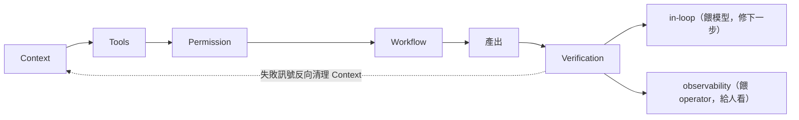

# Harness Engineering：讓 AI Agent 從 Demo 走向生產的工程體系

> 一份綜合性的參考筆記。涵蓋定義、核心心法、五大面向、技術分層，以及對應到 Claude Code 的具體 primitives。

## 目錄

- [前言：被命名之前已經存在的工程現實](#前言)
- [一、Harness 到底是什麼](#一harness-到底是什麼)
- [二、為什麼這個詞現在火了](#二為什麼這個詞現在火了)
- [三、Harness 的核心心法](#三harness-的核心心法)
  - [心法 1：The Ratchet — 錯誤的單向累積](#心法-1the-ratchet--錯誤的單向累積)
  - [心法 2：Working Backwards from Behavior](#心法-2working-backwards-from-behavior)
  - [心法 3：Success Is Silent, Failures Are Verbose](#心法-3success-is-silent-failures-are-verbose)
  - [心法 4：軟硬約束光譜](#心法-4軟硬約束光譜)
- [四、Harness 的五大面向](#四harness-的五大面向)
  - [面向 1：Context 脈絡](#面向-1context-脈絡)
  - [面向 2：Tools 工具](#面向-2tools-工具)
  - [面向 3：Permission 權限](#面向-3permission-權限)
  - [面向 4：Workflow 編排](#面向-4workflow-編排)
  - [面向 5：Verification 驗證](#面向-5verification-驗證)
- [五、對應到 Claude Code:Primitives Mapping](#五對應到-claude-codeprimitives-mapping)
- [六、技術分層：Vibe → Spec → Harness](#六技術分層vibe--spec--harness)
- [七、落實考量](#七落實考量)
- [八、結語](#八結語)
- [九、來源與更新](#九來源與更新)

### 閱讀路徑建議

- **第一次讀**：§一 → §三 → §八（掌握核心概念與心法）
- **動手設定 Claude Code**：直接看 §五
- **制度/規範設計者**：§三 + §四 + §七
- **想知道與其他框架關係**：§六

---

## 前言

Agent 圈密集討論一個詞：Harness。許多人第一次看到，會以為這是新框架、新範式，甚至像是什麼「下一代 Agent 技術名詞」。

但仔細看完會發現，Harness 不是新技術發明——它更像是 Agent 工程裡那部分一直存在、但過去沒被完整命名的「軟體工程現實」。

從原理上講，Agent 真的不複雜。一句話就能寫出來：

```
Agent = Loop(LLM + Context + Tools)
```

在一個迴圈裡提供工具、維護上下文、呼叫大模型——十幾分鐘就能寫出最小版本。給模型一個 system prompt、給它幾個 tools、讓它在迴圈裡不斷決定要不要繼續做事，這就已經是 agent 了。

但為什麼相同的迴圈，在生產環境會爛掉、在 demo 階段卻看起來很厲害？

答案通常不是因為模型突然變笨，而是因為這些工程問題開始集中出現：上下文越來越髒、工具越來越多但沒有治理、狀態沒有結構化、安全邊界靠「相信模型懂事」、錯誤沒有歸類、長任務沒有階段性 checkpoint、文件和規則堆成一坨模型根本吃不動、人和 agent 的協作邊界不清晰。

這些問題，全都不是「模型理論問題」，它們是徹頭徹尾的軟體工程問題。Harness 這個詞的價值就在這裡：它提醒人們，**Agent 專案的真正主戰場，不是模型層，而是執行環境層**。

---

## 一、Harness 到底是什麼

### 定義

可以這樣定義：

> **Harness 是 Agent 運行時的「工程環境總和」，是讓模型在約束中穩定完成任務的整套運行時系統。**

兩種互補的觀察視角：

- **結構式**：`Agent = Loop(LLM + Context + Tools)`
- **能力式**：`Agent 表現 ≈ 模型 × Harness`（任一邊弱，整體就崩；Addy Osmani 用加法 `Agent = Model + Harness` 強調「不是模型的就是 harness」，語氣稍有差別但結論一致。注意這個 harness 界定在**單一 agent** 那層——把多個這樣的 agent 用排程串成自走系統是上一層的 loop，見本節末「與相鄰概念」的上邊界）

這個「環境總和」（以**關注維度**列舉）至少包含：

1. 任務如何被表達
1. 上下文如何被組織
1. 工具如何被暴露、治理、攔截
1. 狀態如何被儲存、恢復、裁剪
1. 回饋如何回流給模型
1. 錯誤如何被分類、重試、升級
1. 安全邊界如何被建立
1. 系統如何驗證 agent 真的把事做好了
1. 執行成本與行為如何被觀測（log、trace、cost、latency）

對照 Trivedy 的 inventory（以**具體 artifact** 列舉）則包括：

- system prompts、CLAUDE.md、AGENTS.md、skill files、subagent instructions
- tools、skills、MCP servers 與其技術描述
- bundled infrastructure(filesystem、sandbox、headless browser)
- orchestration logic(spawning subagents、handoffs、model routing)
- hooks 與 middleware(deterministic execution、lint check、context compaction)
- observability tools（logs、traces、cost、latency 度量）

如果把 Agent 想成一個「會呼叫工具的大腦」，那 Harness 就是給這個大腦配的身體、感測器、護欄、操作台、流程制度、回執系統，以及出事後的保險。

### Working Backwards from Behavior（設計方法論）

設計 harness 的最有效方式不是「先設計元件、再看能做什麼」，而是反向：

> **想要的行為 → 達成該行為的元件設計**

每個 harness 元件都該能說出它服務的具體行為。**講不出職責的元件，就應該被刪掉**。這條原則同時也是熵管理的篩選器（見 §四 面向 1 的時間維度）。詳見 §三 心法 2。

### 與相鄰概念的差異

值得釐清三組常被混淆的概念：

| 詞彙                | 關注點                        |
| ------------------- | ----------------------------- |
| Prompt Engineering  | 怎麼說（措辭、few-shot 編排） |
| Context Engineering | 給模型什麼資訊                |
| Harness Engineering | 模型在什麼環境裡做事          |

Context Engineering 是 Harness 的一個組成部分，但 Harness 不等於 Context。它比 Context 更大一層，因為它不只管「餵什麼」，還管：什麼時候能動手、動手時有哪些工具、工具是否需要審批、輸出太長怎麼辦、危險操作怎麼攔、會話如何恢復、中間產物如何持久化、任務失敗後如何修復。

同樣地，LangChain、LangGraph、CrewAI 這類 SDK 也不等於 Harness——它們回答的是「怎麼造 Agent」，而 Harness 回答的是「Agent 運行時，世界如何與它互動」。可以用 LangChain 實現 Harness 的某個模組，但 LangChain 本身並非 Harness。

還有一個**上邊界**要界定：本筆記講的 harness 是**單一 agent 的運行環境**。把多個這樣的環境用排程心跳串成「自己找事、自走、自我餵食」的系統，是上一層的 **loop engineering**——Addy Osmani 的講法是「loop 坐落在 harness 的上一層」。兩者不衝突：`loop ⊃ harness ⊃ Loop(LLM + Context + Tools)`。本筆記到 harness 本體為止；上一層的自走 loop 見 [Loop Engineering](./loop-engineering.md)。

---

## 二、為什麼這個詞現在火了

因為行業終於開始承認一件事：

> **Agent 的問題，越來越不是「模型夠不夠聰明」，而是「環境夠不夠好」。**

幾組業界資料佐證了這個論點（資料時點：2025 年中至 2026 年初，具體百分比可能隨後續實驗變動）：

- **LangChain 實驗**：只優化 Harness、不換底層模型，寫程式 agent 在 Terminal Bench 2.0 得分顯著提升（從中段班跳到前段班）
- **Vercel 實驗**：大幅移除（約八成）agent 工具，反而步驟更少、Token 消耗更低、任務成功率更高
- **OpenAI 案例**：少數工程師 + Codex Agent，在數個月內生成百萬量級程式碼

這些資料共同指向一個結論：**Agent 表現 ≈ 模型 × Harness**。

Addy Osmani 提供了另一個更鮮明的 framing：

> **頂級模型放進現成框架的得分，常輸給次級模型放進精調 harness 的得分。**

換句話說，benchmark 上看到的差距，不全是模型差距，**很大一部分是工程設計差距**。

這也意味著一件事：**驗證一套 harness 的方向是否正確，最好的方式不是用最新最強的模型測，而是用一個發布將近一年的舊模型測**。如果一個相對古早的模型在這套環境裡仍能做成事，那才說明工程方向是對的。

---

## 三、Harness 的核心心法

進入元件目錄之前，先建立四條貫穿全文的設計原則。每個面向、每個 primitive 都該對應到至少一條心法。

### 心法 1：The Ratchet — 錯誤的單向累積

最核心的一條心法。HumanLayer 的講法是：

> **"It's not a model problem. It's a configuration problem."**

實作上的紀律：

- agent 每次失敗 → 寫成永久規則 / hook / AGENTS.md 條目
- 規則**只在觀察到實際失敗**時才加（不要預先假設）
- 規則**只在模型升級到能自己處理**時才移除
- 一條好的 system prompt，**每一行都該追溯到一次具體的歷史失敗**

換句話說，harness 是一個只進不出（或極少出）的棘輪——錯誤一旦被觀察到，就要轉成永久信號，不要重複付一樣的學費。

> Ratchet 與 §四 面向 1 的「熵管理」（Context 的時間維度）剛好是兩個方向：Ratchet 在加，熵管理在減。兩者合起來才是完整迴圈——規則該加時果斷加，該減時果斷減。

### 心法 2：Working Backwards from Behavior

從「期望行為」反推 harness 元件，而不是從元件目錄逐項上架。

- 每個 hook、每個 sub-agent、每條 rule、每個 MCP server，都該能說出它服務的**具體行為**
- 講不出職責 → 刪掉

這條同時也是 review harness 的標準：定期問「這個元件到底在防哪一類失敗？」「沒有它會發生什麼？」如果答不出來，它就是熵的來源。

> **精細化（針對能力相依的元件）**：對 evaluator 這類元件，「有沒有可述職責」是二元的第一道篩，但它的價值其實是**連續函數**——取決於任務相對於「當前模型可獨立可靠完成範圍」的位置。同一個 evaluator，在較弱模型上（任務剛好落在能力邊緣）有實質 lift，在較強模型上對範圍內任務變成純 overhead、但對超出範圍的部分仍有用。所以評估元件的取捨，要看**任務 vs 當前模型能力的相對位置**，而不只看它有沒有可述職責。（這也呼應 §七：模型一升級，這類元件最先被重新計價甚至淘汰。）

### 心法 3：Success Is Silent, Failures Are Verbose

Hook 與 feedback 設計的核心心法。

- 檢查通過 → agent **完全聽不到**（不污染 context、不消耗 token）
- 檢查失敗 → 錯誤訊息**直接注入回 context**，讓 agent 自己看見並修正

實作意義：PostToolUse 跑 lint / typecheck，過了就靜默；沒過就用 exit code 把錯誤回傳。這比把錯誤丟給人類看再轉達更省時間，也讓 agent 自成回饋迴路。

### 心法 4：軟硬約束光譜

每條規則都該決定它的位階：

- **軟約束**：寫進 prompt(CLAUDE.md / AGENTS.md / Rules)— 模型「應該」遵守
- **硬約束**：寫進 hook / 規則引擎 / CI lint — 模型「無法違反」

從軟到硬的升級路徑（也是 Ratchet 的預設動作）：

1. 先在 AGENTS.md 寫一條規則（軟）
1. 觀察到 agent 反覆違反或誤讀（Ratchet 觸發）
1. 升級成 PreToolUse / PostToolUse hook（硬）
1. 進一步固化成 CI 階段的結構測試（最硬）

不該所有規則都直接做成 hook（過度工程），也不該所有規則都靠 prompt（不可靠）。**用「失敗成本 × 失敗頻率」決定該升到哪一層**。

---

## 四、Harness 的五大面向

五個面向不是並排的清單，而是一個**迴路**；更關鍵的是，每個面向綁死**一個它獨佔的問題**——這是讓講解不糊焦的核心紀律：講某個面向時，一旦發現自己在回答別的面向的問題，就是越界了。



| 面向               | 它獨佔的問題                 |
| ------------------ | ---------------------------- |
| **1 Context**      | 模型看到什麼？               |
| **2 Tools**        | 有哪些動作可用？（菜單）     |
| **3 Permission**   | 哪些動作要擋／要審？（規則） |
| **4 Workflow**     | 什麼順序、拆給誰做？         |
| **5 Verification** | 怎麼知道做對了、花了多少？   |

前四個是把意圖變成動作的**前向路徑**；第五個是**回授層**——感測產出後對兩個聽眾說話（in-loop 餵模型修下一步、observability 餵 operator 看趨勢），失敗訊號再反向清理 Context。兩個原本獨立的舊面向，在這裡收成子概念：**熵管理 = Context 的時間維度**（長期清理）、**checkpoint / state = 持久化的 Context**。

> **另一種正交切法（Birgitta Böckeler, martinfowler.com）**：把 harness 元件按「作用時機」二分——**feedforward controls（guides）**：行動前的預先引導（架構文件、coding 慣例、bootstrap script）；**feedback controls（sensors）**：行動後的感測修正（linter、test、review agent），sensor 再分 computational（毫秒級、確定性）與 inferential（AI 語意分析，慢但語意豐富）。對到本筆記的五面向：feedforward ≈ 面向 1＋3（前向路徑的引導與閘門），feedback ≈ 面向 5（回授層）。她對人的角色的立場也與本筆記一致：「好的 harness 不是要消滅人的輸入，而是把人的輸入導向最重要的地方」。

### 面向 1：Context 脈絡

**模型看到什麼？** 最基礎、也最容易翻車的一層。核心要對抗的問題叫 **context rot**：當關鍵內容落在上下文中間位置時，模型表現會下降 30%+。即使是百萬 token 的視窗，內容一多，指令遵循能力依舊會下降。

把 Context 想成橫跨**空間**（餵什麼、放哪裡）與**時間**（怎麼長期不爛）兩個維度——時間維度就是舊「熵管理」收進來的地方，狀態/checkpoint 則是「可以存到磁碟、之後再載回來的 Context」。

**空間之一：組裝（餵什麼進去）**

- **持久化指令文件**：repo 根目錄放 `CLAUDE.md` / `AGENTS.md`，寫架構、build/test 指令、命名約定。OpenAI 在程式碼庫散佈大量 `AGENTS.md`（報告稱 80+ 個，具體數字會變），agent 進入對應目錄時自動載入規則
- **作用域組裝**：組織級 / 使用者級 / 專案根 / 父目錄 / 子目錄分層載入，monorepo 必備
- **分層記憶**：精簡索引常駐 context（幾百行內），相關內容按需載入，完整歷史寫入磁碟
- **Tool-call offloading**：工具呼叫產生的大量輸出（例如 2,000 行 log），寫入 filesystem，context 只保留**指針 + 摘要**。模型需要時再用 grep/read 局部存取——避免把 2k 行直接吃進 context
- **動態提示詞組裝**：把 prompt 拆成多層（基礎模板 / 使用者偏好 / 專案上下文 / Skills / 工具描述 / 工具 JSON），不同新鮮度、不同優先級分開注入

**空間之二：外部化與持久化（放到哪裡、怎麼存活）**

- **Filesystem 是外部認知**：把模型「能操作的東西」從 context window 解放——文件可以遠大於 context，模型用 Read/Edit/Glob 局部存取
- **Git 是 agent 的 free 回溯狀態**：不只是版本控制——branch 試錯、checkpoint、rollback、diff 自我檢查，這些都是 harness 層免費繼承的能力，不需自己實作
- **Checkpoint / state = 持久化的 Context**：長任務定期存狀態快照，配合 `--resume` 從失敗點恢復而非從頭開始。狀態不是獨立面向，它就是被存到磁碟、之後再載回來的 Context

**Compaction vs Reset：清理 live context 的兩種本質**

壓縮不是只有一種。兩條路對抗的是同一個問題——**context anxiety**（context 越長、越接近上限，模型的指令遵循與決策品質越退化、越「焦慮」）——但解法不同：

- **Compaction（原地摘要）**：把舊內容就地總結、保留連貫性，但**不給乾淨白紙**——焦慮的根源（一條越拉越長的歷史）還在，只是被壓短
- **Reset（重開白紙）**：直接開新 context，給模型乾淨起點；代價是**必須有 handoff artifact**（寫到檔案的狀態交接，正是上面的持久化 Context）把該帶的狀態帶過去，否則等於失憶

哪個對是**模型相依**的：能力較弱的世代往往**非 reset 不可**（compaction 留下的雜訊它扛不住），較新的世代用 SDK 的 auto-compaction 就夠。這是心法 4「軟硬光譜」之外的**另一條光譜**——同一個面向的解法會隨模型世代在這條軸上滑動。

**時間維度：怎麼長期不爛（＝熵管理）**

agent 一旦持續運行，Context 一定會逐漸變髒——prompt 越來越長、rules 越來越舊、memory 混入大量無效資訊。

> 當一切都重要時，一切都不重要。大而全的說明文件會迅速腐爛。

- **漸進式上下文壓縮**：新對話保留細節，稍舊內容做輕量總結，再往前的逐步折疊成短摘要——越久遠的資訊保留得越粗
- **記憶整合（Dream Consolidation）**：背景跑「垃圾回收」邏輯，在空閒時定期去重、刪舊、重組結構
- **垃圾回收 agent**：定期掃描文件矛盾、過期規則、技術債——這批 agent 不創造新功能，只做清潔工
- **過期規則失效機制**：規則需定期 review，沒人記得當初為什麼加的就是熵；低價值歷史也要退出 context

> Ratchet（心法 1）負責「加規則」、熵管理負責「減規則」，兩者合起來才是規則的完整生命週期：沒有 Ratchet 系統學不到教訓，沒有熵管理規則會堆成廢墟——而熵管理該清什麼，輸入訊號來自面向 5 的 observability（失敗統計）。

關鍵心態的轉變：**提示詞不是靜態文件，而是動態組裝系統**。不能把所有來源的資訊全塞進一個大 prompt，然後指望模型自己理解層級關係——必須先在工程上把層級關係建好，再交給模型。

### 面向 2：Tools 工具

**有哪些動作可用？** 這一面向只管「菜單上有什麼、長什麼樣」——**「准不准用」是面向 3 的事**。這條界線一畫，工具治理就不會講著講著滑進審批。要回答的問題：模型如何發現工具、工具怎麼定義、要給多少。

**雙軌策略：Bash + 專用工具**

業界對「該給 agent 多少工具、長什麼樣」存在兩種看似對立的主張：

- **「少而專用」**派：把 cat / sed / grep 拆成專用的 Read / Edit / Grep 工具，邊界明確、權限好控、審計清晰（Claude Code 的預設選擇）
- **「Bash + Code Exec」**派：Agent 對 shell 已經很熟，給它 bash + sandbox，讓它自己組合（Addy Osmani：「agents generally excel at shell commands」）

實務上**兩者並存**：日常讀寫用專用工具（可審計、可攔截），臨時計算/組合操作落 bash（彈性、低 token）。Claude Code 同時提供 Read/Edit/Glob/Grep 與 Bash 就是這個設計。

**其餘要做的事：**

- **宣告式工具定義 DSL**：把工具寫成可驗證的 schema，而非裸 function；呼叫前先用 schema 驗證參數
- **漸進式工具擴展**：預設只給少數常用工具（讀寫檔、搜尋），複雜工具按需載入
- **工具收斂原則**:**10 個聚焦、互不重疊的工具，勝過 50 個重疊不清的工具**（Vercel 的 80% 移除實驗就是這個道理）。每多一個工具，模型決策成本上升、prompt token 上升、審計面積上升

**工具描述是 prompt surface（定義工具時就埋下的性質）**

工具的 description 欄位會被注入到 prompt 餵給模型——所以**描述本身就是一段可被任意人撰寫的 prompt**。由此得到一個性質：來路不明的工具描述等同於 prompt injection 攻擊面。自家工具的 description 也應遵守 prompt-as-code 的紀律（避免敏感邏輯外洩、避免讓模型產生錯誤聯想）。至於「第三方 MCP 該不該准入、要不要審查」——那是面向 3 的把關動作，不在這裡。

許多 Agent 一開始能跑、後來越來越不穩，根因是它們的工具系統不是「系統」，只是「工具列表」。這一面向的核心任務是把工具從「模型可以呼叫的能力」，提升成「定義清晰、可發現、可演化的菜單」——可不可控、要不要審批，交給面向 3。

### 面向 3：Permission 權限

**哪些動作要擋／要審？** 面向 2 給出菜單，這一面向決定**菜單上每道菜准不准點、要不要先簽核**。只要 agent 能寫文件、跑 shell、改設定，它就不再是「聊天模型」，而是作業系統參與者——安全問題不是「以後再說」，而是第一天就存在。

**最關鍵的一個原則：**

> 安全不能只靠模型自覺。不能把「請不要執行危險指令」寫在 prompt 裡，然後假裝問題解決了。**真正的安全邊界，必須落在運行時**。

（對應心法 4：這條規則必須是**硬約束**，不能停在軟約束。）

**指令風險分類**：把動作分級——低風險自動放行、高風險才人工確認（read / write / execute / critical 四級）。這是整個面向的定價表：風險越高，要的閘門越硬。

**三道防線：**

1. **子程序管理**：會話池、數量限制、輸出截斷、逾時終止、自動清理
1. **指令守衛**：指令解析、危險指令黑名單、system hint 回傳
1. **審批系統**：依風險分級決定審批模式、指紋快取、dangerous 模式保底

**第三方 MCP 准入審查**：MCP server 的 tool description 會吃進 prompt（面向 2 點出的攻擊面），所以新增第三方 MCP 前，要把 description 當「不受信內容」review——這是「准不准用」的把關，歸這裡。

加上 **Human-in-the-loop 強制節點**：資金操作、資料去識別化、系統變更等高風險操作前強制暫停並等待人工確認。可以類比財務審批的「四眼原則」。

Demo 級別的 agent 靠的是「模型大概會聽話」；Harness 級別的 agent 靠的是「即便模型不聽話，系統也有邊界」。

### 面向 4：Workflow 編排

**什麼順序、拆給誰做？** 核心就是一個詞——**分離**。把讀取和寫入拆開、把「查資料」和「改程式碼」的上下文拆開、把順序執行和並行執行拆開。（還有一種分離——把**生成和評估**拆開——因為本質是「怎麼知道做對」，移到面向 5 講。）

大多數 Agent 的預設做法是把這些事情混在一起，剛開始可能沒問題，但任務一複雜，品質很容易崩——所有東西都會堆在同一個上下文裡，研究內容、規劃討論、程式碼修改、日誌輸出全混在一起，等真正開始改程式碼時，很多無關資訊已經在干擾判斷。

**要做的事：**

- **探索-規劃-行動三段式**：權限逐步放開——先只讀模式探索結構 → 對齊規劃方案 → 才給執行權限
- **上下文隔離子 agent**：研究 agent 只能讀、規劃 agent 只設計、執行 agent 才有完整工具權限。每個子 agent 只接觸自己需要的資訊，避免被「流雜訊」污染
- **Sprint Contract（驗收標準先協商）**：在自主 generator/evaluator pipeline 裡，兩個 agent 在寫 code 前先透過檔案來回協商「done 長什麼樣」，把驗收標準固定下來再開工。這跟上面「探索-規劃-行動」互補——後者是單 agent 對自己對齊計畫，前者是**兩個獨立 agent 互相對齊驗收標準**，避免 evaluator 事後用浮動標準打槍
- **長時任務的 force-continuation**：agent 很容易在任務沒做完時提早宣告完成。在 Stop hook 攔截「我已完成」訊號，對照原始 completion goal 檢查，沒達成就把它丟回 loop 繼續做。注意這是**進度**問題（事情沒做完），跟面向 5 的**正確性**問題（事情沒做對）不同——一個問「做完沒」，一個問「做對沒」
- **Fork-Join 並行**：跨檔案互不依賴的改動可以拆分，每個子 agent 在獨立的程式碼副本（例如 `git worktree`）裡跑，互不干擾，等都完成後再合併

代價是：多了協調成本，小任務會顯得「流程過重」，合併分支也可能比順序處理更難解。但對複雜、不熟悉的程式碼庫來說，這個取捨划算。

### 面向 5：Verification 驗證

**怎麼知道做對了、花了多少？** 前四個面向把意圖變成動作，這一面向是**回授層**：感測產出，然後說給某個聽眾聽。它內部唯一的分界線就是**聽眾**——這也是它不糊焦的關鍵：

- **in-loop（餵模型）**：即時翻譯成模型能消費的回饋，讓 agent 自己修下一步
- **observability（餵 operator）**：聚合成人類工程師能讀的指標，讓你知道 agent 整體跑得好不好、貴不貴

兩者搞混就會糊：給模型的回饋要「即時、可動作」，給人的遙測要「可聚合、看趨勢」。先認聽眾，再決定形狀。

#### 5a｜in-loop：餵模型，修下一步

Agent 能持續做事，不是因為它一直「想」，而是因為它不斷收到回饋——工具結果、審批是否通過、輸出是否被截斷、搜尋是否過多、指令是否被拒。沒有翻譯，模型只看到「失敗了」；有了翻譯，它才知道是權限、是裁剪、是範圍太大、還是被擋。

**兩個核心原則（對應心法 3）：**

> 1. 把系統內部發生的事，翻譯成模型能消費的回饋語言。
> 2. **Success is silent, failures are verbose**——通過的檢查不要餵「OK」雜訊去稀釋真正的失敗訊號。

- **異常翻譯機制**：用結構化的 system_hint（例如 XML 標籤）承載異常狀態
- **確定性生命週期 hooks**：必須每次都做的事——改完程式碼跑 format、執行前做驗證、切換目錄時重新載入設定——絕對不能寫在 prompt 裡靠模型記，掛到生命週期節點自動執行；通過時 silent，失敗時才把 stderr 注入 context
- **架構硬約束（hard-gate）**：放棄 LLM 的軟性約束，用確定性規則引擎做硬性管控（對應心法 4）——CI/CD 自定 lint、驗證架構模式的結構測試、清晰的模組邊界。輸出必須通過「硬檢查」才能落實，違規直接攔截。這是企業級的永恆取捨：**放棄「生成任何東西」的靈活性，換取可靠性**
- **生成 / 評估分離**:**模型對自己的產出有正向偏誤**（positive bias）——它寫的程式碼，自己 review 容易說「沒問題」。把生成 agent 與評估 agent 拆成不同實例（各自獨立 context、甚至不同 system prompt），評估才有獨立判斷（這是面向 4「分離」原則用在驗證上的一個 instance）。**但分離是必要、不是充分**：evaluator 本身仍是 LLM，一樣傾向對 LLM 產出寬容（"out of the box, Claude is a poor QA agent"——它會找到真 bug，然後說服自己放行）。分離只是讓「**調教一個嚴格的 evaluator**」變得可行（比讓 generator 自我批判可行得多）；真正讓它生效的後半段是 **skeptical 調教 + few-shot 校準**（具體 rubric 設計見 §五 5.5）
- **Stop hook 最終驗證**：agent 宣告完成時，觸發完整測試/檢查，沒過要求繼續（這是**正確性**檢查，與面向 4 的 force-continuation **進度**檢查互補：一個問「做對沒」，一個問「做完沒」）

判斷準則：**凡是「不能出錯、不能漏」的事，都不該交給模型記，而應該交給系統保底**。

#### 5b｜observability：餵 operator，給人看

> 生產級 agent 沒有觀測層 = 盲飛。

回答的不是「agent 做什麼」（那是 5a 的回饋），而是「**作為 operator，我怎麼知道 agent 在做什麼、花了多少錢、品質好不好**」。

- **執行 trace**：完整 tool call 序列、輸入輸出、執行時間。可重播、可診斷
- **Cost / Latency 計量**：每次 session 的 token 用量、$ 成本、p50/p95 latency。沒有這層，看不到「最近哪個 agent 變貴了」「哪個 hook 拖慢了 90% 的 session」
- **失敗分類**：依錯誤類型、發生位置、recovery 結果聚合。**這是 Ratchet 的最重要輸入源**——沒有失敗統計，就找不到該升級成 hook 的高頻錯誤，也餵不出面向 1 熵管理該清什麼
- **回顧分析**：定期跑 batch 分析過去 N 天的 session，找重複失敗模式、找 token 浪費熱點、找 sub-agent 編排是否合理

**為什麼和 5a 同屬一個面向、卻又分子層？** 兩者都在回答「怎麼知道」，但使用者不同：5a 服務 agent（讓它即時自我修正），5b 服務 operator（讓人理解與調校）。前四個面向優化模型的執行環境，5b 優化**工程師對 agent 的理解**——沒有它，前面所有改善都是黑箱中的盲目調整。

---

## 五、對應到 Claude Code:Primitives Mapping

> ⚠️ 本節內容對應到 **Claude Code 2026-05 前後版本**。Primitive 名稱、CLI flag、快捷鍵、設定 schema 會隨版本演進——最新規格以 [Anthropic 官方文件](https://docs.claude.com/en/docs/claude-code) 為準，本節僅捕捉設計理念。

Claude Code 本身就是一個 harness——打開 terminal 輸入 `claude` 那一刻，就已經在一個 perception-action-verification 環境裡工作了。它的 extension layer 提供了一組 primitives，讓使用者把預設 harness 塑造成「自己的 harness」。

### 速查表

| 面向                 | 主要 Primitives                                                                                                                          |
| -------------------- | ---------------------------------------------------------------------------------------------------------------------------------------- |
| 1. Context 脈絡      | `CLAUDE.md`、`.claude/rules/`、Skills、Imports、`/compact`、`--resume`、清潔 sub-agent                                                   |
| 2. Tools 工具        | MCP servers、宣告式 tool schema、漸進式工具載入                                                                                          |
| 3. Permission 權限   | `/sandbox`、Permission modes、`allow`/`deny`/`ask`、PreToolUse hook、MCP description 審查                                                |
| 4. Workflow 編排     | Plan Mode、Sub-agents (Task tool)、Slash commands、git worktree                                                                          |
| 5. Verification 驗證 | **in-loop**：PostToolUse / Stop hooks、evaluator sub-agent；**observability**：Session JSONL、Statusline cost/token、SessionEnd 外送遙測 |

### 5.1 Context 脈絡 → CLAUDE.md + Rules + Skills（＋持久化＋維護）

| Primitive                     | 對應做法                                                                                                                       |
| ----------------------------- | ------------------------------------------------------------------------------------------------------------------------------ |
| `CLAUDE.md`（專案級）         | repo 根目錄，session 啟動時自動載入。寫架構、build/test 指令、命名約定、已知陷阱                                               |
| `~/.claude/CLAUDE.md`（全域） | 個人通用偏好（commit convention、code review 標準、禁止行為）                                                                  |
| `.claude/rules/`              | 條件式規則目錄，用 `paths:` glob 指定「只有碰到某些檔案時才載入」。前端/後端規則可分開                                         |
| Skills (`.claude/skills/`)    | 可重用的指令集封裝領域知識，Claude 自動判斷何時啟用                                                                            |
| `@import` 語法                | CLAUDE.md 可 `@filename.md` 匯入其他文件，實現作用域組裝（對應分散式 AGENTS.md 的散佈策略）                                    |
| `/compact` 指令               | 手動觸發上下文壓縮；auto-compaction 在視窗接近滿時自動執行                                                                     |
| `--resume`（持久化）          | 恢復先前 session＝把存到磁碟的 Context 載回來，對應 checkpoint 機制                                                            |
| 清潔 sub-agent（時間維度）    | `.claude/agents/cleaner.md`：定期掃過期指令、矛盾規則、超長 prompt——熵管理就是 Context 的長期清理，輸入訊號來自 5.5 的失敗統計 |

### 5.2 Tools 工具 → MCP Servers + 工具定義

- **MCP servers**：把外部工具（GitHub API、database、CI/CD）透過 MCP 介接，而不是讓 agent 自己亂 curl。每個 tool 邊界明確、可檢視——這裡只談「把能力接進來、定義清楚」，**准不准用是 5.3**
- **宣告式 tool schema**：工具以可驗證的 schema 定義，呼叫前驗證參數，而非裸 function
- **漸進式工具載入**：預設給少數常用工具，複雜工具按需載入，貫徹「10 個聚焦 > 50 個重疊」的收斂原則
- **工具描述即 prompt**：description 會注入 prompt，撰寫時守 prompt-as-code 紀律（第三方 MCP 的 description 審查屬把關動作，見 5.3）

### 5.3 Permission 權限 → Sandbox + Permissions + Hooks

```json
// .claude/settings.json (schema 隨版本變動,以官方文件為準)
{
  "permissions": {
    "allow": ["Bash(npm test:*)", "Bash(git status)"],
    "deny": ["Bash(rm -rf:*)", "Read(.env)"],
    "ask": ["Bash(git push:*)"]
  }
}
```

- **指令前綴授權**：Bash 可細到「只允許 `git commit`，不允許 `git push`」這種粒度（對應面向 3 的風險分類）
- **WebFetch / WebSearch 黑白名單**：限制 agent 能存取的網域
- **MCP description 安全審查**：第三方 MCP server 的 tool description 會吃進 prompt，等同可被任意人撰寫的 prompt 段落——**新增 MCP 前 review description**，避免引入 prompt injection 面

**`/sandbox` 指令**：啟用 OS 級隔離。

- macOS:Seatbelt（開箱即用）
- Linux/WSL:bubblewrap + socat（需要安裝）
- 設定 allowed paths、allowed hosts，內部測試可顯著減少 permission prompt 觸發次數

**PreToolUse hook 範例（攔破壞性指令）：**

```bash
# .claude/hooks/pre-tool-use.sh
input=$(cat)
tool=$(echo "$input" | jq -r .tool_name)
cmd=$(echo "$input" | jq -r .tool_input.command)
if [[ "$tool" == "Bash" && "$cmd" =~ rm[[:space:]]+-rf ]]; then
  echo '{"decision": "block", "reason": "rm -rf blocked"}'
fi
```

**Permission modes**:

- `default`：每個 tool 都問
- `acceptEdits`：檔案編輯自動通過
- `plan`：純規劃模式，完全不能執行
- `bypassPermissions`：全部跳過，僅建議在 sandbox 內使用

**通用策略**：在能隔離的環境裡放寬編輯權限，保留高風險操作的人工審批。例如 `/sandbox + acceptEdits` 的組合在隔離前提下兼顧效率與安全。

### 5.4 Workflow 編排 → Plan Mode + Sub-agents + Slash Commands

| Primitive                     | 用途                                                                                   |
| ----------------------------- | -------------------------------------------------------------------------------------- |
| Plan Mode                     | 純規劃模式，Claude 只讀不寫，直到 approve plan 才執行。對應「探索-規劃-行動三段式」    |
| Sub-agents(Task tool)         | 把任務委派給隔離的 Claude 實例，各自有獨立 context                                     |
| `.claude/agents/`             | 自訂 sub-agent，設定 system prompt 和 allowed tools                                    |
| `.claude/commands/`           | Custom slash commands，封裝重複工作流程                                                |
| Stop hook（進度）             | 攔截「任務完成」訊號做 force-continuation（沒做完丟回 loop）；**正確性最終驗證見 5.5** |
| Git worktree + 多 Claude 實例 | 對應 Fork-Join 並行，每個 worktree 跑獨立 session                                      |

常見 sub-agent 模式（同源「分離」原則，但各自歸不同面向）：

- **Researcher**：只做研究，不污染主 context（Workflow 本面向）
- **Reviewer / Evaluator**：抗正向偏誤的獨立判斷者——歸 **Verification（見 5.5）**，回答「做對沒」
- **Cleaner**：熵管理——歸 **Context（見 5.1）**，清的是脈絡

常見 slash commands：

- `/review`：只看 bug 和 security
- `/plan`：先產出 plan 到 `plans.md` 等 approve
- `/setup`：一鍵初始化開發環境

### 5.5 Verification 驗證 → Hooks + Session JSONL + Statusline

分兩個聽眾：**in-loop**（hooks 把驗證結果即時餵模型）與 **observability**（JSONL/Statusline 把軌跡與成本餵 operator）。

#### in-loop：餵模型

**Lifecycle hooks**（節錄常用，完整列表以官方文件為準）：

| Hook               | 用途                                                                                   |
| ------------------ | -------------------------------------------------------------------------------------- |
| `PreToolUse`       | tool 執行前攔截（多半屬面向 3 權限）                                                   |
| `PostToolUse`      | tool 完成後驗證（format、type check）——硬閘門主力                                      |
| `UserPromptSubmit` | 使用者送出訊息前                                                                       |
| `Stop`             | agent 結束回應時觸發。正確性驗證（沒過要求繼續）；進度用的 force-continuation 屬面向 4 |
| `SubagentStop`     | sub-agent 結束時                                                                       |
| `PreCompact`       | 上下文壓縮前（備份 transcript 用，屬面向 1）                                           |
| `SessionStart`     | session 開始（載入 git diff、open issues，屬面向 1）                                   |
| `SessionEnd`       | session 結束；送 trace/cost 到外部（見下方 observability）                             |
| `Notification`     | 通知事件                                                                               |

**Hook 設計原則（對應心法 3）：success silent, failures verbose**——通過 exit 0 不輸出；失敗 exit 2（或寫 stderr），Claude 把訊息注入下一輪 context。

**PostToolUse 跑硬檢查**（範例骨架，完整參數見官方文件）：

```bash
# .claude/hooks/post-tool-use.sh
# 改完程式碼自動跑 lint+typecheck;失敗 exit 2 把錯誤丟回 Claude
input=$(cat)
tool=$(echo "$input" | jq -r .tool_name)
[[ "$tool" =~ ^(Edit|Write)$ ]] || exit 0
npm run lint && npm run typecheck || {
  echo '{"decision": "block", "reason": "lint or typecheck failed"}'
  exit 2
}
```

**Stop hook 跑最終驗證**：agent 認為做完時觸發完整測試，沒過要求繼續。**Evaluator sub-agent**：用獨立實例 review，抗正向偏誤（對應面向 5 的生成／評估分離）。**output-style 自訂**：設計回饋結構，例如「永遠先說做了什麼、再說結果」。

**評分標準設計：讓 evaluator 能評「主觀品質」**

光把 evaluator 拆出來還不夠（見面向 5：分離是必要不充分）。難點在怎麼讓它穩定地評「這東西好不好」這種主觀判斷。把主觀變可評分的五個手法：

- **拆維度**：把「這設計好不好？」拆成數條可獨立評分的標準（例如 design quality / originality / craft / functionality），不要讓 evaluator 給一個籠統的總分
- **加權弱項**：**刻意調高模型本來就弱的維度的權重**（例如 originality、craft），抵銷模型「什麼都還行」的鈍感
- **設硬門檻**：任一關鍵維度不過 → 整批 fail（gate），不要讓高分維度平均掉低分維度
- **few-shot 校準**：給 evaluator 幾個「這是 8 分、這是 3 分、為什麼」的範例 + 分數拆解，防止 **score drift**（評分標準在長 session 裡漂移）
- **措辭引導**：評分 prompt 的用字會直接改變產出風格——例如要求 "museum quality" 會實際拉高 craft 維度的輸出，而不只是改變評分

> 面試被問「你會怎麼設計一個 evaluator」時，這段最能展現深度：答案不是「再開一個 agent 去 review」，而是「**分離 + skeptical 調教 + 上面這套可評分 rubric**」三件事缺一不可。

#### observability：餵 operator

Claude Code 沒有內建完整觀測平台，但提供了**原料**：

- **Session JSONL**（`~/.claude/projects/<project>/<session>.jsonl`）：每個 tool call、每個 message 完整落檔。可寫腳本聚合 token 用量、tool 失敗率、session 長度
- **Statusline**（`.claude/statusline.sh`）：即時顯示 context %、git branch、cost、token rate——把系統內部狀態翻譯成可讀指標
- **`/cost` 指令**（若版本支援）：查詢當前 session 累積成本
- **SessionEnd hook**：session 結束時送摘要（成本、tool counts、錯誤分類）到外部系統（Datadog / Grafana / 自家 DB），做跨 session 趨勢分析
- **失敗分類管線**：把 session JSONL 餵給專職分析 agent，聚合「最常被攔截的指令」「最容易讓 agent 卡住的工具」——這是 Ratchet 升級規則、也是面向 1 熵管理的最佳輸入源

實務上小型專案用 Statusline + 偶爾翻 JSONL 就夠；團隊規模上來才需要做正式遙測管線。

### 兩層式架構：全域 vs 專案

對於跨多專案的開發者，Claude Code 設定本身就有分層機制：

| 層級 | 位置                                 | 放什麼                                    |
| ---- | ------------------------------------ | ----------------------------------------- |
| 全域 | `~/.claude/`                         | 個人通用偏好、危險指令攔截、慣用 commands |
| 專案 | repo 根目錄 `CLAUDE.md` + `.claude/` | 專案架構、特定 hooks、領域 commands       |

對應到面向 1（Context）、面向 3（Permission）、面向 4（Workflow）的分層落實。

---

## 六、技術分層：Vibe → Spec → Harness

Vibe Coding、Spec Coding、Harness Engineering 不是相互競爭的方案，而是**使用 harness 的不同方式**——對同一套底層工具（Cursor、Claude Code、Codex 等），不同情境下的紀律差異。

| 層                  | 核心問題                   | 優化目標     | 紀律強度 |
| ------------------- | -------------------------- | ------------ | -------- |
| Vibe Coding         | 怎麼快速生成程式碼？       | 生成速度     | 低       |
| Spec Coding         | 怎麼生成符合規格的程式碼？ | 規格對齊     | 中       |
| Harness Engineering | 怎麼讓系統長期可靠運行？   | 系統可信賴性 | 高       |

> **重要釐清**：Cursor、Claude Code、Codex、Aider、Cline **都是 harness framework**。同一個 Cursor，輕量試錯時是 Vibe，跟著 spec 文件嚴謹開發時是 Spec，搭配嚴格 hook + sub-agent 編排 + 觀測時就是 Harness Engineering。**框架是同一個，差別在你怎麼用它**。

三層是包含關係，不是替代：Vibe 是 Spec 的基礎（快速試錯找模式）、Spec 是 Harness 的核心輸入（把模式變成可執行規範）、Harness 讓 Vibe + Spec 真正落實（沒有它兩者都只是紙上）。

值得強調的是：**在 Harness Engineering 體系內，仍可使用 Vibe Coding 快速探索需求**。只是 Harness 會為這種探索劃定明確邊界（例如限制在 sandbox 與特定 sub-agent 內），避免探索結果變成無法收拾的「屎山程式碼」。

### 另一條正交軸：互動式 harness vs 自主 pipeline harness

Vibe / Spec / Harness 是「紀律強度」軸。還有一條跟它正交的軸，講的是**人介入的程度**，它決定了你能用哪一套 primitive：

|                    | 互動式 harness                                   | 自主 pipeline harness                              |
| ------------------ | ------------------------------------------------ | -------------------------------------------------- |
| 典型形態           | Claude Code CLI，人在 loop 裡逐步審批            | Agent SDK 多 agent pipeline，跑數小時無人介入      |
| 主要 primitive     | CLI / hook / CLAUDE.md / slash / permission mode | SDK 編排 + 檔案 IPC（agent 間靠讀寫檔案溝通）      |
| 「沒做完」怎麼處理 | Stop hook force-continuation（人可隨時接手）     | evaluator 判 fail → 把工作丟回 generator（全自動） |
| 刪元件的果斷度     | 偏保守（人可補救，留著元件成本低）               | 果斷（沒人補救，多餘元件就是純成本，該刪就刪）     |

本筆記 §五 的 primitive mapping 基本上是**互動式 harness** 的視角（CLI / hook 為主）。當你把同一套心法搬到**自主 pipeline**，對應物會換一批：你的 Stop hook force-continuation，在 pipeline 裡對應的是「evaluator 判 fail → 退回 generator」；你的 permission mode，對應的是 SDK 層的 tool gating。兩者不衝突，但**不是同一個 harness 情境**——讀別人的 harness 經驗時，先分清楚他站在這條軸的哪一端（這也解釋了為什麼自主 pipeline 的案例敢隨手刪元件，見 §七）。

> **與 loop engineering 的接縫**：這條軸的「自主 pipeline」端，其實就是「把一個單-agent harness 放進一個會自走的 loop 裡跑」。再往上加**排程心跳**（週期性自己啟動）、**跨 run 記憶**（context 外的磁碟狀態）、**自動判停**（`/goal` / evaluator 判完成），整套就升格成 Addy 說的 loop engineering（harness 的上一層）。本筆記只到 harness 本體；loop 那層見 [Loop Engineering](./loop-engineering.md)。

#### 落到 Claude Code：四種協調 primitive 在這條軸上的位置

Claude Code 把「協調多步驟工作」做成四種 primitive，差別正好是這條軸的刻度——核心就兩個問題：**誰掌握計畫、中間結果落在哪**。

|              | sub-agent                  | skill             | agent team                     | workflow                               |
| ------------ | -------------------------- | ----------------- | ------------------------------ | -------------------------------------- |
| 它是什麼     | Claude 生成的工作者        | Claude 遵循的指示 | 監督對等 session 的主導 agent  | 執行期跑的 JS 腳本                     |
| 誰掌握計畫   | Claude，逐輪               | Claude，照提示    | 主導 agent，逐輪               | **腳本（確定性）**                     |
| 中間結果落點 | 主 context                 | 主 context        | 共享 task list                 | **腳本變數**（主 context 只留結論）    |
| 可重播的是   | worker 定義                | 指示              | 團隊定義                       | **協調本身**                           |
| 規模         | 每輪幾個                   | 同 sub-agent      | 少數長命對等 agent             | **數十～數百 agent／次**               |
| 中斷後       | 重啟該輪                   | 重啟該輪          | 隊友續跑                       | 同 session 可恢復                      |
| 防自我偏袒   | 靠主 agent 自律派 reviewer | 同 sub-agent      | 無結構性防禦（隊員易互相寬容） | **構造性**（隔離＋對抗驗證寫死在腳本） |
| 在本軸的位置 | 偏互動                     | 偏互動            | 中間                           | **自主 pipeline 端**                   |

讀法（harness 視角）：

- **「誰掌握計畫」＝硬化程度**：由左到右，協調從「模型逐輪即興（軟）」固化成「確定性腳本（硬）」——心法 4 的軟硬光譜，在這裡是一條可選的滑桿。
- **「中間結果落點」是一句面向 1 的話**：workflow 把中間產物留在腳本變數、主 context 只收最終答案——這正是它能一次跑數十～數百 agent 而不爆 context 的原因（面向 1 offloading 開到極致）。
- **workflow 內建面向 5**：它能讓獨立 agent 互相對抗性審查、多角度起草再權衡，等於把「生成／評估分離 ＋ 評分標準設計」做成可重播的腳本步驟。
- **要 human-in-the-loop 就往左**：workflow 跑起來「無中途使用者輸入」；階段間要簽核，官方建議「把每個階段做成各自的 workflow」——即退回互動式那一端取一次人工 gate。
- **隔離是刻意設計，不是限制**：workflow agent 彼此不通訊，正是為了在構造上破解單一 context 的三種失敗模式——agentic laziness（偷懶）、self-preferential bias（自我偏袒）、goal drift（目標漂移）。team 反過來把「能即時溝通、重新協商介面」當賣點，代價是對自我偏袒沒有結構性防禦，要靠人為設角色（如專職 devil's advocate 隊員）補。

> 來源：Claude Code《Dynamic workflows》文件（研究預覽，需 v2.1.154+；`/deep-research`、`ultracode` 觸發）。`ultracode` 會把一個請求自動拆成「理解 → 修改 → 驗證」一串 workflow——正是 harness 迴路（面向 4 ＋ 面向 5）被排成序列。

#### 社群實戰校準（2026-03～06 的使用報告）

四 primitive 表是規格視角；下面是社群實際用過之後的修正訊號（來源見 §九）：

- **失敗模式同病不同影**：team 的翻車主因是「人的規格不清」——Heeki Park 的結論是「這不是 agent team 實作的失敗，是規格的失敗」（實作只花 15-20 分鐘，事後卻花數小時迭代，因為需求在測試時才被自己想清楚）；workflow 的翻車主因是「範圍沒結晶化」——指示模糊就只是燒 token。兩者其實是同一個病（**需求未定義**）在軟硬兩種 primitive 上的顯影：team 讓你邊做邊發現沒想清楚，workflow 逼你開跑前就想清楚。
- **team 寧小勿大**：把 frontend/backend/infra/SRE 全塞一個大 team 會因協調 overhead 與假設衝突而慘敗；「兩個窄範圍 agent 持續勝過一個寬範圍大團隊」（Habib）。有效配方：每階段 2-3 人、階段間 fresh start（防前階段過期 context 污染）、強制 plan-first。
- **成本實感**：team 每個隊員各自載入完整 context，約 2-4x token overhead，且多隊員會把 permission 請求延遲放大；workflow 單一重任務可吃掉 Max plan 約 20% 的 session 限額——中小任務（改按鈕、調 API response）用 workflow 是純浪費，回到單 session 即可。`ultracode` 是 session-wide 開關，重任務跑完記得切回，否則日常小事也照燒。
- **規模上限的標竿案例**：workflow——Bun 從 Zig 移植到 Rust（約 75 萬行、11 天、99.8% 測試通過）；team——16 個 agent 寫出 10 萬行 Rust C compiler（近 2,000 個 session）。兩者都驗證了「大規模遷移／稽核選 workflow、互相牽動的系統建造選 team」的分工判準。

---

## 七、落實考量

### Token 成本

Harness 的上下文注入機制會增加 Token 消耗，但 Harness Engineering 本身也提供成本優化手段：

- **KV-cache 優化**：透過穩定的上下文前綴設計、只追加的上下文結構、確定性序列化邏輯，可大幅降低 Token 成本（無需修改底層模型）
- **工具精簡原則**：移除非核心工具，減少執行步驟，實現「少工具、少 Token、高成功率」
- **Tool-call offloading**（見面向 1）：大型工具輸出寫檔案，context 只留指針

### 適用邊界

> 以下適用邊界較偏向**組織導入**情境（企業/團隊規模）。個人開發者通常不需要前期完整評估，直接從 Claude Code 開始用、隨需要加 hook 即可。

**適合落實（滿足其一即可）：**

- 任務複雜度高，單 Agent 無法覆蓋，需要多 Agent 協同
- 操作風險高，錯誤代價不可接受（財務、客戶資料、核心系統變更）
- 任務週期長，需要狀態管理與斷點恢復
- 合規要求明確，需要完整審計追蹤與人工確認節點

**不適合大規模投入：**

- 業務流程簡單確定，現有 RPA 方案運作良好
- 數位化基礎設施薄弱，無法支撐 Harness 的上下文工程與架構約束
- ROI 過低，Harness 的初期投入遠高於業務收益

### 模型夠強之後 Harness 還有用嗎？

Addy Osmani 在這個問題上的觀察是：

> **Harnesses Don't Shrink, They Move.**

這句話的正確解讀是**整個 harness 的組合空間在位移**，不是「每個元件都不死、只是換工作」。模型升級時會同時發生三件事：

- **責任位移（元件還在，去服務更微妙的失敗）**
  - 過去 hook 攔的是 `rm -rf` → 模型不再亂跑後，hook 改去攔更微妙的失敗（例如錯誤的 git 操作模式、危險的 SQL DDL）
  - 過去靠 hook 強制 typecheck → 模型自己會跑 typecheck 後，hook 改去檢查更高階的架構違規
  - 過去 CLAUDE.md 條目寫「請逐步思考」 → 模型內建 reasoning 後，這些條目移除，但 CLAUDE.md 改載入更具體的領域知識
- **元件淘汰（直接刪掉）**：當某元件編碼的假設整個過時、又沒有更高階的工作可接手，它就**直接被移除**，不是被重新分配
- **新元件長出**：模型新解鎖的能力（更長 horizon、更強自評）會需要新的治理元件去框它

> ⚠️ **這裡要修掉一個常見誤讀**（也是本筆記早期版本犯過的錯）：不要把「組合空間移動」講成「元件職責改變但元件本身仍存在」。後者跟[心法 1](#心法-1the-ratchet--錯誤的單向累積)的「規則只在模型升級到能自己處理時才移除」直接矛盾——心法 1 明確背書「該刪就刪」，§七 不該把這個「刪」軟化成「元件不死、只換工作」。

**實證對照**：在一個自主多 agent pipeline 的案例裡，底層模型從 Opus 4.5 升到 4.6 之後，作者**整段刪掉** sprint 結構、**完全拿掉** context reset，連負責驗證的 evaluator 在「任務落在模型能力範圍內」時都變成純 overhead 而被設為可選。這些不是「責任位移」，是**元件淘汰**——可見當代模型一升級，harness 的縮減是真實且果斷的。

換句話說，**每個 harness 元件都編碼一個對「模型現在做不到什麼」的假設**。當假設過時，元件可能**位移、淘汰、或被新元件取代**——三條路都可能。重點是組合在動，而非個別元件不朽。

這也是為什麼 harness 是 living system 而非 static config——更何況模型 post-training 過程會把流行的 harness pattern 學進去，造成模型對特定 harness 過擬合（training-loop feedback）。沒有「最佳 harness」，只有「適合當下這代模型的 harness」。

### 趨勢觀察：HaaS 與 harness convergence

- **Harness-as-a-Service(HaaS)**：產業重心從「建在 LLM API 上（自己拼 orchestration）」 → 「建在 harness framework 上（選一套穩定的 harness 來調）」。Claude Code、Cursor、Codex 等就是這種服務化 harness 的代表
- **Harness pattern 收斂**：頂級 coding agent(Claude Code、Cursor、Codex、Aider、Cline)的設計越來越像彼此，反而比模型差異更明顯——「編輯與讀取分離」「Plan Mode」「sub-agent」「lifecycle hook」這些 pattern 已是業界共識
- **實務含意**:**如果你發現 X 公司的 agent 比 Y 公司強，差距通常在 harness 工程，不是模型基礎能力**。這也意味著對 agent 採購方/使用方來說，評估重點該放在 harness 設計而非底層模型編號

---

## 八、結語

如果一定要用一句話概括 Harness 的本質：

> **Harness Engineering 就是把 Agent 從「會呼叫工具的模型」，變成「能在約束中穩定完成任務的系統」。**

Addy Osmani 的版本更直接：**「If you're not the model, you're the harness.」**——你只要不是在訓練模型，你做的所有事就都在 harness 這一層。

最重要的三個詞不是 Agent、不是模型，而是：**約束、回饋、穩定**。真實世界裡的 agent 不是靠「聰明」活下來的，而是靠**有邊界、有結構、有狀態、有回饋、有保底**活下來的。

工程師的工作正在從「寫程式碼」轉向「**設計環境、指定意圖、建立回饋迴路，讓 agent 能可靠工作**」。Harness Engineering 並非全新概念，而是企業架構治理、DevOps、RPA 等已有實踐在 AI Agent 時代的自然延伸——它只是被系統化、被命名，讓那些一直在做、卻沒被明確指認的工程現實，終於擺到桌面上認真討論。

---

## 九、來源與更新

### 主要來源

- **Addy Osmani**, _"Agent Harness Engineering"_（2026-05-10）— [https://x.com/addyosmani/status/2053231239721885918](https://x.com/addyosmani/status/2053231239721885918)
- **Addy Osmani**, _"Loop Engineering"_（2026-06-09）— harness 的上一層，另立筆記 [Loop Engineering](./loop-engineering.md)；原文 [https://x.com/addyosmani/status/2064127981161959567](https://x.com/addyosmani/status/2064127981161959567)
- **Vaibhav Trivedy**（@Vtrivedy10）— "harness engineering" 命名與核心定義
- **HumanLayer / @dexhorthy** — 「failures are configuration problems, not model problems」reframe
- **Anthropic** — context engineering 研究、Claude Code 官方文件
- **Fareed Khan** — Claude Code architecture breakdown（[level up gitconnected](https://levelup.gitconnected.com/building-claude-code-with-harness-engineering-d2e8c0da85f0)）
- **Fred Schott**（@FredKSchott）— [Flue framework](https://x.com/FredKSchott/status/2050274923852210397)
- **Birgitta Böckeler**, _"Harness engineering for coding agent users"_ — [martinfowler.com](https://martinfowler.com/articles/harness-engineering.html)（feedforward/feedback controls）
- **Vivek Trivedy**, _"The Anatomy of an Agent Harness"_（2026-03-10）— [LangChain blog](https://www.langchain.com/blog/the-anatomy-of-an-agent-harness)

### 社群實戰報告（§六「社群實戰校準」的依據）

- **Heeki Park**, _"Collaborating with agent teams in Claude Code"_（2026-03-12）— [Medium](https://heeki.medium.com/collaborating-with-agents-teams-in-claude-code-f64a465f3c11)
- **Michael Habib**, _"Trying Out Claude Code Teams"_ — [Medium](https://medium.com/@itsHabib/trying-out-claude-code-teams-e4c2a0eaf72f)
- **Rally**, Dynamic Workflows / Ultracode 実測 — [note.com](https://note.com/rally_ai/n/nc0a366d425dc)
- **Claude Fast**, _"Ultracode + Dynamic Workflows vs Agent Teams"_ — [claudefa.st](https://claudefa.st/blog/guide/development/ultracode-dynamic-workflows-agent-teams)
- **alexop.dev**, _"Claude Code Workflows: Deterministic Multi-Agent Orchestration"_ — [alexop.dev](https://alexop.dev/posts/claude-code-workflows-deterministic-orchestration/)（三種失敗模式的隔離論證）
- **Anthropic**, _"Building a C compiler with a team of parallel Claudes"_ — [anthropic.com](https://www.anthropic.com/engineering/building-c-compiler)
- **Anthropic**, _"Introducing dynamic workflows in Claude Code"_（2026-05-28）— [claude.com](https://claude.com/blog/introducing-dynamic-workflows-in-claude-code)（Bun Zig→Rust 移植案例）

### 業界資料佐證（具體數字會隨後續實驗變動）

- LangChain Terminal Bench 2.0 實驗（優化 harness 不換模型，得分顯著提升）
- Vercel agent 工具精簡實驗（移除約八成工具，任務成功率反升）
- OpenAI Codex Agent 案例（少數工程師數月生成百萬行程式碼）

### 校對紀錄

- **2026-05-01**：初版，六大面向 + Claude Code mapping
- **2026-05-10**：對照 Addy Osmani《Agent Harness Engineering》整體 review
  - 新增 §三 核心心法（Ratchet / Working Backwards / Success Silent / 軟硬約束光譜）
  - 新增 面向 7 觀測與計量
  - 修正 模型升級論（Harnesses Don't Shrink, They Move）
  - 工具治理改寫為 Bash + 專用工具雙軌策略
  - 補入 tool description = prompt surface 安全角度
  - 補入 generation/evaluation 分離理由與 Loops vs Stop 區分
  - 加入 詞源致謝、frontmatter `last_reviewed`、本「來源與更新」段
  - §六 Vibe→Spec→Harness 重新定位為「使用 harness 的方式」而非「工具種類」
- **2026-05-29**：對照一個自主多 agent pipeline 實證案例（Opus 4.5→4.6）做框架校正
  - **修內部矛盾**：§七「Don't Shrink, They Move」原寫「元件職責改變但元件本身仍存在」與心法 1「該刪就刪」打架；改為「組合空間位移（位移／淘汰／新生三條路）」，並補入 4.6 升級後果斷刪元件的實證
  - §四 面向 4：補「生成/評估分離是必要不充分」（evaluator 本身也是 LLM，會放水）+ skeptical 調教 + Sprint Contract pattern
  - §五 5.4：新增「評分標準設計」sub-section（拆維度／加權弱項／硬門檻／few-shot 校準／措辭引導）
  - §四 面向 1：補 context anxiety 與 compaction vs reset 的本質差異（模型相依的另一條光譜）
  - §六：新增「互動式 harness vs 自主 pipeline harness」正交軸
  - 心法 2：補「evaluator 價值是連續函數」的精細化判準
- **2026-06-05**：七大面向重構為**五大面向**（教學/面試導向，追求 MECE、面向間不重疊）
  - 改採 Context / Tools / Permission / Workflow / Verification，每個面向綁死「一個獨佔的問題」，附「越界自查」紀律
  - 拆開兩個用「與」硬綁的舊複合面向：「回饋與狀態」「架構約束與熵管理」沿接縫重分配
  - 熵管理 → 收進 Context 的時間維度；checkpoint / state → 持久化的 Context
  - 觀測與 in-loop 回饋併為 Verification，內部以「聽眾」（餵模型 vs 餵 operator）分子層
  - 風險分類、MCP 准入審查從工具治理移到 Permission，修掉 tooling↔permission 重疊
  - §四 開頭加迴路圖；§五 primitives mapping 同步收斂為 5 節
  - 併入 2026-05-29 的 pipeline 校正：評分標準設計移至 §五 5.5、Sprint Contract 留面向 4、compaction vs reset 收進面向 1
  - §六：補「sub-agent / skill / agent team / workflow」harness 對照表，對齊官方 Dynamic workflows 文件（誰掌握計畫、中間結果落點）

- **2026-06-10**：補社群實戰心得與 feedforward/feedback 對照
  - §四 開頭：補 Böckeler「feedforward（guides）/ feedback（sensors）」正交切法，對應到面向 1＋3 vs 面向 5
  - §六 四 primitive 表：新增「防自我偏袒」列（team 無結構性防禦 vs workflow 構造性防禦）
  - §六 讀法：補「隔離是刻意設計」——workflow 不通訊是為了破解 agentic laziness / self-preferential bias / goal drift 三種失敗模式
  - §六：新增「社群實戰校準」段——失敗模式同病不同影（team＝規格不清、workflow＝範圍沒結晶化）、team 寧小勿大（2-3 人＋fresh start＋plan-first）、成本實感（team 2-4x overhead、workflow 單任務 ~20% session 限額）、規模標竿（Bun 移植、C compiler）
  - §九：補社群實戰報告來源區
- **2026-06-14**：採 Addy《Loop Engineering》(2026-06-09) 分層，把本筆記 scope 明確收斂到**單一 agent 環境**；上一層的自走 loop 拆為獨立筆記 [Loop Engineering](./loop-engineering.md)
  - §一：補 harness 的**上邊界**（loop 在其上一層）與包含關係 `loop ⊃ harness ⊃ Loop(LLM+Context+Tools)`；能力式條目註明 Addy 把 harness 界定在單 agent
  - §六：自主 pipeline 端標註為 harness ↔ loop 的**接縫**，指向 loop 筆記
  - §九：來源新增 Addy《Loop Engineering》

下次 review 觸發點：Claude Code 主版本變動、出現新的有名 harness pattern、模型世代跨越（例如下一代 reasoning model 大規模可用）。
