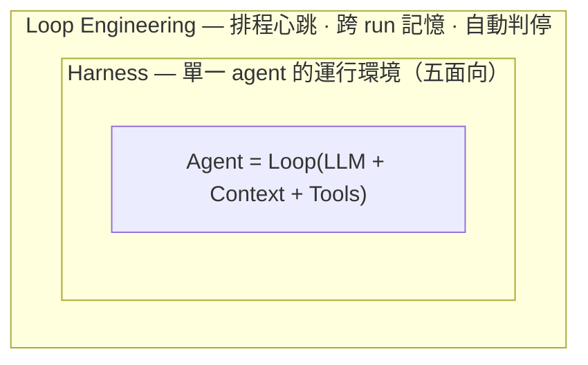

# Loop Engineering：從「親自 prompt agent」到「設計會自走的系統」

> Harness 的上一層。當你不再逐輪 prompt agent，而是設計一個「自己找事、發派、檢查、記錄、決定下一步」並週期性自走的系統，你就在做 loop engineering。

## 目錄

- [一、Loop 是什麼，跟 harness 的關係](#一loop-是什麼跟-harness-的關係)
- [二、Loop 獨有的三塊（其餘複用 harness）](#二loop-獨有的三塊其餘複用-harness)
  - [2.1 心跳 / Automations：何時啟動](#21-心跳--automations何時啟動)
  - [2.2 跨 run 記憶：跨 run 記得什麼](#22-跨-run-記憶跨-run-記得什麼)
  - [2.3 判停 / Stop Condition：何時算完成](#23-判停--stop-condition何時算完成)
- [三、一個 loop 長什麼樣](#三一個-loop-長什麼樣)
- [四、Loop 不會幫你做的事](#四loop-不會幫你做的事)
- [五、Claude Code ↔ Codex：loop primitive 對照](#五claude-code--codexloop-primitive-對照)
- [六、來源與更新](#六來源與更新)

---

## 一、Loop 是什麼，跟 harness 的關係

過去兩年，從 coding agent 拿到產出的方式是：你寫一個好 prompt、給足 context，讀回應、再打下一句——agent 是工具，你全程握著它，一輪接一輪。Loop engineering 把「按下一步的那個人」也換掉：你設計一個系統去戳 agent，而不是你自己戳。

兩句業界引述定調了這個轉向（皆為原文短引）：

> steipete：「design loops that prompt your agents」。
> bcherny（Anthropic Claude Code 負責人）：「My job is to write loops」。

### 與 harness 的分層

採 Addy Osmani 的界定：**loop 坐落在 harness 的上一層**。

- **Harness**＝**單一 agent** 跑在裡面的運行環境（context、tools、permission、編排、驗證——見 [harness-engineering.md](./harness-engineering.md) 的五大面向）。
- **Loop**＝harness ＋ 排程心跳 ＋ 多 agent 自走 ＋ 自我餵食。同一個 harness，加上「會自己定時啟動、把工作丟給自己、檢查完再決定下一步」就升格成 loop。

包含關係：`loop ⊃ harness ⊃ Loop(LLM + Context + Tools)`。

> **與本筆記體系的接法**：[harness-engineering.md](./harness-engineering.md) §六 有一條「互動式 harness ↔ 自主 pipeline harness」軸。那條軸的**自主 pipeline 端**，其實就是「把一個單-agent harness 放進一個會自走的 loop 裡跑」——也就是本筆記的主題。harness 筆記講到「一個 agent 的環境長怎樣」為止；「怎麼讓這些環境自走、串起來」由本筆記接手。

### 一個重要的觀察：這已經不是工具問題了

一年前要做 loop，你得自己寫一坨 bash 並永遠維護它。現在這些零件直接內建在產品裡——Steinberger 的清單幾乎一對一落在 Codex app 上，又幾乎原樣落在 Claude Code 上。一旦發現「形狀是一樣的」，就不必再爭哪個工具，而是設計一個**換工具也還成立**的 loop。這正是 [harness-engineering.md](./harness-engineering.md) §七「harness pattern 收斂」在更上一層的延續。

---

## 二、Loop 獨有的三塊（其餘複用 harness）

Addy 列出一個 loop 需要「五塊 ＋ 一個記憶」。但其中四塊，[harness-engineering.md](./harness-engineering.md) 已經寫透了，本筆記**直接連回、不重講**；只詳寫 loop 真正獨有、harness 著墨較少的部分。

| Addy 的積木                 | 歸屬                         | 一句話                                |
| --------------------------- | ---------------------------- | ------------------------------------- |
| Skills                      | 複用 → harness **面向 1**    | 把專案知識寫下來，免得 agent 每次重猜 |
| Connectors / Plugins（MCP） | 複用 → harness **面向 2**    | 接上 issue tracker / DB / Slack 等    |
| Sub-agents                  | 複用 → harness **面向 4＋5** | 生成/評估分離（maker ≠ checker）      |
| Worktrees                   | 複用 → harness **面向 4**    | 平行 agent 不互相踩同一個檔案         |
| **Automations（排程心跳）** | **loop 獨有**                | 讓 loop ≠ 一次性 run                  |
| **Memory（跨 run）**        | **loop 獨有**                | context 之外、存在磁碟上的狀態        |
| **判停 / stop condition**   | **loop 獨有**                | 自走時「何時算完成」                  |

> 沿用 harness 筆記 §四的紀律——每個元件獨佔一個問題。Loop 的三塊各自回答：**心跳＝何時啟動、記憶＝跨 run 記得什麼、判停＝何時算完成**。三個問題不重疊，缺一塊 loop 就漏。

### 2.1 心跳 / Automations：何時啟動

心跳是讓「一個 loop」不只是「你跑過一次的某次執行」的關鍵。沒有心跳，五面向再齊也只是一次手動 run。

- **Claude Code**：`/loop`（依週期重跑）、cron / `/schedule`（雲端、機器關機後續跑）、lifecycle hooks（在 agent 生命週期特定點觸發 shell）、或推到 GitHub Actions 讓它在你關電腦後繼續。
- **Codex**：Automations tab——選 project、要跑的 prompt、頻率、跑在本地 checkout 還是背景 worktree；有發現的 run 進 Triage inbox，沒發現的自動歸檔。

實例見 [boris-cherny-tips.md](./boris-cherny-tips.md)：bcherny 實際在跑的排程是「每 5 分鐘處理一次 code review、每 30 分鐘推 Slack 反饋、每小時清理過期 PR」。一個 automation 可以呼叫一個 skill，所以你維護的是 `$skill-name` 一行，而不是塞一大坨指令進一個沒人會更新的排程。

### 2.2 跨 run 記憶：跨 run 記得什麼

模型在 run 與 run 之間會忘光一切，所以記憶必須在**磁碟上、不在 context 裡**。一個 markdown 檔、一塊 Linear board——任何活在「單次對話之外」、記住「什麼做完了、下一步是什麼」的東西。

> Addy 的話（原文短引）：「The agent forgets, the repo doesn't.」

這和 harness **面向 1** 的「持久化」是同一個機制，但維度不同：harness 面向 1 多談「單一 session 內」的 context 組織與 offloading；loop 的記憶強調**跨 run、跨排程週期**的狀態接力——明天早上那次 run，要能接續今天停下的地方。記憶是整個 loop 的脊椎：它記住試過什麼、什麼過了、什麼還開著。

### 2.3 判停 / Stop Condition：何時算完成

Addy 把這塊歸在 automations 底下，但「何時啟動」和「何時算完成」是兩個問題，這裡拆開談。

- `/loop` 是「依週期重跑」；`/goal` 是「**跑到你寫的條件為真**為止」，而且每輪結束後由**另一個小模型**判斷是否完成——寫程式的那個 agent 不是給自己打分的那個。你給它類似「`test/auth` 全綠且 lint 乾淨」這種可驗證條件，然後走開。
- 這就是把 harness **面向 5**（生成/評估分離、maker ≠ checker）套在「**完成判定**」本身上：連「做完了沒」這個判斷，都交給一個獨立的檢查者，而不是讓做事的 agent 自己說了算。
- Claude Code 與 Codex 都有 `/goal`，跨輪跑到可驗證的停止條件成立，可 pause / resume / clear。

> 來源細節見 [boris-cherny-tips.md](./boris-cherny-tips.md)：有人問 bcherny 能不能加 `/goal`，他回「用 `/loop until` 就行」，隨後 Claude Code 在 18 小時內正式推出 `/goal`——底層機制等同 `/loop until <條件>`。

---

## 三、一個 loop 長什麼樣

把三塊與複用的四塊湊起來，一條 thread 就變成一個小控制台。一個常見形狀：

1. 一個 **automation** 每天早上對 repo 跑一次。它的 prompt 呼叫一個 triage **skill**，讀昨天的 CI 失敗、開著的 issue、最近的 commit，把發現寫進一個 markdown 檔或 Linear board（**記憶**）。
2. 對每個值得做的發現，thread 開一個隔離的 **worktree**，派一個 **sub-agent** 草擬修法，再派**第二個 sub-agent** 對著專案 skill 與既有測試審查那份草稿（生成/評估分離）。
3. **連接器**（MCP）讓 loop 自己開 PR、更新票。loop 處理不了的，落到 triage inbox 等你。
4. **狀態檔**記住試過什麼、什麼過了、什麼還開著，所以明早那次 run 接續今天停下的地方（**判停**＋**記憶**接力）。

關鍵在於：這些步驟你**一次設計**、之後**沒有逐步 prompt 任何一步**。而且因為零件是同一批，這個 loop 在 Codex 或 Claude Code 裡是同一個 loop。

---

## 四、Loop 不會幫你做的事

Loop 改變了工作，沒有把你從工作裡刪掉。而且有三個問題隨著 loop 變好而**變尖銳**，不是變輕鬆：

- **驗證仍在你身上**。無人看管地跑的 loop，也是無人看管地犯錯的 loop。把 verifier sub-agent 從 maker 拆出來，是為了讓 loop 說的「做完了」有意義——但「done」仍是一個宣稱，不是一個證明。
- **理解會繼續腐蝕**（comprehension debt）。loop 越順、它出你沒寫的程式碼越快，「存在的東西」與「你真正掌握的東西」之間的落差就拉越大。順手的 loop 只是讓這個落差長得更快——除非你去讀它做了什麼。
- **舒服的姿勢往往是危險的那個**（cognitive surrender）。loop 自己跑起來時，很容易停止有意見、照單全收。設計 loop 用判斷力去做是解藥，用它來逃避思考則是加速器——同一個動作，相反結果。

> Addy 的收尾（原文短引）：「Build the loop. Stay the engineer.」

一個 loop 兩個人用會得到相反結果：一個用它在自己**深刻理解**的工作上跑更快，另一個用它**避免理解**這份工作。loop 不知道差別，你知道。這正是為什麼 loop 設計比 prompt engineering 更難，不是更簡單——槓桿點移動了，難度沒有消失。

---

## 五、Claude Code ↔ Codex：loop primitive 對照

Addy 的論點之一是兩邊的零件形狀已經一樣。對照如下（互通性會隨版本變動）：

| 積木     | Claude Code                                                | Codex                                                 |
| -------- | ---------------------------------------------------------- | ----------------------------------------------------- |
| 心跳     | `/loop`、cron `/schedule`、lifecycle hooks、GitHub Actions | Automations tab（project/prompt/頻率）＋ Triage inbox |
| 判停     | `/goal`（= `/loop until`，另一小模型判完成）               | `/goal`（跨輪跑到可驗證停止條件，可 pause/resume）    |
| 記憶     | markdown / `CLAUDE.md` / Linear                            | markdown / Linear board                               |
| Skills   | `.claude/` skill（`SKILL.md`）                             | `$` / `/skills`（`SKILL.md`，同格式）                 |
| 連接器   | MCP server                                                 | MCP（同協定，連接器常可互通）                         |
| 子代理   | `.claude/agents/`、agent team                              | `.codex/agents/`（TOML，可設 model / effort）         |
| 平行隔離 | `git worktree`、`--worktree`、`isolation: worktree`        | 內建 worktree                                         |

> 一個釐清：**skill 是撰寫格式，plugin 是配送方式**。要跨 repo 共享或打包多個 skill，就包成 plugin。Codex 與 Claude Code 皆然。

---

## 六、來源與更新

### 主要來源

- **Addy Osmani**, _"Loop Engineering"_（2026-06-09）— [https://x.com/addyosmani/status/2064127981161959567](https://x.com/addyosmani/status/2064127981161959567)
- **Peter Steinberger**（@steipete）— "design loops that prompt your agents"（loop 概念定調）
- **Boris Cherny**（@bcherny）— "My job is to write loops"（Anthropic Claude Code 負責人）

### 本 repo 內部連結

- [harness-engineering.md](./harness-engineering.md) — 內層：單一 agent 的運行環境（五面向、四心法、Claude Code primitive mapping）
- [boris-cherny-tips.md](./boris-cherny-tips.md) — Claude Code loop primitive 的實際用法與實例（`/loop`、`/schedule`、`/goal`、worktree、hooks）

### 校對紀錄

- **2026-06-14**：初版。依 Addy《Loop Engineering》(2026-06-09) 採「loop 在 harness 上一層」分層
  - 採「薄、委派型」結構：四塊複用元件連回 [harness-engineering.md](./harness-engineering.md)，只詳寫 loop 獨有的三塊（心跳 / 跨 run 記憶 / 判停）
  - 沿用 harness 筆記 §四「每元件獨佔一個問題」的紀律切分 loop 三塊
